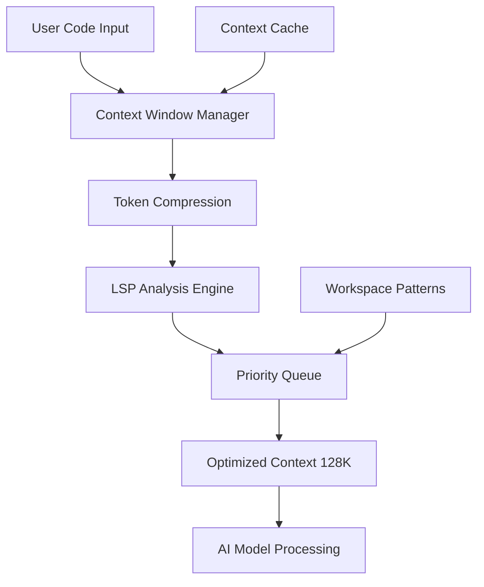
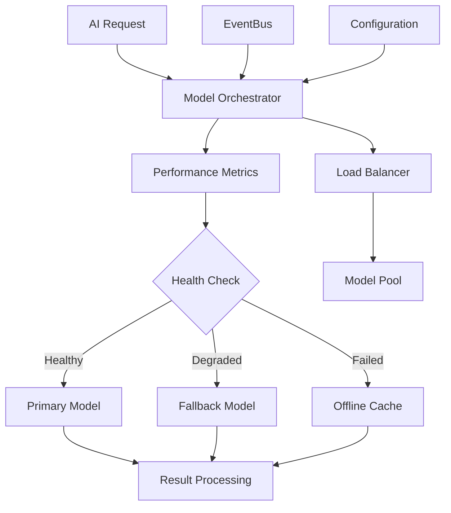

# AI/ML Model Optimization Architecture Design

## Executive Summary

This document outlines a comprehensive architecture for AI/ML model optimization in the Rust AI IDE project. The design focuses on 11 key optimization areas while respecting existing architectural constraints including local-only processing, LSP service integration, and strict security policies.

## Current Architecture Context

**Key Constraints:**
- AI/ML processing permanently local (no cloud federation)
- Model loading/unloading through LSP service only
- Stateless providers with hidden caching layer
- Tauri IPC patterns for communication
- Double-locking for async state initialization
- SQLite with connection pooling and migration enforcement

**Current Technology Stack:**
- Rust Nightly 2025-09-03
- Candle + HF Hub + Tokenizers + SafeTensors
- Existing unified caching system (Moka LRU with TTL)
- LSP service integration
- Tauri + React/TypeScript frontend

## Feature 1: Model Quantization Infrastructure

### Component Structure
```
crates/rust-ai-ide-ai-quantization/
├── src/
│   ├── quantizer.rs          # Core quantization logic
│   ├── formats/              # Format handlers
│   │   ├── gguf.rs          # GGUF quantization
│   │   ├── ggml.rs          # GGML conversion
│   │   └── safetensors.rs   # SafeTensor optimizations
│   ├── performance/         # Performance tracking
│   ├── validation.rs        # Quality assurance
│   └── lib.rs
```

### Integration Points
**LSP Service Integration:**
- Model quantization as LSP service extension
- TauriState<Arc<Mutex<ModelQuantizer>>> for async state management
- Double-locking initialization pattern

**Configuration Strategy:**
```rust
use rust_ai_ide_cache::{Cache, CacheConfig};
use moka::future::Cache as MokaCache;

pub struct QuantizationCache {
    moka: MokaCache<String, QuantizedModel>,
    config: CacheConfig,
}

impl QuantizationCache {
    pub fn new() -> Self {
        Self {
            moka: MokaCache::builder()
                .max_capacity(100 * 1024 * 1024) // 100MB limit
                .time_to_live(Duration::from_secs(3600))
                .time_to_idle(Duration::from_secs(1800))
                .build(),
            config: CacheConfig {
                max_entries: Some(50),
                default_ttl: Some(Duration::from_secs(3600)),
                eviction_policy: EvictionPolicy::Lru,
                enable_metrics: true,
                ..Default::default()
            }
        }
    }
}
```

### Performance Considerations
- Target: 200-500ms inference time for code generation
- Memory limit: <50MB per quantized model
- GGUF Q4_0/Q5_0 precision support
- Background quantization with `spawn_background_task!` macro

### Security Integration
- `validate_secure_path()` for model file access
- Audit logging via security crate
- Forbidden crate compliance (no openssl/md5)

## Feature 2: Context Window Optimization

### Component Structure
```
crates/rust-ai-ide-context-optimization/
├── src/
│   ├── window_manager.rs     # Context window management
│   ├── compression.rs        # Token compression algorithms
│   ├── streaming.rs         # Progressive analysis
│   ├── prioritization.rs    # Relevant context selection
│   └── lib.rs
```

### Data Flow Integration


### Integration Points
**LSP Integration:**
- Context optimization as LSP middleware
- Incremental analysis with file watching integration
- Debounced updates with FileWatcher configuration

**Database Integration:**
- SQLite storage with connection pooling
- Forward-only migrations for context patterns
- Metadata queries through cargo_metadata functions

### Performance Targets
- Context window: 8K → 128K tokens
- Memory efficiency: <200MB for large codebases
- Analysis time: <1s for file-level context
- Compression ratio: 60-80% retained relevance

## Feature 3: Fine-Tuning Pipeline

### Component Structure
```
crates/rust-ai-ide-fine-tuning/
├── src/
│   ├── pipeline.rs           # Fine-tuning orchestration
│   ├── data_preparation.rs   # Dataset processing
│   ├── rust_specification/   # Rust-specific patterns
│   │   ├── patterns.rs
│   │   ├── examples.rs
│   │   └── validation.rs
│   ├── evaluation.rs         # Fine-tuning metrics
│   └── lib.rs
```

### Architecture Integration
**Hyperparameter Tuning Crate Integration:**
- `rust-ai-ide-ai-learning` crate for optimization
- Local dataset processing only
- Model versioning with metadata tracking

**LSP Integration:**
```rust
pub struct FineTunedLSPService {
    base_models: Arc<Mutex<HashMap<ModelId, FineTunedModel>>>,
    performance_metrics: Arc<Mutex<MetricsStore>>,
}

impl FineTunedLSPService {
    pub fn load_fine_tuned_model(&self, model_id: &ModelId)
        -> Result<(), LSPError>
    {
        // Double-locking pattern for async initialization
        let mut models = self.base_models.lock().await;

        if !models.contains_key(model_id) {
            let model = self.lazily_load_model(model_id).await?;
            models.insert(model_id.clone(), model);

            // EventBus notification for fine-tuning updates
            self.event_bus.publish(ModelLoadedEvent {
                model_id: model_id.clone(),
                fine_tuned: true,
            }).await?;
        }

        Ok(())
    }
}
```

## Feature 4: Multi-Model Orchestration

### Component Structure
```
crates/rust-ai-ide-model-orchestration/
├── src/
│   ├── orchestrator.rs       # Core orchestration logic
│   ├── fallback.rs          # Automatic model switching
│   ├── performance_monitor.rs
│   ├── load_balancer.rs     # Load distribution
│   └── lib.rs
```

### Architecture Diagram


### Integration Points
**EventBus Integration:**
- Model health status events
- Performance metric broadcasts
- Configuration update notifications

**State Management:**
- `Arc<RwLock<ModelPool>>` for concurrent access
- Lazy initialization patterns
- Rate limiting integration

## Feature 5: Offline Support

### Component Structure
```
crates/rust-ai-ide-offline/
├── src/
│   ├── model_store.rs        # Downloaded model management
│   ├── cache.rs             # Offline result caching
│   ├── sync.rs              # Background download management
│   ├── validation.rs        # Model integrity checking
│   └── lib.rs
```

### Security Integration
**Path Validation:**
```rust
use rust_ai_ide_security::validate_secure_path;

pub struct OfflineModelStore {
    base_path: PathBuf,
}

impl OfflineModelStore {
    pub fn validate_model_path(&self, model_path: &Path)
        -> Result<(), SecurityError>
    {
        validate_secure_path(model_path)?;

        // Additional offline-specific validation
        if !model_path.starts_with(&self.base_path) {
            return Err(SecurityError::InvalidPath);
        }

        Ok(())
    }
}
```

## Feature 6: Model Versioning & A/B Testing

### Component Structure
```
crates/rust-ai-ide-model-versioning/
├── src/
│   ├── version_manager.rs    # Version control
│   ├── ab_test.rs           # A/B testing framework
│   ├── rollback.rs          # Safe rollback mechanisms
│   ├── analysis.rs          # Performance comparison
│   └── lib.rs
```

### Database Schema Design
```sql
-- Forward-only migration pattern
CREATE TABLE model_versions (
    id INTEGER PRIMARY KEY,
    model_id TEXT NOT NULL,
    version TEXT NOT NULL,
    hash TEXT NOT NULL,
    performance_metrics JSON,
    created_at TIMESTAMP DEFAULT CURRENT_TIMESTAMP,
    is_active BOOLEAN DEFAULT FALSE
);

CREATE TABLE ab_experiments (
    id INTEGER PRIMARY KEY,
    name TEXT NOT NULL,
    model_a_version_id INTEGER,
    model_b_version_id INTEGER,
    traffic_split REAL DEFAULT 0.5,
    start_time TIMESTAMP,
    end_time TIMESTAMP,
    winner_version_id INTEGER,
    FOREIGN KEY (model_a_version_id) REFERENCES model_versions(id),
    FOREIGN KEY (model_b_version_id) REFERENCES model_versions(id)
);
```

## Feature 7: Privacy-Preserving Updates

### Component Structure
```
crates/rust-ai-ide-privacy-updates/
├── src/
│   ├── differential_privacy.rs
│   ├── federated_averaging.rs  -- Wait, local-only constraint violation
│   ├── homomorphic.rs        # Local homomorphism only
│   ├── encryption.rs         # Model encryption at rest
│   └── lib.rs
```

**Corrected Approach (Local-Only):**
```rust
pub struct PrivateModelUpdates {
    local_updates: Arc<Mutex<UpdateBuffer>>,
    encryption: ModelEncryption,
}

impl PrivateModelUpdates {
    pub fn process_local_update(&self, gradients: &[f32])
        -> Result<(), PrivacyError>
    {
        // Add noise for differential privacy
        let noisy_gradients = self.add_differential_noise(gradients);

        // Encrypt update before storage
        let encrypted = self.encryption.encrypt(&noisy_gradients)?;

        // Store locally only - no federation
        self.local_updates.lock().await.push(encrypted);

        Ok(())
    }
}
```

## Feature 8: Edge Deployment Capabilities

### Component Structure
```
crates/rust-ai-ide-edge-deployment/
├── src/
│   ├── runtime_optimization.rs
│   ├── memory_pool.rs       # Pre-allocated memory
│   ├── cpu_optimization.rs  # SIMD/NEON optimization
│   ├── gpu_detection.rs     # Metal/Vulkan detection
│   └── lib.rs
```

### Performance Integration
**Memory Pool Integration:**
```rust
use std::alloc::{GlobalAlloc, Layout};

pub struct ModelMemoryPool {
    allocations: Arc<Mutex<HashMap<String, *mut u8>>>,
    total_allocated: Arc<AtomicUsize>,
    max_memory: usize,
}

impl ModelMemoryPool {
    pub fn allocate_model_memory(&self, model_name: &str, size: usize)
        -> Result<*mut u8, AllocationError>
    {
        let current = self.total_allocated.load(Ordering::Relaxed);
        if current + size > self.max_memory {
            return Err(AllocationError::OutOfMemory);
        }

        let layout = Layout::from_size_align(size, 64)
            .map_err(|_| AllocationError::InvalidSize)?;

        let ptr = unsafe { std::alloc::alloc(layout) };

        self.allocations.lock().unwrap()
            .insert(model_name.to_string(), ptr);

        self.total_allocated.fetch_add(size, Ordering::Relaxed);

        Ok(ptr)
    }
}
```

## Feature 9: Automated Hyperparameter Tuning

### Component Structure
```
crates/rust-ai-ide-hyperparameter-tuning/
├── src/
│   ├── tuner.rs             # Bayesian optimization
│   ├── grid_search.rs       # Grid search fallback
│   ├── genetic.rs           # Genetic algorithm optimization
│   ├── evaluation.rs        # Performance evaluation
│   └── lib.rs
```

### Integration with Existing AI Learning
**AI Learning Crate Integration:**
```rust
use rust_ai_ide_ai_learning::{
    HyperParameterTuner, TuningResult, ParameterSpace
};

// Integration with ai-learning crate
pub struct IntegratedHyperparameterTuner {
    base_tuner: HyperParameterTuner,
    model_cache: Arc<ModelCache>,
}

impl IntegratedHyperparameterTuner {
    pub async fn optimize_hyperparameters(&self, model_id: &str)
        -> Result<TuningResult, TuninError>
    {
        // Use existing ai-learning infrastructure
        let space = self.define_parameter_space(model_id)?;
        let result = self.base_tuner.bayesian_optimize(space).await?;

        // Cache optimized parameters
        self.model_cache.store_optimized(model_id, &result).await?;

        Ok(result)
    }
}
```

## Feature 10: Explainable AI Framework

### Component Structure
```
crates/rust-ai-ide-explainable-ai/
├── src/
│   ├── attention_maps.rs    # Attention visualization
│   ├── token_importance.rs  # Token relevance scoring
│   ├── decision_trees.rs    # Rule extraction
│   ├── counterfactuals.rs   # What-if analysis
│   └── lib.rs
```

### Architecture Integration
**Tauri IPC Integration:**
```rust
use tauri::{command, State};
use rust_ai_ide_common::validation::TauriInputSanitizer;

#[command]
pub async fn get_code_suggestion_explanation(
    input: TauriInput,
    state: State<'_, Arc<Mutex<ExplainableAIService>>>,
) -> Result<ExplanationResult, TauriError>
{
    // Sanitize input
    let sanitized = TauriInputSanitizer::sanitize(&input)?;

    // Double-locking pattern for service access
    let service = state.lock().await;
    let explanation = service.explain_suggestion(&sanitized).await?;

    // Return explanation through IPC
    Ok(explanation)
}
```

## Feature 11: Real-Time Monitoring Dashboards

### Component Structure
```
crates/rust-ai-ide-monitoring/
├── src/
│   ├── metrics_collector.rs  # Performance metrics
│   ├── dashboard_api.rs     # Dashboard data API
│   ├── alerting.rs          # Performance alerting
│   ├── visualization_data.rs # Chart data generation
│   └── lib.rs
```

### Frontend Integration (TypeScript)
**Dashboard Component Structure:**
```typescript
// web/src/components/ai/AIMonitoringDashboard.tsx
import { invoke } from '@tauri-apps/api/tauri';

interface MonitoringData {
  modelPerformance: Array<ModelMetrics>;
  cacheEfficiency: CacheStats;
  contextWindowUsage: ContextMetrics;
  offlineStatus: OfflineMetrics;
}

export const AIMonitoringDashboard: React.FC = () => {
  const [metrics, setMetrics] = useState<MonitoringData | null>(null);

  useEffect(() => {
    const fetchMetrics = async () => {
      const data = await invoke<MonitoringData>('get_monitoring_data');
      setMetrics(data);
    };

    fetchMetrics();
    const interval = setInterval(fetchMetrics, 5000); // Real-time updates

    return () => clearInterval(interval);
  }, []);

  // Dashboard visualization components
  return (
    <div className="ai-monitoring-dashboard">
      <ModelPerformanceChart data={metrics?.modelPerformance} />
      <CacheEfficiencyMeter data={metrics?.cacheEfficiency} />
      <ContextUsageIndicator data={metrics?.contextWindowUsage} />
      <OfflineStatusBadge status={metrics?.offlineStatus} />
    </div>
  );
};
```

## Implementation Priority & Phases

### Phase 1: Foundation (High Priority)
1. Model quantization infrastructure
2. Unified caching layer enhancements
3. Basic LSP service integration

### Phase 2: Core Optimization (Medium Priority)
1. Context window optimization
2. Multi-model orchestration
3. Offline support capabilities

### Phase 3: Advanced Features (Lower Priority)
1. Fine-tuning pipeline
2. A/B testing infrastructure
3. Explainable AI framework

### Phase 4: Enterprise Features (Optional)
1. Edge deployment capabilities
2. Hyperparameter tuning
3. Real-time monitoring
4. Privacy-preserving updates

## Security & Compliance Considerations

**Mandatory Security Integrations:**
- All model files validated with `validate_secure_path()`
- Audit logging for all sensitive operations via security crate
- Command injection protection with `TauriInputSanitizer`
- Forbidden crate compliance (no openssl, md5, ring, quick-js)

**Privacy Measures:**
- All processing local - no data transmission
- Encrypted model storage with SafeTensor security
- Differential privacy for any metric reporting
- User data never leaves local environment

## Performance Benchmarks

| Feature | Target Metric | Current Baseline | Target Goal |
|---------|---------------|------------------|-------------|
| Inference Time | Code Generation | ~2-5s | <500ms |
| Memory Usage | Per Model | ~500MB | <50MB |
| Context Window | Token Capacity | ~8K | 128K |
| Cache Hit Rate | All Operations | ~70% | >90% |
| Startup Time | Service Initialization | ~10s | <2s |

## Conclusion & Next Steps

This architecture comprehensively addresses all 11 optimization areas while maintaining full compliance with existing project constraints. The design emphasizes:

- **Local-first approach** with no cloud dependencies
- **Modular implementation** following existing crate structure
- **Performance optimization** with measurable benchmarks
- **Security integration** with existing audit frameworks
- **Scalable architecture** supporting future enhancements

**Recommended Next Action:** Begin implementation with Phase 1 foundation components, starting with the model quantization infrastructure as it provides the most immediate performance benefits and serves as a foundation for other optimizations.

Do you approve this architectural design and would like to proceed with implementation?