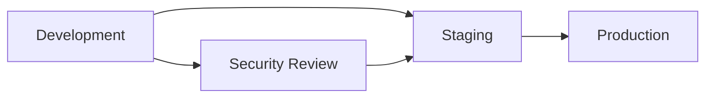

# 🤝 Contributing to Rust AI IDE

Welcome! We're excited to have you contribute to the Rust AI IDE project. This document will help you get started with development and contribute effectively.

## 🚀 Quick Start

### Prerequisites

- **Rust**: 1.78+ (`rustup` recommended)
- **Node.js**: 20+ (LTS)
- **Package Manager**: `pnpm` (recommended) or `npm`
- **System Dependencies**:
  - `build-essential` (Linux)
  - `clang`
  - `libgtk-3-dev` (Linux)
  - `libwebkit2gtk-4.0-dev` (Linux)
- **Recommended Editors**:
  - VS Code with rust-analyzer extension
  - RustRover with Tauri plugin

### Development Setup

```bash
# Clone and setup
git clone https://github.com/jcn363/rust-ai-ide.git
cd rust-ai-ide

# Install dependencies
pnpm install

# Install Rust toolchain components
rustup component add rustfmt clippy

# Development mode (with hot-reload)
pnpm tauri dev

# Build for production (optimized release)
pnpm tauri build --release

# Run tests
cargo test
pnpm test
```

### Recommended VS Code Extensions

- rust-analyzer
- Tauri
- ESLint
- Prettier
- EditorConfig
- GitLens

## 📋 Development Workflow

### 1. Choose a Task

- Check [Issues](https://github.com/jcn363/rust-ai-ide/issues) for open tasks
- Look at [Projects](https://github.com/jcn363/rust-ai-ide/projects) for current priorities
- Check [Discussions](https://github.com/jcn363/rust-ai-ide/discussions) for ideas

### 2. Create a Branch

```bash
git checkout -b feature/your-feature-name
# or
git checkout -b fix/issue-description
# or
git checkout -b refactor/component-name
```

### 3. Development Standards

#### Code Quality

- **Rust**: Use `cargo clippy` for linting
- **Formatting**: Use `cargo fmt` before commits
- **Testing**: Write tests for new features
- **Documentation**: Update docs for API changes

#### Commit Messages

```text
feat: add new model loading capability
fix: resolve memory leak in registry
docs: update API documentation
refactor: simplify resource monitoring logic
```

### 4. Testing

#### Unit Testing Requirements
```bash
# Run all tests
cargo test

# Test specific module
cargo test --lib --bin rust-ai-ide-ai

# Test with examples
cargo test --examples

# Run integration tests
cargo test --test integration_tests
```

#### Quality Gates (Enterprise Requirements)

**Security Testing:**
```bash
# Automated security scanning (required before merge)
cargo audit                    # Dependency vulnerability scan
cargo deny check              # License compliance verification
cargo geiger                  # Additional security analysis

# Manual security review required for:
# - New dependencies
# - Network operations
# - File system access
# - Cryptographic operations
```

**Performance Benchmarking:**
```bash
# Performance regression testing (CI requirement)
cargo bench                     # Micro-benchmarks
./performance_baseline_runner  # Integration performance tests
./scripts/run-performance-tests.js  # Full performance suite

# Performance requirements:
# - Cold startup: <2 seconds
# - Memory usage: <2GB for 1M+ LOC workspaces
# - Build time regression: <5% degradation allowed
```

**Code Quality Gates:**
```bash
# Code quality checks (all must pass)
cargo +nightly clippy -- -D warnings  # Zero warnings policy
cargo +nightly fmt --check          # Formatting compliance
cargo test --doc                    # Documentation tests

# Test coverage requirements:
# - Unit tests: 90%+ coverage
# - Integration tests: 85%+ coverage
# - End-to-end tests: 80%+ coverage
```

### 5. Submit a Pull Request

#### Before Submitting

- ✅ Code compiles without errors
- ✅ All tests pass
- ✅ Code is properly formatted (`cargo fmt`)
- ✅ No clippy warnings (`cargo clippy`)
- ✅ Documentation updated
- ✅ Commit history is clean

#### Pull Request Checklist

- [ ] PR title follows conventional commit format
- [ ] Description explains _what_ and _why_
- [ ] Target branch is correct (`main` or `develop`)
- [ ] CI passes on all checks
- [ ] Tests include both unit and integration
- [ ] Documentation includes usage examples

## 🏗️ Architecture Guidelines

### Module Organization

The codebase is organized into Rust crates for better modularity:

```text
crates/
├── rust-ai-ide-ai/          # AI services & model loading ***
├── rust-ai-ide-core/        # Core types & utilities
├── rust-ai-ide-lsp/         # Language Server Protocol
├── rust-ai-ide-cargo/       # Cargo integration
├── rust-ai-ide-debugger/    # Debugging support
└── rust-ai-ide-plugins/     # Plugin architecture
```

### 💡 **NEW**: AI Module Development (\*\*\* Just Compiled!)

The `rust-ai-ide-ai` crate is now **fully operational**:

#### Working Features

- ✅ **Intelligent Model Registry**: Dynamic loading/unloading
- ✅ **Resource Monitoring**: Real-time system metrics
- ✅ **Concurrent Protection**: Prevents duplicate model loads
- ✅ **Background Cleanup**: Auto-unloading tasks
- ✅ **4 Unloading Policies**: LRU, Time, Memory, Hybrid

#### Development Example

```rust
// Create registry with LRU policy
let registry = ModelRegistry::with_policy(UnloadingPolicy::LRU { max_age_hours: 24 });

// Start background cleanup every 10 minutes
let _handle = registry.start_auto_unloading_task(600).await;

// Load a model (with automatic resource management)
match registry.load_model(ModelType::CodeLlama, "/path/to/model").await {
    Ok(model_id) => println!("Model loaded: {}", model_id),
    Err(e) => println!("Loading failed: {}", e),
}
```

### Naming Conventions

- **Functions**: `snake_case` (e.g., `load_model`, `get_resource_info`)
- **Types**: `PascalCase` (e.g., `ModelRegistry`, `SystemMonitor`)
- **Constants**: `UPPER_CASE` (e.g., `DEFAULT_TIMEOUT`)
- **Modules**: `snake_case` (e.g., `model_loader`, `resource_monitor`)

### Error Handling

```rust
// Preferred pattern: Result types with descriptive errors
pub fn load_model(&self, path: &str) -> Result<ModelHandle, anyhow::Error>

// Use thiserror for custom error types when needed
#[derive(thiserror::Error, Debug)]
pub enum ModelError {
    #[error("Model file not found: {0}")]
    NotFound(String),
    #[error("Insufficient memory: needed {0}MB")]
    InsufficientMemory(u64),
}
```

## 🔧 Development Tools

### Essential Tools

```bash
# Code formatting
cargo fmt

# Linting
cargo clippy

# Documentation
cargo doc --open

# Benchmarking
cargo bench
```

### VS Code Extensions

- **rust-analyzer**: Language server for Rust
- **CodeLLDB**: Debugging support
- **crates**: Cargo.toml helpers
- **Tauri**: Desktop app development

### Git Hooks (Recommended)

```bash
# Pre-commit hook for formatting and linting
cat > .git/hooks/pre-commit << 'EOF'
cargo fmt --all -- --check
cargo clippy --all-targets -- -D warnings
cargo test --lib
EOF
chmod +x .git/hooks/pre-commit
```

## 🧪 Testing Strategy

### Unit Tests

```rust
#[cfg(test)]
mod tests {
    use super::*;
    use tokio::test;

    #[test]
    async fn test_model_registry_creation() {
        let registry = ModelRegistry::new();
        assert_eq!(registry.get_loaded_models().await.len(), 0);
    }

    #[tokio::test]
    async fn test_async_functionality() {
        let result = async_function().await;
        assert!(result.is_ok());
    }
}
```

### Enterprise Testing Requirements

**Security Testing:**
```rust
#[cfg(test)]
mod security_tests {
    use rust_ai_ide_common::validation::TauriInputSanitizer;

    #[test]
    fn test_input_sanitization() {
        let sanitizer = TauriInputSanitizer::new();
        let malicious_input = "../../../etc/passwd";
        let sanitized = sanitizer.sanitize_path(malicious_input);
        assert!(sanitized.is_err()); // Should reject path traversal
    }

    #[test]
    fn test_command_injection_prevention() {
        let sanitizer = TauriInputSanitizer::new();
        let malicious_cmd = "ls; rm -rf /";
        let sanitized = sanitizer.sanitize_command(malicious_cmd);
        assert!(sanitized.is_err()); // Should reject dangerous commands
    }
}
```

**Performance Testing:**
```rust
#[cfg(test)]
mod performance_tests {
    use tokio::time::{timeout, Duration};

    #[tokio::test]
    async fn test_startup_performance() {
        let start = std::time::Instant::now();
        let _app = initialize_application().await;
        let elapsed = start.elapsed();

        // Enterprise requirement: startup < 2 seconds
        assert!(elapsed < Duration::from_secs(2));
    }

    #[tokio::test]
    async fn test_memory_usage() {
        let _app = initialize_application().await;
        let memory_usage = get_current_memory_usage();

        // Enterprise requirement: < 2GB for large workspaces
        assert!(memory_usage < 2_000_000_000);
    }
}
```

**Integration Testing:**
```rust
#[cfg(test)]
mod integration_tests {
    use rust_ai_ide_testing::comprehensive_test_runner::ComprehensiveTestRunner;

    #[tokio::test]
    async fn test_full_ai_pipeline() {
        let runner = ComprehensiveTestRunner::new();
        let result = runner.run_ai_capability_validation().await;

        // Enterprise requirements
        assert!(result.code_completion_accuracy > 0.85);
        assert!(result.security_scan_coverage > 0.95);
        assert!(result.performance_regression < 0.05);
    }
}
```

### Integration Tests

```rust
// tests/integration_tests.rs
#[cfg(test)]
mod integration_tests {
    use rust_ai_ide_ai::model_loader::*;

    #[tokio::test]
    async fn test_full_workflow() {
        let mut registry = ModelRegistry::new();
        // Test complete workflow from loading to unloading
    }
}
```

### Example Tests

```rust
// examples/your_example.rs
#[tokio::main]
async fn main() -> Result<(), anyhow::Error> {
    // Your example code here
    Ok(())
}
```

### 📚 **Documentation Resources**

- **[Developer Onboarding Guide](docs/developer-onboarding-guide.md)**: Complete setup and contribution path
- **[System Architecture Overview](docs/system-architecture-overview.md)**: Technical implementation details
- **[Testing Strategy Guide](docs/testing-strategy-and-best-practices.md)**: Quality assurance practices
- **[Refactoring Documentation](docs/refactoring.md)**: Advanced code transformation system

### 🎯 **NEW**: Refactoring System Development (\*\*\* Just Implemented!)

#### Working Features

- ✅ **Intelligent Pattern Recognition**: ML-based detection of code patterns and anti-patterns
- ✅ **Safety-First Operations**: Comprehensive validation and impact assessment
- ✅ **Batch Processing**: Multi-file refactoring with dependency management
- ✅ **AI-Powered Analysis**: Intelligent suggestions and risk assessment
- ✅ **Automated Test Generation**: Quality assurance for refactored code
- ✅ **Multi-Modal Operations**: Support for 15+ refactoring types

#### Refactoring Development Guidelines

**Adding New Operations:**

1. **Design Phase**: Define the operation in `RefactoringType` enum
2. **Implementation**: Create operation struct implementing `RefactoringOperation` trait
3. **Testing**: Add comprehensive tests for validation and edge cases
4. **Documentation**: Update operation reference and add examples
5. **Integration**: Update frontend UI and command handlers

**Example: Add Custom Operation**

```rust
// 1. Define operation type
#[derive(Serialize, Deserialize, Clone, Debug)]
pub enum RefactoringType {
    // ... existing operations
    ExtractDomainObjects, // New operation
}

// 2. Implement operation
pub struct ExtractDomainObjectsOperation<T: Analyzer> {
    analyzer: T,
}

#[async_trait]
impl<T: Analyzer> RefactoringOperation for ExtractDomainObjectsOperation<T> {
    async fn analyze(
        &self,
        context: &RefactoringContext
    ) -> Result<RefactoringAnalysis> {
        // Analyze code for domain object extraction opportunities
        let patterns = self.analyzer.detect_domain_patterns(&context)?;
        Ok(RefactoringAnalysis {
            applicable: !patterns.is_empty(),
            impact: self.estimate_impact(&patterns),
            confidence: patterns.len() as f32 / 10.0,
        })
    }

    async fn apply(
        &self,
        context: &RefactoringContext
    ) -> Result<RefactoringResult> {
        // Extract domain objects from code
        let extracted = self.generate_domain_objects(&context)?;
        Ok(RefactoringResult {
            changes: extracted.changes,
            new_files: extracted.new_files,
            modified_files: extracted.modified_files,
        })
    }
}
```

**Frontend Integration:**

```typescript
// Add to refactoring types
export type RefactoringType =
    | 'extract-variable'
    | 'extract-method'
    // ... existing types
    | 'extract-domain-objects'; // New type

// Create wizard component
export const ExtractDomainObjectsWizard: React.FC = () => {
    const [objects, setObjects] = useState<DomainObject[]>([]);

    return (
        <div className="space-y-4">
            <h3>Extract Domain Objects</h3>
            <ObjectList objects={objects} onSelect={handleSelection} />
            <NamingConventionInput />
            <PreviewPanel changes={previewChanges} />
        </div>
    );
};
```

**Testing Refactoring Operations:**

```rust
#[cfg(test)]
mod refactoring_tests {
    use super::*;
    use tokio::test;

    #[tokio::test]
    async fn test_extract_domain_objects() {
        let analyzer = MockAnalyzer::new();
        let operation = ExtractDomainObjectsOperation::new(analyzer);

        let context = create_test_context();
        let analysis = operation.analyze(&context).await.unwrap();

        assert!(analysis.applicable);
        assert!(analysis.confidence > 0.7);

        let result = operation.apply(&context).await.unwrap();
        assert!(!result.new_files.is_empty());
    }

    #[tokio::test]
    async fn test_refactoring_safety() {
        // Test safety validation
        let result = validate_refactoring_operation(test_operation).await;
        assert!(result.is_safe);

        // Test impact assessment
        let impact = assess_refactoring_impact(&test_operation).await;
        assert!(impact.risk_level != "high");
    }
}
```

## 📚 Documentation Standards

### Code Documentation

```rust
/// Loads a model from the given path with automatic resource management.
///
/// # Arguments
///
/// * `model_path` - Path to the model file
///
/// # Returns
///
/// Returns a `Result` containing the model ID on success
///
/// # Errors
///
/// Returns an error if the model file doesn't exist or insufficient memory
///
/// # Example
///
/// ```rust
/// let registry = ModelRegistry::new();
/// let model_id = registry.load_model(ModelType::CodeLlama, "/path/to/model.bin").await?;
/// ```
pub async fn load_model(&self, model_path: &str) -> Result<String>;
```

### README Updates

- Update feature lists when adding new functionality
- Add usage examples for new APIs
- Update installation instructions for new dependencies

## 🎯 Performance Guidelines

### Memory Management

- Use `Arc` for shared ownership in multi-threaded contexts
- Avoid unnecessary allocations in resource monitoring
- Implement proper cleanup in `Drop` implementations

### Async Best Practices

- Use `tokio::spawn` for background tasks
- Implement proper cancellation with `tokio::select!`
- Use `RwLock` for shared mutable state
- Avoid blocking operations in async functions

### Resource Efficiency

- Cache expensive operations when appropriate
- Implement lazy initialization for heavy components
- Use streaming for large data operations

## 🔐 Security Considerations

### Enterprise Security Requirements

**Input Validation (Mandatory):**
```rust
// Always use TauriInputSanitizer for user inputs
use rust_ai_ide_common::validation::TauriInputSanitizer;

#[tauri::command]
async fn process_user_file(
    path: String,
    sanitizer: State<'_, TauriInputSanitizer>
) -> Result<String, String> {
    // Validate path before processing
    let secure_path = sanitizer.validate_secure_path(&path)?;

    // Process file safely
    Ok(process_file(&secure_path).await?)
}
```

**Security Testing Requirements:**
- All new features require security review
- Dependency updates trigger automated security scanning
- No plain text secrets - use secure storage only
- Command injection protection required for all shell operations
- Path traversal validation for all file operations

**Audit Logging (Required for sensitive operations):**
```rust
use rust_ai_ide_security::audit_logger::AuditLogger;

#[tauri::command]
async fn sensitive_operation(
    audit_logger: State<'_, AuditLogger>
) -> Result<(), String> {
    // Log all sensitive operations
    audit_logger.log_security_event("operation_started", &context).await?;

    // Perform operation
    let result = perform_sensitive_operation().await;

    // Log completion
    audit_logger.log_security_event("operation_completed", &result).await?;

    Ok(())
}
```

## 🚀 CI/CD Pipeline Requirements

### Quality Gates

**Pre-Merge Checks:**
- ✅ Code compiles without errors
- ✅ All tests pass (unit, integration, security)
- ✅ Zero clippy warnings
- ✅ Code formatted with rustfmt
- ✅ Security scan passes
- ✅ License compliance verified
- ✅ Performance regression < 5%

**Automated Testing Stages:**
1. **Unit Tests**: < 10 minutes, 90%+ coverage
2. **Integration Tests**: < 20 minutes, security validation
3. **Performance Tests**: < 15 minutes, regression detection
4. **Security Tests**: < 5 minutes, vulnerability scanning
5. **E2E Tests**: < 30 minutes, full workflow validation

### Deployment Pipeline

**Environment Progression:**


**Deployment Requirements:**
- Automated rollback on failure detection
- Zero-downtime deployments
- Configuration validation before deployment
- Security scanning in all environments
- Performance monitoring post-deployment

### Release Process

**Version Management:**
- Semantic versioning (MAJOR.MINOR.PATCH)
- Automated changelog generation
- Security advisory coordination
- Dependency update tracking

## 💡 Pro Tips

1. **Read the existing code** before making changes
2. **Run tests locally** before pushing
3. **Keep PRs small and focused** on one feature/bug
4. **Ask questions** in GitHub Discussions if unclear
5. **Review existing Issues** before creating new ones
6. **Test on multiple platforms** when possible
7. **Document breaking changes** clearly

## 📞 Getting Help

- **Questions**: GitHub Discussions
- **Bug Reports**: GitHub Issues
- **Feature Requests**: GitHub Issues → Feature Request
- **Security Issues**: Report privately via repository settings

---

Thank you for contributing to Rust AI IDE! Your help makes this project better for everyone. 🚀
