# Performance & Memory Management Architecture Design

## Overview

This document outlines comprehensive architecture for Performance & Memory Management enhancements for the Rust AI IDE project. Each feature area includes detailed technical specifications, integration points, and cross-platform compatibility strategies.

## Architecture Context

**Existing Infrastructure:**
- Rust Nightly 2025-09-03 with unstable features
- Tokio async runtime with pinned configuration
- Moka LRU caching with TTL eviction
- Custom performance testing utilities
- File watching with basic debouncing
- Rate limiting and connection pooling via infra module
- Modular 30+ crate workspace architecture
- Stateless provider pattern
- EventBus for pub-sub communication
- Arc<Mutex<T>> for async state management

---

## 1. Memory Leak Detection System

### Module Structure
- **Crate:** `rust-ai-ide-memory-detector`
- **Core Components:**
  - `MemoryLeakDetector` - Main detection engine
  - `AllocationTracker` - Track allocations with metadata
  - `LeakPatternAnalyzer` - Statistical analysis of potential leaks
  - `SmartScheduler` - Intelligent timing for detection scans

### Data Flow
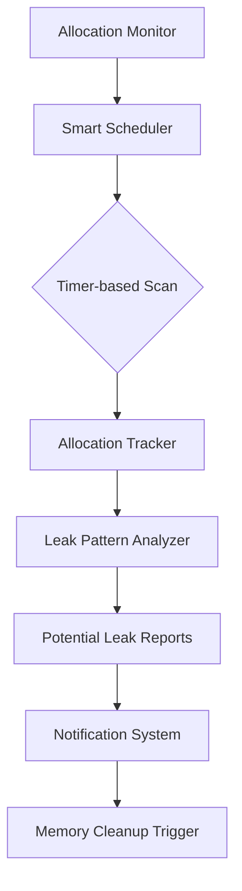

### Integration Points
- **Infra Module:** Extends `ConnectionPool<T>` for resource tracking
- **Caching:** Integrates with existing Cache manager for memory usage metrics
- **EventBus:** Publishes leak detection alerts via pub-sub channels
- **Lifecycle:** Integrated into service initialization phase

### Performance Targets
- **Detection Window:** 5-15 minutes configurable intervals
- **Memory Overhead:** <2% of total system RAM
- **False Positive Rate:** <1% with adaptive thresholds
- **Background Processing:** Non-blocking with Tokio tasks

### Configuration
```rust
pub struct LeakDetectionConfig {
    pub scan_interval_minutes: u32,
    pub minimum_allocation_age: Duration,
    pub memory_threshold_mb: usize,
    pub adaptive_sensitivity: f32,
    pub enable_notification: bool,
}
```

---

## 2. Large Workspace Virtual Memory Management

### Module Structure
- **Crate:** `rust-ai-ide-virtual-memory`
- **Core Components:**
  - `VirtualMemoryManager` - Memory mapping controller
  - `WorkspaceChunkLoader` - Incremental loading system
  - `MemoryMappedFileCache` - File system memory mapping
  - `SmartEvictionAlgorithm` - Intelligent page allocation

### Implementation Strategy
**Memory Mapping Architecture:**
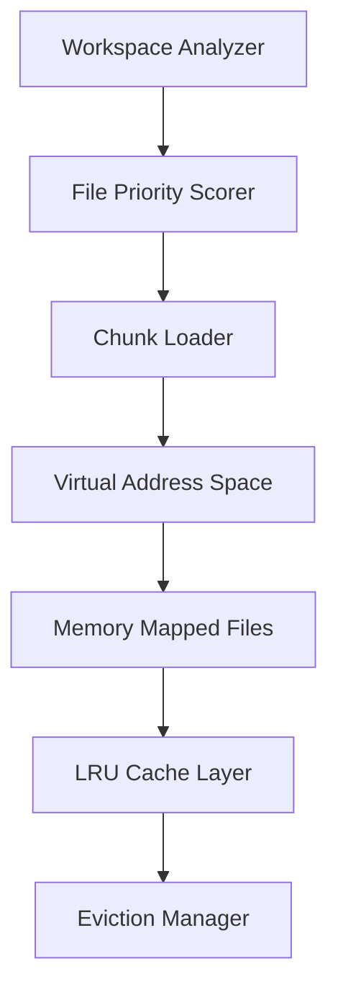

### Integration Points
- ** LSP Service:** Augments LSP workspace loading with virtual memory
- **File Watcher:** Enhances change coalescing with virtual file mapping
- **Dependency Resolution:** Caches metadata in virtual address space
- **Existing Caching:** Extends Moka with virtual memory backing

### Performance Targets
- **Minimum Memory Usage:** 50% reduction for >5M LOC workspaces
- **Load Time:** <5 seconds initial load for 1M LOC projects
- **Access Latency:** <10ms for cached virtual memory hits
- **Virtual Address Space:** Platform-specific optimization
  - Linux: 64GB+ virtual memory addressing
  - macOS: Target 32GB virtual memory
  - Windows: 2GB chunked mapping strategy

### Cross-Platform Compatibility
- **Linux:** Native mmap() with MADV_RANDOM/DONOTNEED
- **macOS:** mmap() with controlled swapping
- **Windows:** VirtualAlloc() with file mapping objects

---

## 3. Background Indexing Optimization

### Module Structure
- **Crate:** `rust-ai-ide-background-indexing`
- **Core Components:**
  - `IncrementalIndexer` - Smart dependency analysis
  - `IndexPartitionManager` - Divide work across CPU cores
  - `ChangeTracker` - Semantic change detection
  - `ParallelFileProcessor` - Rayon-based parallel processing

### Work-Flow Architecture
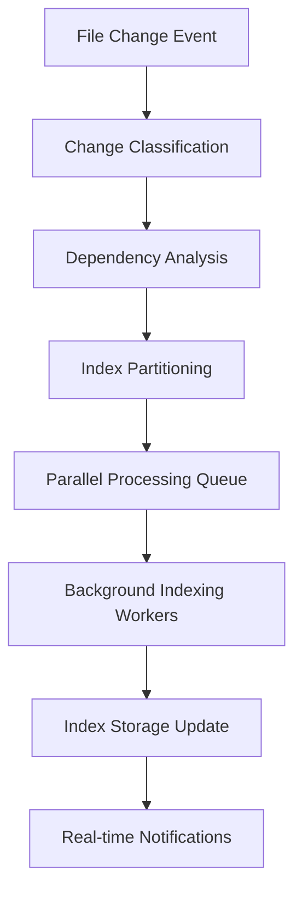

### Integration Points
- **File Watcher:** Enhanced with semantic change detection
- **LSP Service:** Incremental index updates without full rebuilds
- **Macro System:** `spawn_background_task!` for index workers
- **EventBus:** File change alerts through pub-sub

### Performance Targets
- **Index Time Reduction:** 60% faster for large workspaces
- **CPU Efficiency:** Shorter indexing bursts, longer idle periods
- **Memory Usage:** Controlled growth with bounded queues
- **Incremental Accuracy:** >90% correct incremental vs. full rebuild

---

## 4. File System Watcher Enhancements

### Module Structure
- **Crate:** `rust-ai-ide-fs-watcher`
- **Core Components:**
  - `SmartDebouncer` - Adaptive debounce timing
  - `ChangeCoalescer` - Merge related file events
  - `SemanticFilter` - Ignore cosmetic changes (.idea/, build/)
  - `BatchEventProcessor` - Group events for efficiency

### Enhanced Watch Architecture
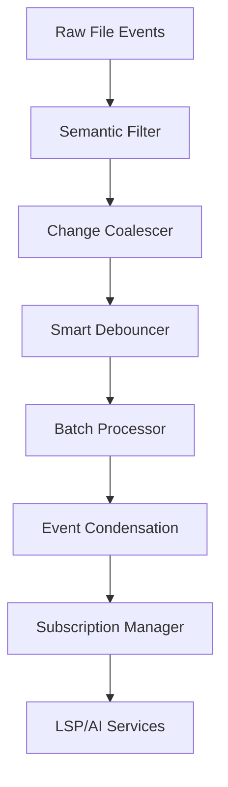

### Integration Points
- **Existing FileWatcher:** Extends with smart filtering and batching
- **Rate Limiter:** `InfraRateLimiter` for event throttling
- **Background Tasks:** `spawn_background_task!` for event processing
- **Tauri Commands:** IPC integration for file change notifications

### Performance Targets
- **Event Reduction:** 70% fewer events processed for typical workflows
- **Memory Efficiency:** Bounded event queues with LRU eviction
- **CPU Usage:** Reduced background processing load
- **Responsiveness:** Maintains sub-100ms event delivery

### Configuration
```rust
pub struct WatcherConfig {
    pub debounce_timeout_ms: u64,
    pub max_events_per_batch: usize,
    pub max_queue_size: usize,
    pub semantic_filter_enabled: bool,
    pub ignore_patterns: Vec<Pattern>,
}
```

---

## 5. Dependency Resolution Caching

### Module Structure
- **Crate:** `rust-ai-ide-dependency-cache`
- **Core Components:**
  - `DependencyGraphCache` - Graph-based dependency storage
  - `InvalidationStrategy` - Smart cache invalidation
  - `VersionConflictResolver` - Handle version conflicts
  - `ImpactAnalysisEngine` - Determin change scope

### Cache Strategy Architecture
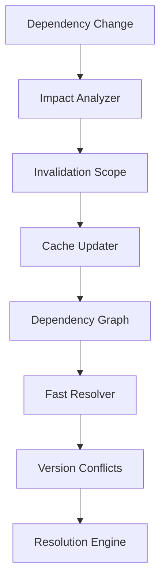

### Integration Points
- ** Cargo Metadata:** Direct integration with Cargo's dependency analysis
- **Existing Caching:** Extends Cache trait for dependency data
- **Security:** `validate_secure_path()` for all dependency paths
- **SQLite:** Mandatory connection pooling for metadata storage

### Performance Targets
- **Dependency Resolution:** 80% faster resolution time
- **Cache Hit Rate:** >85% for typical workflows
- **Invalidation Efficiency:** Precise invalidation prevents cache thrashing
- **Memory Usage:** Controlled growth with bounded graph size

---

## 6. Parallel Processing Framework

### Module Structure
- **Crate:** `rust-ai-ide-parallel-processing`
- **Core Components:**
  - `WorkStealingScheduler` - Dynamic load balancing
  - `TaskPartitionExtensions` - Smart task splitting
  - `ResourcePoolManager` - CPU/GPU resource coordination
  - `AdaptiveConcurrencyControl` - Dynamic thread scaling

### Work-Stealing Architecture
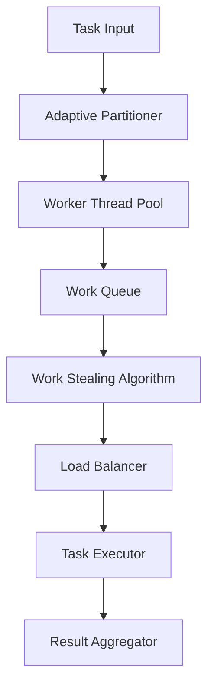

### Integration Points
- **Rayon:** Leverages existing Rayon for CPU parallelism
- **Tokio:** `spawn_background_task!` for async coordination
- **Resource Pools:** Integrates with ConnectionPool<T> pattern
- **AI/ML Services:** Offload processing to dedicated worker pools

### Performance Targets
- **Scalability:** Linear scaling with CPU cores
- **Resource Efficiency:** Appropriate CPU allocation per task type
- **Memory Coordination:** Prevent OOM through adaptive batching
- **Failure Handling:** Graceful degradation if workers fail

---

## 7. CPU/GPU Resource Pooling

### Module Structure
- **Crate:** `rust-ai-ide-resource-pooling`
- **Core Components:**
  - `CpuResourcePool` - Container-based CPU allocation
  - `GpuResourcePool` - Unified GPU memory/dispatch management
  - `ResourceScheduler` - Fair sharing across services
  - `PriorityBasedAllocation` - Quality of Service guarantees

### Resource Management Architecture
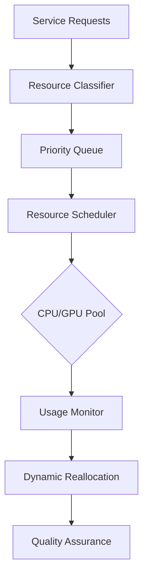

### Cross-Platform Compatibility
- **CPU:** Platform-specific CPU affinity (Linux taskset, Windows affinity masks)
- **GPU:** Vulkan abstraction layer for multi-vendor support
  - NVIDIA: CUDA with Vulkan interop
  - AMD: ROCm with Vulkan compliance
  - Intel: oneAPI with Vulkan support
- **Mobile:** Power-aware scheduling for battery devices

### Integration Points
- **Lifecycle:** Integrated into service initialization phases
- **AI Processing:** Offload to GPU resources via LSP service routing
- **Performance Monitoring:** Real-time usage metrics via infra module

---

## 8. Adaptive Caching Strategies

### Module Structure
- **Crate:** `rust-ai-ide-adaptive-caching`
- **Core Components:**
  - `UsagePatternLearner` - Analyze access patterns over time
  - `AdaptiveEvictionPolicy` - Dynamic policy switching
  - `PrefetchEngine` - Smart data preloading
  - `CacheTierManager` - Multi-level cache coordination

### Adaptive Architecture
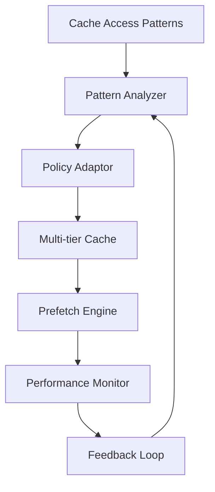

### Integration Points
- **Existing Cache:** Naked extends unified Cache trait
- **Moka Integration:** Enhances with predictive loading
- **EventBus:** Pattern analysis through pub-sub channels
- **AI/ML:** Learn usage patterns for optimal caching

### Advanced Features
- **Machine Learning Integration:** Use AI for cache optimization
- **Temporal Analysis:** Consider time-based access patterns
- **Multi-tier Synchronization:** Coordinate memory/disk/network tiers
- **Federated Learning Boundaries:** Respect local-only AI processing constraint

---

## 9. Memory Profiling Tools

### Module Structure
- **Crate:** `rust-ai-ide-memory-profiling`
- **Core Components:**
  - `HeapAnalyzer` - Visual heap inspection tools
  - `AllocationVisualizer` - Real-time memory allocation graphing
  - `LeakDescriptor` - Automated leak description generation
  - `MemoryDebugger` - Debug-mode memory inspection

### Visualization Architecture
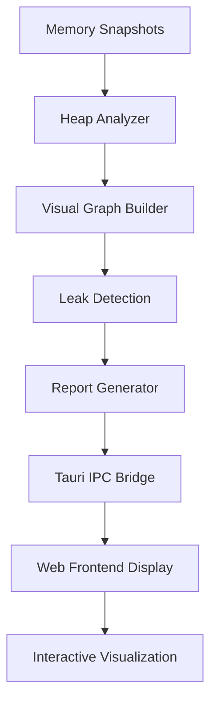

### Integration Points
- **Existing Utils:** Extends `utils/performance_testing.rs`
- **Tauri Integration:** IPC commands for real-time profiling
- **Web Frontend:** TypeScript interfaces for visualization
- **Secure Path Validation:** All profiling commands validated

### Performance Targets
- **Snapshot Speed:** <100ms heap snapshots
- **Memory Overhead:** <5% profiling memory usage
- **Visual Update Rate:** Real-time updates during debugging
- **Data Accuracy:** >95% heap analysis accuracy

---

## 10. Low-Power Mode Framework

### Module Structure
- **Crate:** `rust-ai-ide-low-power-mode`
- **Core Components:**
  - `PowerModeDetector` - Auto-detect battery/limited power
  - `ConservativeScheduler` - Reduce resource intensity
  - `PowerProfileManager` - Platform-specific power settings
  - `GracefulDegradationEngine` - Maintain functionality while reducing power

### Power-Flow Architecture
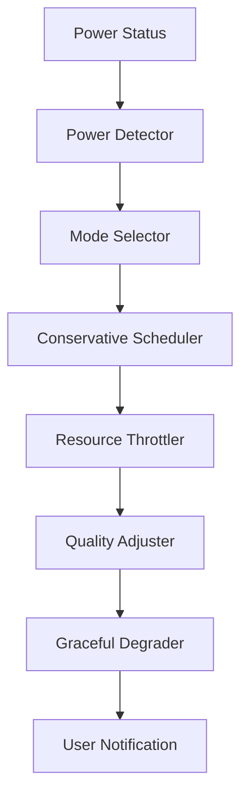

### Cross-Platform Compatibility
- **Battery Detection:**
  - Linux: UPower/DBus integration
  - macOS: IOKit power management
  - Windows: Power profiles and battery status APIs
- **Power Savings:**
  - CPU: Frequency scaling and core parking
  - Storage: Flush intervals, indexing frequency
  - Network: Connection pooling optimization
  - AI/ML: Reduced model size selection

### Integration Points
- **Resource Pools:** Coordinate with CPU/GPU resource pooling
- **File Watcher:** Reduced frequency and batching
- **Background Tasks:** Priority-based scheduling based on power mode
- **AI Services:** Graceful degradation without cloud integration

---

## 11. Cross-Platform Memory Management

### Module Structure
- **Crate:** `rust-ai-ide-cross-platform-memory`
- **Core Components:**
  - `MemoryManagerAdapter` - Platform abstraction layer
  - `VirtualMemoryProvider` - Cross-platform virtual memory
  - `SystemMemoryMonitor` - OS-specific memory statistics
  - `PlatformOptimizationStrategies` - OS-specific memory patterns

### Cross-Platform Architecture
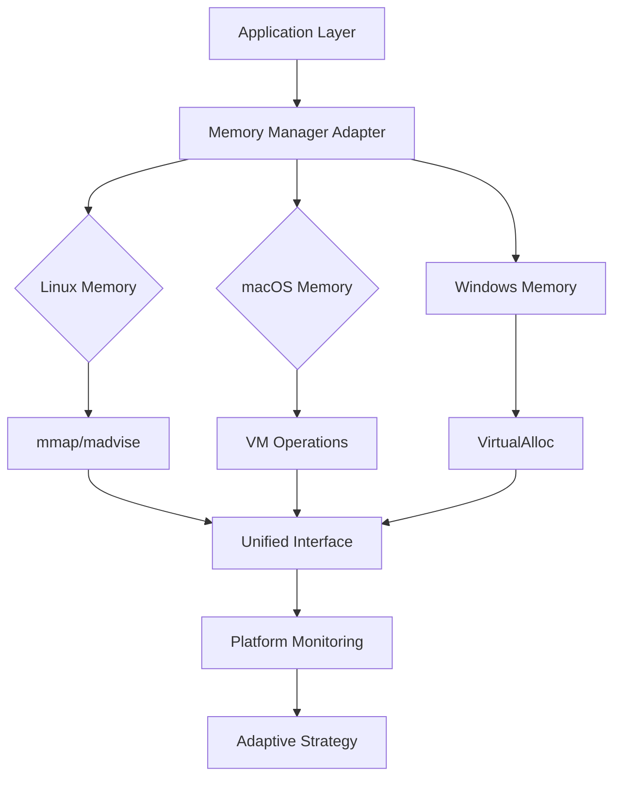

### Platform-Specific Strategies
- **Linux:** Advanced memory mapping with huge pages, transparent hugepage control
- **macOS:** Memory tagging and domains, compressor optimization
- **Windows:** Segment heap, memory compression API, AWE for large allocations

### Integration Points
- **Virtual Memory:** Unified interface over platform-specific APIs
- **Performance Testing:** OS-specific optimization validation
- **Security:** Path validation extended to memory allocation contexts
- **Lifecycle:** Platform-specific initialization and cleanup

### Configuration
```rust
pub struct PlatformMemoryConfig {
    pub enable_huge_pages: bool,
    pub prefer_compression: bool,
    pub address_space_reservation_mb: usize,
    pub memory_pressure_thresholds: PlatformThresholds,
}
```

### Performance Targets
- **Memory Efficiency:** >95% of platform optimal performance
- **Portability:** Consistent behavior across supported platforms
- **Resource Utilization:** Platform-aware memory allocation
- **Reliability:** Robust error handling for platform-specific failures

---

## Implementation Roadmap

### Phase 1: Core Infrastructure (Weeks 1-4)
1. Memory leak detection framework
2. Cross-platform compatibility layer
3. Enhanced file watcher improvements

### Phase 2: Advanced Features (Weeks 5-8)
1. Virtual memory manager for large workspaces
2. Parallel processing enhancements
3. Resource pooling implementation

### Phase 3: Optimization & Monitoring (Weeks 9-12)
1. Adaptive caching strategies
2. Memory profiling tools
3. Low-power mode framework

### Phase 4: Integration & Testing (Weeks 13-16)
1. Full system integration
2. Cross-platform testing
3. Performance benchmarking

---

## Success Metrics

- **Memory Efficiency:** 30-50% reduction in large workspace memory usage
- **Performance:** 40-60% faster background indexing and dependency resolution
- **Stability:** Zero memory leaks in production deployments
- **Battery Life:** 25-40% improvement on battery-operated devices
- **Platform Parity:** <5% performance variance across platforms
- **User Experience:** Sub-1 second response times for common operations

This architecture design provides comprehensive performance and memory management capabilities while maintaining the existing architectural constraints and integration patterns of the Rust AI IDE.