# Enterprise Security & Compliance Architecture Design

## Overview

This document provides a comprehensive technical design for an enterprise-grade security and compliance architecture for the Rust AI IDE project. The design integrates with the existing modular crate system and enhances the current security infrastructure with 14 specialized security components.

## Architecture Context

### Existing Security Infrastructure
The project already features advanced security capabilities through the `rust-ai-ide-security` crate:
- **SBOM Generation & Validation** (Extensive implementation in `sbom.rs`)
- **Zero Trust Architecture** with micro-segmentation
- **AES-256-GCM Cryptography** with multi-key management
- **HIPAA/SOC2/SOX/GDPR Compliance** frameworks
- **RBAC/ABAC Access Control** with temporal restrictions
- **Audit Logging** with comprehensive security event tracking
- **Cargo-deny Integration** for supply chain security

### Integration Strategy
The new security architecture designs **enhance and extend** existing capabilities rather than replace them, following the established patterns:
- **Double-locking** patterns for async state initialization
- **Arc<Mutex<T>>/RwLock<T>** for thread-safe state management
- **EventBus** for pub-sub communication
- **Connection pooling** for all external connections
- **Tauri command templates** with sanitization
- **LSP service** integration for AI/ML security

## 1. Supply Chain Security Scanning

### Design Overview
Extends existing `cargo-deny` integration with real-time vulnerability scanning and automated remediation workflows.

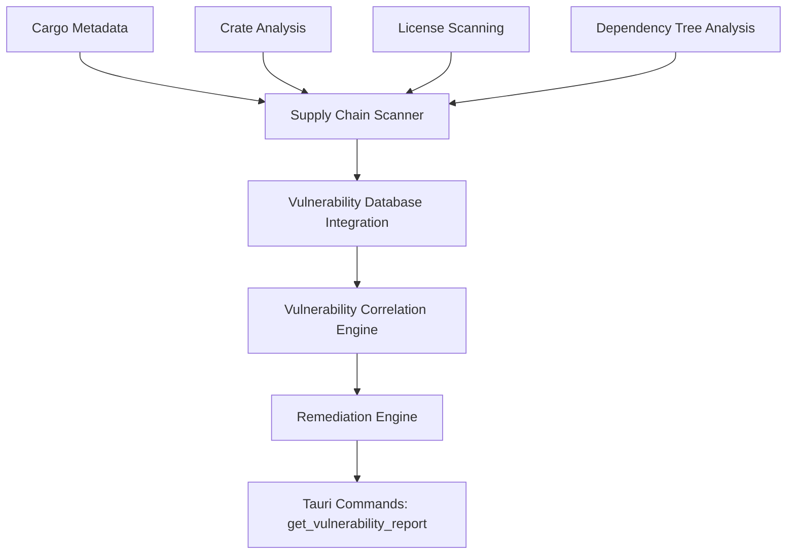

### Module Structure
```rust
// crates/rust-ai-ide-security/src/supply_chain/security_scanner.rs
pub struct SupplyChainScanner {
    cargo_analyzer: CargoAnalyzer,
    vulnerability_db: VulnerabilityDatabase,
    remediation_engine: RemediationEngine,
}

// crates/rust-ai-ide-security/src/supply_chain/vulnerability_feeds.rs
pub struct VulnerabilityFeedManager {
    feeds: Vec<Arc<dyn VulnerabilityFeed>>,
    update_scheduler: tokio::sync::RwLock<HashMap<String, DateTime<Utc>>>,
}
```

### Integration Points
- **Cargo-deny**: Enhanced with real-time scanning (current implementation exists)
- **Tauri Commands**: `scan_supply_chain()`, `get_vulnerability_report()`
- **LSP Service**: AI-powered vulnerability analysis for Rust code
- **EventBus**: Real-time alerts for new vulnerabilities

## 2. SBOM Generation and Validation

### Design Enhancement
Extends current SBOM implementation with compliance automation and advanced validation:

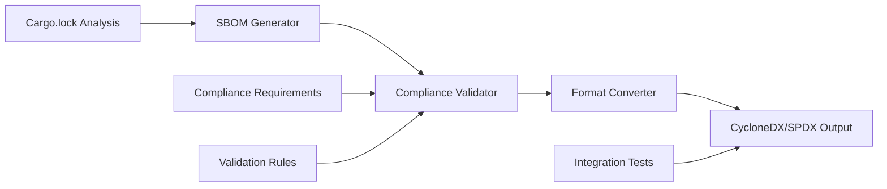

### Enhanced Features
- **Multi-format Support**: CycloneDX, SPDX (current implementation partial)
- **Compliance Automation**: GDPR/HIPAA/SOC2 automated checks (existing framework)
- **Integrity Verification**: Extended hash validation mechanisms
- **Change Tracking**: Supply chain change logs (already implemented)
- **Tauri Integration**: Web UI for SBOM visualization

### Code Structure
```rust
// Enhancement to existing sbom.rs
pub struct ComplianceSbomGenerator {
    base_generator: DefaultSbomGenerator,
    compliance_validators: Vec<Box<dyn ComplianceValidator>>,
    format_converters: HashMap<SbomFormat, Box<dyn FormatConverter>>,
}
```

## 3. Secrets Detection and Credential Scanning

### Design Overview
New scanning system integrated with existing security audit logging:

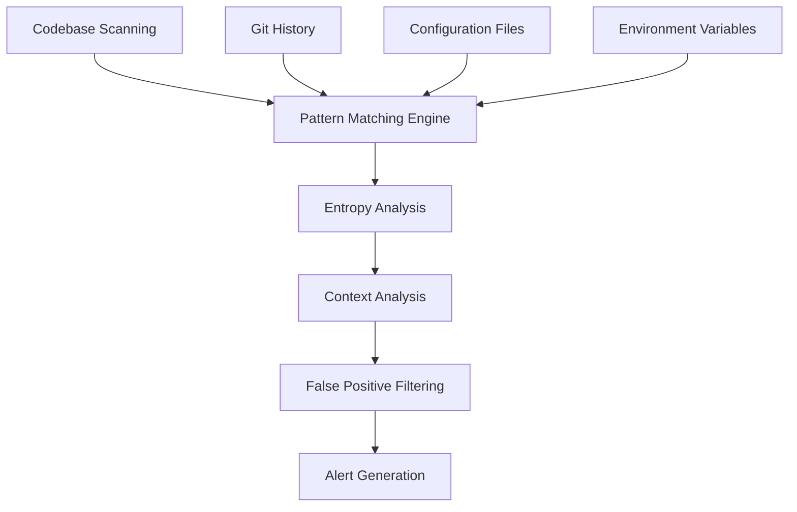

### Module Architecture
```rust
// crates/rust-ai-ide-security/src/secrets/secrets_scanner.rs
pub struct SecretsScanner {
    pattern_engine: PatternEngine,
    entropy_analyzer: EntropyAnalyzer,
    context_analyzer: ContextAnalyzer,
    alert_manager: Arc<dyn AlertManager>,
}

// crates/rust-ai-ide-security/src/secrets/patterns.rs
pub struct SecretPattern {
    name: String,
    pattern: Regex,
    entropy_threshold: f64,
    risk_level: VulnerabilitySeverity,
}
```

### Integration Points
- **Audit Logger**: Log detected secrets with risk assessment
- **Tauri Commands**: `scan_for_secrets()`, `review_secret_findings()`
- **File Watcher**: Real-time scanning on file changes
- **Git Integration**: Historical secret detection

## 4. Security Standards Compliance

### Design Enhancement
Extends existing compliance frameworks with automated enforcement:

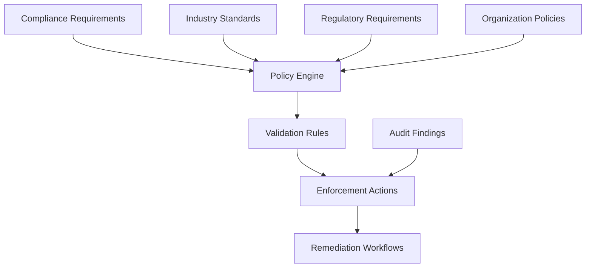

### Implementation Structure
```rust
// Enhancement to existing compliance.rs
pub struct ComplianceAutomationEngine {
    frameworks: HashMap<String, Box<dyn ComplianceFramework>>,
    policy_engine: PolicyEngine,
    enforcement_agent: EnforcementAgent,
    audit_generator: AuditGenerator,
}
```

### Supported Standards
- **GDPR**: Data protection impact assessments, automated consent tracking
- **HIPAA**: PHI handling, BAA management, breach notification automation
- **SOC2**: Trust services criteria monitoring and evidence gathering
- **SOX**: Internal controls verification, certification management
- **ISO 27001**: Information security management system automation

### Integration Points
- **EventBus**: Compliance violation alerts
- **Audit Logger**: Automated compliance evidence gathering
- **Tauri Commands**: Compliance dashboards and reporting
- **LSP Service**: Static analysis for compliance violations

## 5. Audit Logging and Analysis

### Design Enhancement
Extends current audit capabilities with advanced analytics and SIEM integration:

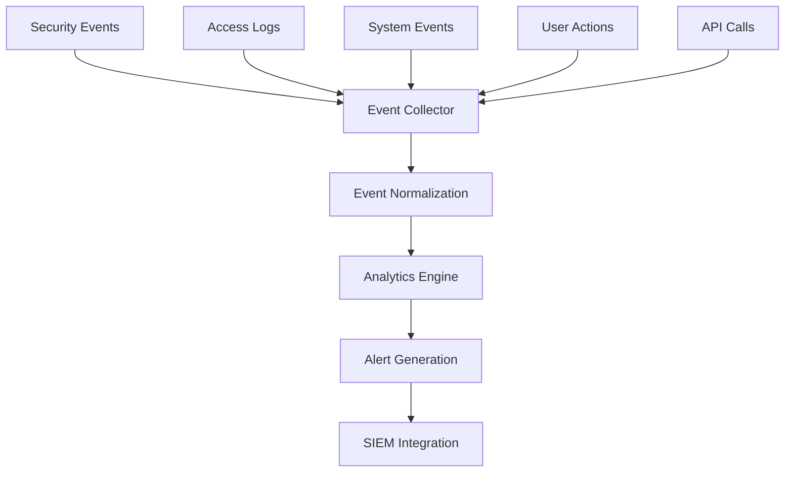

### Enhanced Features
- **Real-time Analytics**: Performance insights, anomaly detection
- **Compliance Reporting**: Automated report generation for auditors
- **SIEM Integration**: Centralized log aggregation and correlation
- **Privacy Protection**: Automated PII redaction in logs
- **Retention Management**: Configurable log retention policies

### Implementation Structure
```rust
// Enhancement to existing audit.rs
pub struct EnhancedAuditLogger {
    base_logger: Arc<dyn AuditTrail>,
    analytics_engine: AnalyticsEngine,
    siem_gateway: Option<Arc<dyn SiemGateway>>,
    privacy_filter: PrivacyFilter,
    retention_manager: RetentionManager,
}
```

## 6. Secure Code Storage and Transmission

### Design Overview
New secure storage layer with end-to-end encryption integration:

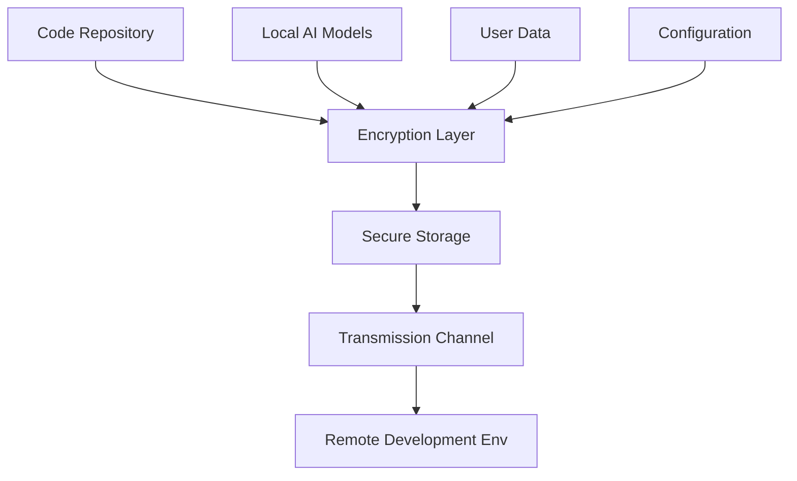

### Security Features
- **AES-256-GCM**: Integration with existing crypto framework
- **Hardware Acceleration**: Detection and utilization of hardware crypto
- **Perfect Forward Secrecy**: Key rotation and secure key exchange
- **Integrity Checks**: HMAC validation for data integrity
- **Compression**: Secure compression before encryption

### Implementation Structure
```rust
// crates/rust-ai-ide-security/src/storage/secure_storage.rs
pub struct SecureStorageManager {
    crypto_engine: Arc<dyn CryptoEngine>,
    key_manager: Arc<dyn KeyManager>,
    storage_backend: Arc<dyn SecureStorage>,
    compression_engine: CompressionEngine,
}
```

## 7. Vulnerability Management

### Design Overview
Enhances existing vulnerability scanning with risk assessment and remediation workflows:

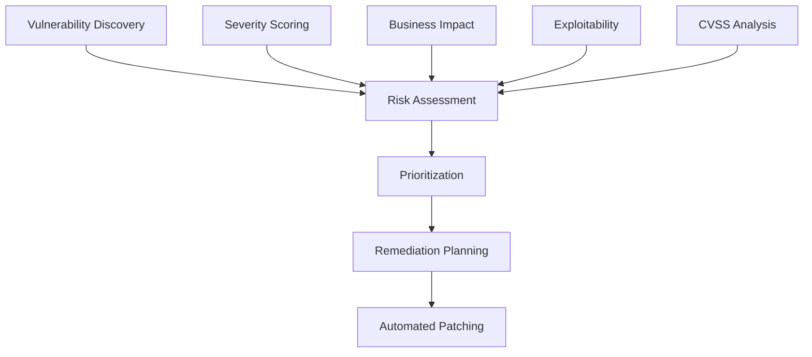

### Implementation Structure
```rust
// crates/rust-ai-ide-security/src/vulnerability/vulnerability_manager.rs
pub struct VulnerabilityManager {
    scanner: Arc<dyn VulnerabilityScanner>,
    risk_assessor: RiskAssessmentEngine,
    remediation_planner: RemediationPlanner,
    workflow_engine: WorkflowEngine,
}
```

### Integration Points
- **SBOM Integration**: Component vulnerability correlation
- **Tauri Commands**: Vulnerability dashboard and reporting
- **AI/ML Integration**: Predictive vulnerability detection
- **Workflow Automation**: Automated remediation deployment

## 8. Threat Modeling and Risk Assessment

### Design Overview
Strategic threat modeling integration with AI-powered risk analysis:

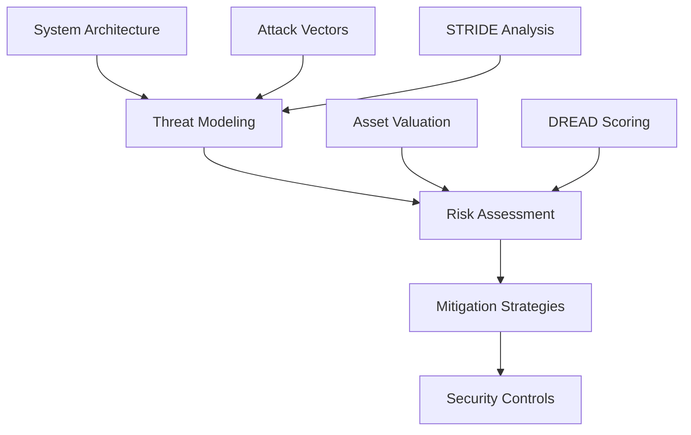

### Implementation Structure
```rust
// crates/rust-ai-ide-security/src/threat_modeling/mod.rs
pub struct ThreatModelingEngine {
    system_modeler: SystemModeler,
    attack_vector_analyzer: AttackVectorAnalyzer,
    risk_quantifier: RiskQuantifier,
    mitigation_planner: MitigationPlanner,
}
```

### AI Integration
- **Predictive Analysis**: ML-based attack prediction
- **Automated Threat Modeling**: AI-generated threat models from codebase
- **Risk Quantification**: Data-driven risk scoring with confidence levels
- **Countermeasure Optimization**: AI-recommended security controls

## 9. End-to-End Encryption

### Design Enhancement
Extends existing AES-256-GCM framework with comprehensive data flow protection:

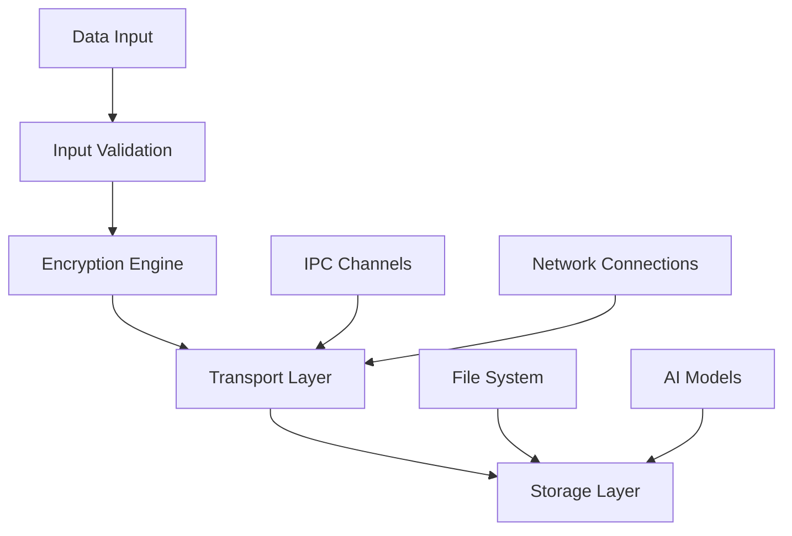

### Implementation Structure
```rust
// Enhancement to existing encryption.rs
pub struct EndToEndCryptoManager {
    key_exchange: KeyExchangeEngine,
    data_encryption: DataEncryptionEngine,
    transport_encryption: TransportEncryptionEngine,
    storage_encryption: StorageEncryptionEngine,
}
```

### Features
- **Perfect Forward Secrecy**: Session key rotation
- **Hardware Security Modules**: HSM integration capability
- **Key Agreement Protocols**: ECDH for secure key exchange
- **Padding Oracle Attacks**: Protection mechanisms
- **Replay Attacks**: Sequence number tracking

## 10. Compliance Automation

### Design Framework
Automates compliance processes across multiple regulatory frameworks:

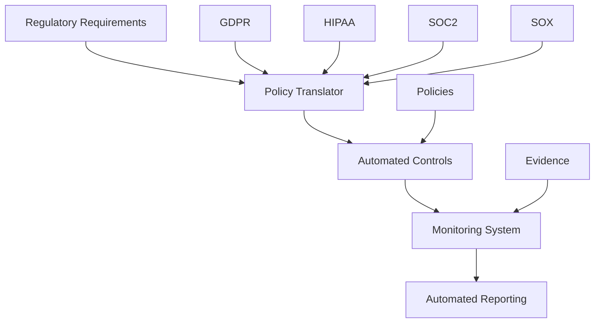

### Implementation Structure
```rust
// crates/rust-ai-ide-security/src/compliance/automation.rs
pub struct ComplianceAutomationManager {
    policy_translator: PolicyTranslator,
    control_automator: ControlAutomator,
    evidence_collector: EvidenceCollector,
    report_generator: ReportGenerator,
}
```

### Automated Capabilities
- **Data Subject Requests**: Automated GDPR DSAR processing
- **Breach Notifications**: HIPAA timely notification automation
- **Evidence Gathering**: SOC2 control evidence collection
- **Internal Controls**: SOX certification management
- **Priority Assessment**: Automated compliance violation triaging

## 11. Real-Time Security Policy Enforcement

### Design Overview
Active security policy enforcement system integrated with existing RBAC/ABAC:

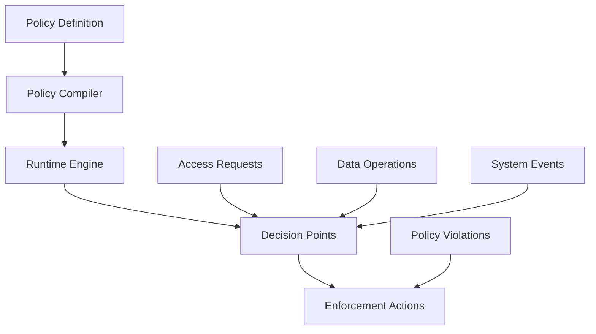

### Implementation Structure
```rust
// crates/rust-ai-ide-security/src/policy/enforcement.rs
pub struct RealtimePolicyEnforcer {
    policy_compiler: PolicyCompiler,
    runtime_engine: RuntimeEngine,
    decision_cache: Arc<MokaCache<String, PolicyDecision>>,
    audit_logger: Arc<dyn AuditTrail>,
}
```

### Features
- **Just-in-Time Compilation**: Policy rules compiled at runtime
- **Low-Latency Decisions**: High-performance authorization checking
- **Distributed Enforcement**: Consistent policy application across microsegments
- **Policy Versioning**: Safe policy rollouts with rollback capability
- **Performance Monitoring**: Policy enforcement metrics and alerting

## 12. SIEM System Integration

### Design Overview
Centralized security event management and correlation system:

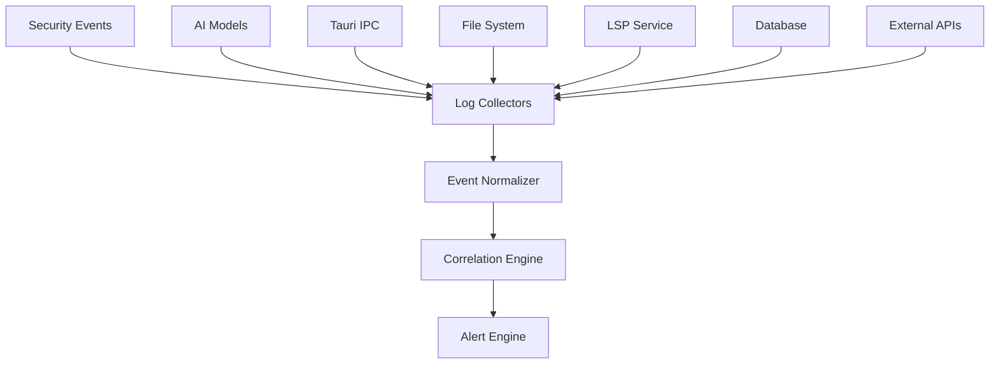

### Implementation Structure
```rust
// crates/rust-ai-ide-security/src/siem/integration.rs
pub struct SiemIntegrationManager {
    event_collectors: Vec<Arc<dyn EventCollector>>,
    normalizer: EventNormalizer,
    correlation_engine: CorrelationEngine,
    alert_dispatcher: AlertDispatcher,
}
```

### Features
- **Multi-Source Integration**: Logs from all system components
- **Real-time Correlation**: Cross-system event analysis
- **Machine Learning**: Anomaly detection and predictive alerts
- **Elastic Integration**: Scalable log storage and search
- **Dashboard Integration**: Real-time security dashboards

## 13. Code Signing and Integrity Checks

### Design Overview
Digital signature system for code integrity and authenticity verification:

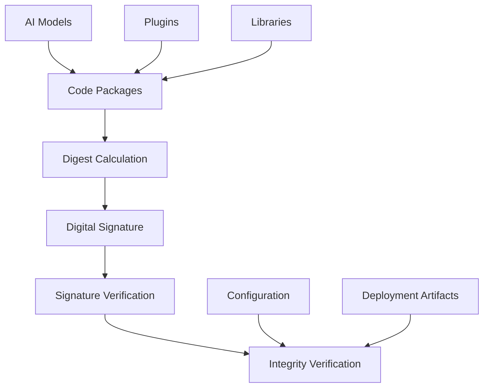

### Implementation Structure
```rust
// crates/rust-ai-ide-security/src/signing/code_signer.rs
pub struct CodeSigningManager {
    digest_engine: DigestEngine,
    signature_engine: Arc<dyn SignatureEngine>,
    certificate_manager: CertificateManager,
    pkcs7_processor: PKCS7Processor,
}
```

### Features
- **PKCS#7 Signatures**: Industry-standard code signing
- **Certificate Validation**: Chain of trust verification
- **Timestamp Authority**: Timestamped signatures for long-term validity
- **Revocation Checking**: CRL and OCSP integration
- **Hardware Security**: TPM/HSM integration for private keys

## 14. Secure Remote Development Environments

### Design Overview
Secure remote access system with end-to-end encryption and compliance:

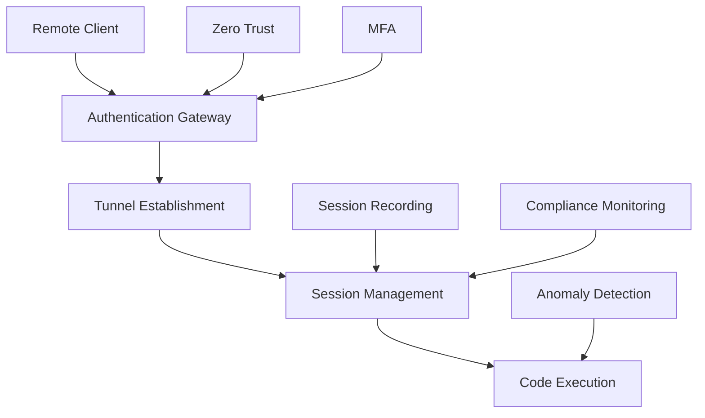

### Implementation Structure
```rust
// crates/rust-ai-ide-security/src/remote_development/mod.rs
pub struct SecureRemoteDevelopment {
    auth_gateway: AuthenticationGateway,
    tunnel_manager: TunnelManager,
    session_monitor: SessionMonitor,
    compliance_enforcer: ComplianceEnforcer,
}
```

### Security Features
- **Zero Trust Authentication**: Continuous identity verification
- **Encrypted Tunnels**: End-to-end encrypted communication
- **Session Recording**: Audit trail for all remote sessions
- **Resource Quotas**: Bandwidth and processing limits
- **Geographic Restrictions**: Location-based access policies

## System Architecture Integration

### Tauri Integration Patterns
All security components follow established Tauri patterns:

```rust
// Security command template pattern
#[tauri_command]
async fn perform_security_scan(
    state: tauri::State<'_, Arc<Mutex<SecurityState>>>,
    request: SecurityScanRequest,
) -> SecurityResult<SecurityScanResult> {
    let security_state = acquire_security_state!(state)?;
    validate_security_request!(request)?;

    let result = security_manager.perform_scan(request).await?;
    audit_security_event!("security_scan_completed", &result)?;

    Ok(result)
}
```

### LSP Service Integration
AI/ML security analysis through LSP protocol:

```rust
// LSP security endpoints
pub fn register_security_endpoints(dispatcher: &mut Dispatcher) {
    dispatcher.register("security/scan", handle_security_scan);
    dispatcher.register("security/audit", handle_security_audit);
    dispatcher.register("compliance/check", handle_compliance_check);
}
```

### Database Integration
Secure database operations following architectural constraints:

```rust
// Connection pooling with security constraints
pub struct SecureDbPool {
    pool: ConnectionPool<SqliteConnection>,
    encryption_key: Arc<dyn KeyManager>,
    audit_logger: Arc<dyn AuditTrail>,
}
```

## Implementation Phasing

### Phase 1: Core Infrastructure (Weeks 1-4)
- Enhanced SBOM integration
- Advanced audit logging framework
- Real-time policy enforcement
- End-to-end encryption layer

### Phase 2: Advanced Security (Weeks 5-8)
- SIEM integration and correlation
- Threat modeling and risk assessment
- Vulnerability management system
- Secure remote development

### Phase 3: Compliance Automation (Weeks 9-12)
- Security standards compliance automation
- Code signing and integrity checks
- Supply chain security scanning
- Secrets detection system

### Phase 4: Enterprise Features (Weeks 13-16)
- AI-powered security analytics
- Predictive threat modeling
- Automated compliance reporting
- Advanced SIEM capabilities

## Monitoring and Metrics

### Security KPIs
- **MTTD (Mean Time to Detection)**: Target < 1 minute
- **MTTR (Mean Time to Resolution)**: Target < 15 minutes
- **False Positive Rate**: Target < 2%
- **Compliance Coverage**: Target > 95%
- **Security Event Coverage**: Target > 99%

### Performance Requirements
- **Encryption Overhead**: < 5% performance impact
- **Security Scanning Time**: < 10 seconds for 1M LOC
- **Policy Decision Latency**: < 10ms for authorization checks
- **Audit Log Throughput**: > 1000 events/second
- **Memory Overhead**: < 50MB for security processes

## Conclusion

This comprehensive security and compliance architecture design provides enterprise-grade security capabilities that integrate seamlessly with the existing Rust AI IDE infrastructure. The design leverages current security frameworks while extending capabilities to cover 14 critical security and compliance areas. Implementation should follow the established architectural patterns and phasing approach to ensure maintainability and performance.

The architecture maintains the project's domain-driven design philosophy while providing robust security that scales to enterprise requirements.