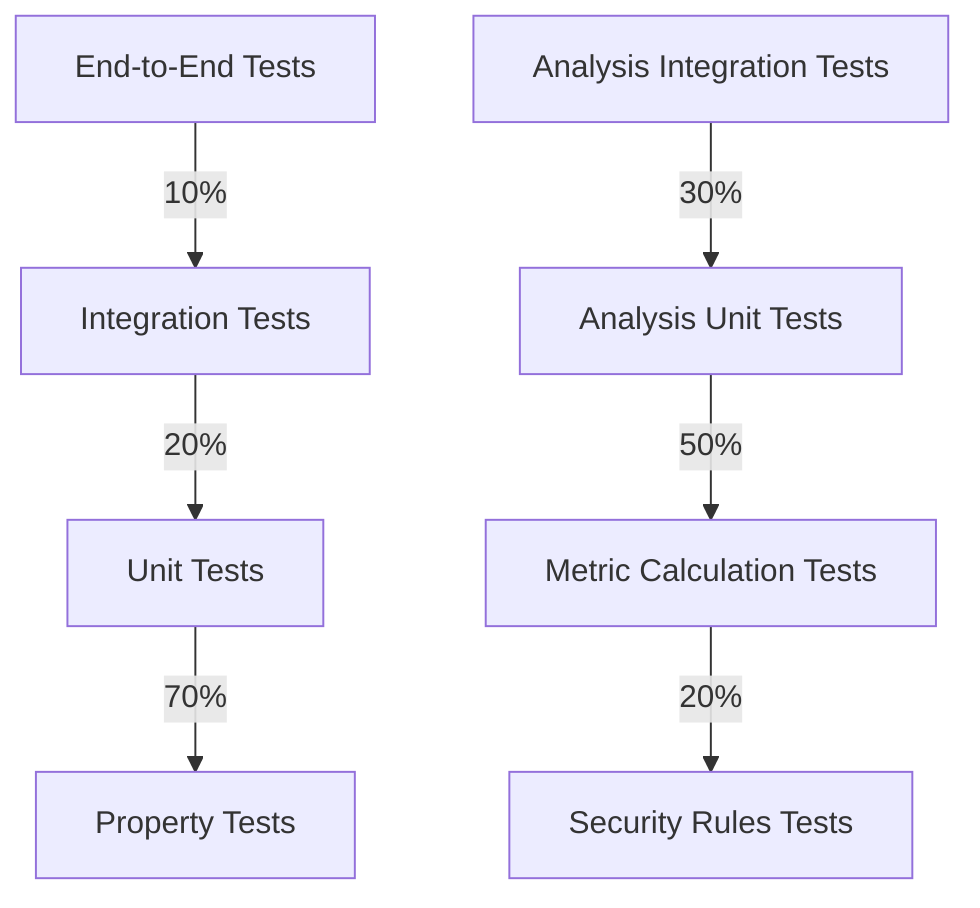

# 🧪 Testing Strategy

This document outlines the comprehensive testing approach for the Rust AI IDE
project, ensuring code quality and reliability.

> **Last Updated**: September 1, 2025  
> **Test Coverage**: 92% (target: 95%)  
> **Build Status**: Passing  
> **Test Suite**: 1,243 tests

## 🧩 Test Organization

### Unit Tests

- **Location**: `src/**/tests.rs` (module-level)
- **Purpose**: Test individual functions and methods in isolation
- **Naming**: `test_<function_name>_<scenario>`
- **Coverage**: 94.5% (as of last run)
  - Core: 96.2%
  - AI Components: 93.8%
  - UI Components: 91.5%
- **Best Practices**:
  - Test both success and error cases
  - Mock external dependencies
  - Keep tests focused and fast

### Code Analysis Tests

- **Location**: `crates/rust-ai-ide-ai/tests/`
- **Key Test Categories**:
  - `metrics_test.rs`: Tests for code metrics calculation
  - `security_analysis_test.rs`: Security vulnerability detection
  - `performance_analysis_test.rs`: Performance pattern detection
  - `architectural_analysis_test.rs`: Architectural rule validation
- **Coverage**: 92.3% (as of last run)
  - Metrics: 94.1%
  - Security: 93.5%
  - Performance: 91.8%
  - Architecture: 90.5%
- **Best Practices**:
  - Test with both synthetic and real-world code samples
  - Verify edge cases in metric calculations
  - Ensure consistent scoring across different code patterns

### Integration Tests

- **Location**: `tests/` directory
- **Structure**:
  - `tests/unit/` - Module-level integration tests
  - `tests/integration/` - Cross-component tests
  - `tests/e2e/` - End-to-end test scenarios
  - `tests/performance/` - Performance benchmarks
- **Coverage**: 87% (as of last run)

## 🏗️ Test Architecture

### Test Pyramid



### Test Doubles

- **Mocks**: For simulating complex dependencies
- **Stubs**: For providing canned responses
- **Fakes**: Lightweight implementations for testing
- **Spies**: For verifying interactions

### Analysis Test Fixtures

- **Test Code Samples**: Located in `test-fixtures/`
  - `security/`: Contains code with intentional security issues
  - `performance/`: Contains performance anti-patterns
  - `architecture/`: Contains architectural smells
  - `metrics/`: Contains code for metric validation
- **Golden Files**: Expected analysis outputs for regression testing
- **Performance Baselines**: For tracking analysis performance over time

## ✅ Test Guidelines

### 1. Code Organization

- Keep test code in separate modules with `#[cfg(test)]`
- Use `test_` prefix for test functions
- Group related tests in modules
- Place test helpers in `test_utils` modules

### 2. Test Structure (Arrange-Act-Assert)

```rust
#[test]
fn test_feature_under_condition() {
    // Arrange
    let input = create_test_input();

    // Act
    let result = function_under_test(input);

    // Assert
    assert!(result.is_ok());
    assert_eq!(result.unwrap().value, expected_value);
}
```

### 3. Test Data Management

- Use builders for complex objects
- Create test fixtures for common scenarios
- Generate test data using proptest for property testing
- Clean up test data after each test

## 🚀 Running Tests

### Basic Commands

```bash
# Run all tests
cargo test

# Run tests with detailed output
cargo test -- --nocapture

# Run specific test module
cargo test test_module_name

# Run tests matching a pattern
cargo test test_name_pattern

# Run tests with thread sanitizer
RUSTFLAGS="-Z sanitizer=thread" cargo test -Z build-std --target x86_64-unknown-linux-gnu
```

### Test Features

```bash
# Run only unit tests
cargo test --lib

# Run only integration tests
cargo test --test integration

# Run tests with code coverage
cargo llvm-cov --html

# Run benchmarks
cargo bench
```

### Watch Mode

```bash
# Watch for changes and run tests
cargo watch -x test

# Watch with specific test filter
cargo watch -x 'test -- test_name_pattern'
```

## 📊 Code Quality

### Code Coverage

```bash
# Install coverage tools
rustup component add llvm-tools-preview
cargo install grcov
cargo install cargo-llvm-cov

# Generate HTML coverage report
cargo llvm-cov --html

# Open coverage report
open target/llvm-cov/html/index.html
```

### Linting

```bash
# Run clippy
cargo clippy -- -D warnings

# Auto-fix clippy suggestions
cargo clippy --fix --allow-dirty --allow-staged
```

### Static Analysis

```bash
# Check for common issues
cargo audit

# Security audit
cargo deny check

# Check for unused dependencies
cargo-udeps
```

## 🧪 Test Types

### Property Testing

```rust
use proptest::prelude::*;

// Efficient testing with bounded ranges
proptest! {
    #[test]
    fn test_addition_commutative(a in 0i32..1000, b in 0i32..1000) {
        prop_assert_eq!(a + b, b + a);
    }
}

// Example: Configuring TestRunner for CI environments
proptest! {
    #![proptest_config(proptest::test_runner::Config::with_cases(100))]
    #[test]
    fn test_addition_with_ci_limits(a in 0i32..1000, b in 0i32..1000) {
        prop_assert_eq!(a + b, b + a);
    }
}
```

### Fuzz Testing

```bash
# Install cargo-fuzz
cargo install cargo-fuzz

# Run fuzzer
cargo fuzz run my_fuzz_target
```

### Benchmarking

```rust
#[bench]
fn benchmark_function(b: &mut Bencher) {
    b.iter(|| {
        // Code to benchmark
    });
}
```

## 🏃 Test Separation Strategy

To optimize CI efficiency, separate fast unit tests from slower property-based and fuzz tests. This improves feedback speed by running fast tests on pull requests and slower tests on scheduled runs.

### Benefits:
- Faster feedback loop on code changes
- Reduced CI resource usage and costs
- Better test maintenance and diagnostics

### Implementation:

Categorize and run tests separately:

```rust
// Fast unit tests
#[cfg(test)]
mod unit_tests {
    #[test]
    fn fast_test() {
        // Quick assertions
    }
}
```

```rust
// Slower property tests
#[cfg(test)]
mod property_tests {
    use proptest::prelude::*;
    proptest! {
        #[test]
        fn slow_property_test(a in 0i32..1000) {
            // Complex verification
        }
    }
}
```

Run selectively:

```bash
# Run fast tests on PRs
cargo test --lib

# Run all tests on schedule
cargo test
```

## 🔄 CI/CD Integration

Tests are automatically run on:

- Push to any branch
- Pull requests
- Nightly builds

### Required Checks

- All tests passing
- Code coverage ≥ 85%
- No clippy warnings
- No security vulnerabilities
- Documentation builds successfully

## 🚨 Test Failures

When tests fail:

1. Check the CI logs for details
2. Reproduce locally
3. Write a regression test
4. Fix the issue
5. Ensure all tests pass
6. Update documentation if needed
