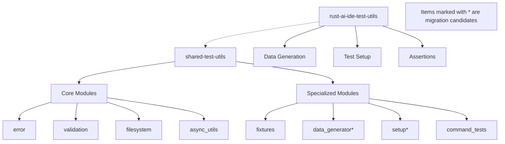

# Test Utilities Consolidation Architecture

## Executive Summary

This document outlines the consolidation strategy for the two test utility crates in the Rust AI IDE workspace: `shared-test-utils` and `rust-ai-ide-test-utils`. The analysis reveals clear functional overlaps with `shared-test-utils` serving as the primary, comprehensive testing utility crate while `rust-ai-ide-test-utils` is already deprecated and contains additional overlapping functionality.

## Assessment of Current State

### shared-test-utils

**Architecture:**
- 17 modules including error handling, validation, filesystem operations, async utilities, test fixtures, and Tauri command testing
- Well-structured and documented with comprehensive README
- Core dependencies: tokio, tempfile, tauri, serde, futures, async-trait
- Purpose: Comprehensive testing utilities for Rust AI IDE workspace

**Key Features:**
- TempWorkspace: Managed temporary directories with auto-cleanup
- Async testing utilities: timeout handling, concurrent execution
- Test fixtures and builders
- Tauri command mocking framework
- Integration testing contexts
- Test generation utilities

### rust-ai-ide-test-utils

**Architecture:**
- 2 source files (lib.rs, helpers.rs) with 8 optional modules
- Already deprecated in Cargo.toml description
- Feature-gated dependencies for optional capabilities
- Depends on shared-test-utils

**Key Features:**
- Helpers with inline functions: data generation, assertions, test setup
- Feature modules: performance, filesystem, async_util, type_helpers, random_data
- TestConfig struct for environment configuration
- TestDir with Drop trait for temporary directories
- Sample file/project creation utilities

## Duplication Analysis

### Overlapping Functionality

| Functionality | shared-test-utils | rust-ai-ide-test-utils |
|---------------|------------------|-------------------------|
| Temp Directory Creation | TempWorkspace module | create_temp_dir() function |
| File/Project Setup | fixtures module | create_sample_* functions |
| Async Timeouts | with_timeout, AsyncContext | wait_with_timeout() |
| Random Data Generation | - | data_generator module |
| Assertions | validation module | assertions module |
| Test Configuration | - | TestConfig struct |

### Unique Features

**shared-test-utils unique:**
- Tauri command testing framework
- Comprehensive fixture presets
- Test generation with multiple languages
- Integration testing context
- Test harness factories
- Compatibility layer
- Unified test generator

**rust-ai-ide-test-utils unique:**
- Inline data generation functions (random_string, random_vec)
- TestDir with cleanup (similar to TempWorkspace)
- Sample compilation error generation
- TestableService trait
- Feature-gated optional modules

## Recommended Consolidation Strategy

### Approach: Unitary Consolidation

Consolidate all functionality into `shared-test-utils` as the single, comprehensive test utility crate. Leverage its existing modular architecture to absorb unique features from `rust-ai-ide-test-utils`.

**Rationale:**
- shared-test-utils has established structure and documentation
- rust-ai-ide-test-utils is already deprecated and smaller
- Better alignment with workspace consolidation goals
- Maintains backward compatibility through migration

### Architecture Diagram



## Migration Plan

### Phase 1: Feature Migration

1. **Data Generator Module**
   - Source: rust-ai-ide-test-utils::data_generator
   - Destination: shared-test-utils::fixtures::DataGenerator
   - Functions: random_string, random_vec, random_file_content
   - Compatibility: Add as new module to maintain API similarity

2. **Test Setup Module**
   - Source: rust-ai-ide-test-utils::setup
   - Destination: shared-test-utils::filesystem::TestSetup
   - Functions: get_project_root, get_test_directory, TestDir
   - Integration: Extend TempWorkspace with TestDir-compatible API

3. **Assertions Module**
   - Source: rust-ai-ide-test-utils::assertions
   - Destination: shared-test-utils::validation::TestAssertions
   - Functions: assert_file_exists_and_not_empty, assert_approximately_equal
   - Compatibility: Add feature flag to maintain optional inclusion

### Phase 2: Dependency Updates

1. **Update Cargo.toml Configurations**
   - Remove rust-ai-ide-test-utils from workspace members
   - Update all dependent crates to use shared-test-utils
   - Example migration:
     ```toml
     # From:
     rust-ai-ide-test-utils = { path = "../rust-ai-ide-test-utils" }

     # To:
     shared-test-utils = { path = "../shared-test-utils", features = ["data_gen"] }
     ```

2. **Feature Flag Mapping**
   | Original Feature | New Feature | Purpose |
   |------------------|-------------|---------|
   | async | tokio | Async testing utilities |
   | filesystem | std + tempfile | File system operations |
   | random | rand + proptest | Random data generation |
   | performance | criterion + chrono | Performance testing |

### Phase 3: Code Migration

1. **Update Import Statements**
   ```rust
   // From:
   use rust_ai_ide_test_utils::*;

   // To:
   use shared_test_utils::fixtures::DataGenerator;
   use shared_test_utils::filesystem::TestSetup;
   ```

2. **Function Mapping**
   | Old Call | New Call |
   |----------|----------|
   | create_temp_dir() | TempWorkspace::new() |
   | random_string() | DataGenerator::random_string() |
   | TestDir::new() | TempWorkspace::create_dir() |

### Phase 4: Testing & Validation

1. **Backward Compatibility Testing**
   - Ensure migrated functions produce identical outputs
   - Validate feature flag activations work correctly
   - Test integration with existing shared-test-utils usage

2. **Workspace Build Verification**
   - Run full workspace tests after migration
   - Verify no breaking changes in dependent crates
   - Update CI/CD pipelines if necessary

## Implementation Timeline

- **Week 1:** Feature migration and module restructuring
- **Week 2:** Dependency updates across workspace
- **Week 3:** Code migration and testing
- **Week 4:** Validation, documentation updates, and cleanup

## Risk Assessment

### Low Risk Items
- Data generator functions (straightforward migration)
- Simple assertion functions (minimal integration required)

### Medium Risk Items
- Test setup utilities (potential API design conflicts)
- Feature-gated modules (dependency management complexity)

### Mitigation Strategies
- Comprehensive testing before and after migration
- Gradual rollout with feature flags
- Maintain backward compatibility where possible
- Document all API changes

## Next Steps

1. Approve this consolidation strategy
2. Create detailed feature migration specifications
3. Execute Phase 1: Code migration
4. Update workspace Cargo.toml files
5. Validate and deploy changes
6. Deprecate and archive rust-ai-ide-test-utils

## Conclusion

The consolidation will result in a single, comprehensive test utilities crate that eliminates duplication while preserving all existing functionality. The approach maintains backward compatibility through proper migration paths and leverages the established architecture of shared-test-utils for long-term maintainability.