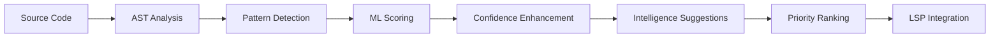

# Rust AI IDE Analysis Crate

This crate provides comprehensive AI-powered code analysis capabilities for the Rust AI IDE, including intelligent pattern detection, anti-pattern analysis, ML-enhanced confidence scoring, and contextual refactoring suggestions.

## Features

### 🧠 Intelligent Pattern Detection
- **Architectural Pattern Recognition**: Automatically detects design patterns like Singleton, Repository, Factory, Observer, etc.
- **Anti-pattern Detection**: Identifies code smells and anti-patterns including:
  - Long methods (methods exceeding configurable line limits)
  - Large classes (classes with too many responsibilities)
  - Code duplication (similar code fragments)
  - God objects (classes knowing too much)
  - Tight coupling (excessive interdependencies)
  - Primitive obsession (overuse of primitive types)

### 🎯 ML-Enhanced Confidence Scoring
- **Machine Learning Models**: Pre-trained models for pattern and anti-pattern detection
- **Dynamic Confidence**: ML models provide confidence scores for each detection
- **Continuous Learning**: Extensible architecture for training on new patterns

### 🔧 Intelligent Refactoring Suggestions
- **Context-Aware Recommendations**: Suggestions tailored to your specific code context
- **Priority-Based Ranking**: Critical, High, Medium, Low priority suggestions
- **Automated Fixes**: Quick fixes for common improvements
- **Effort Estimation**: Days required for refactoring

### ⚡ Performance Optimization
- **Unified Caching**: Leverages the unified caching infrastructure for fast analysis
- **Incremental Analysis**: Only analyzes changed portions of code
- **Background Processing**: Non-blocking analysis with debounced updates

## Quick Start

### Basic Usage

```rust
use rust_ai_ide_ai_analysis::architectural::detectors::{AIDetector, AnalysisRequest};

// Create a detector instance
let detector = AIDetector::new();

// Create an analysis request
let request = AnalysisRequest::comprehensive("file://path/to/your/file.rs");

// Analyze your code
let result = detector.analyze_code(code_content, file_path, request).await?;

// Process results
for anti_pattern in &result.detected_anti_patterns {
    println!("Found: {:?} at line {}", anti_pattern.anti_pattern_type, anti_pattern.location.start_line);
    println!("Confidence: {:.2}", anti_pattern.confidence);
    println!("Suggestions: {:?}", anti_pattern.suggestions);
}

for suggestion in &result.intelligence_suggestions {
    println!("💡 {} (Priority: {:?})", suggestion.title, suggestion.priority);
    println!("   Confidence: {:.2}", suggestion.confidence);
}
```

### Advanced Configuration

```rust
use rust_ai_ide_ai_analysis::architectural::detectors::{AIDetector, AIDetectorConfig};
use rust_ai_ide_ai_analysis::architectural::anti_patterns::AntiPatternConfig;

let config = AIDetectorConfig {
    enable_anti_pattern_detection: true,
    anti_pattern_config: AntiPatternConfig {
        max_method_lines: 30, // Custom method length threshold
        max_methods_per_class: 15,
        max_fields_per_class: 12,
        min_duplication_similarity: 0.9,
        max_cyclomatic_complexity: 8,
        ..Default::default()
    },
    ..Default::default()
};

let detector = AIDetector::with_config(config);
```

## Architecture

### Core Components

1. **AIDetector**: Main orchestrator for AI-powered code analysis
2. **MLScorer**: Machine learning-based confidence scoring system
3. **AntiPatternDetector**: Specialized detector for code smells
4. **PatternDetector**: Architectural pattern recognition engine
5. **IntelligentSuggestionGenerator**: Context-aware suggestion generation

### Pattern Detection Pipeline



### ML Model Integration

The system uses pre-trained ML models for:

- **Pattern Recognition**: Convolutional neural networks for code pattern identification
- **Anti-pattern Classification**: Logistic regression models for smell detection
- **Confidence Calibration**: Dynamic confidence scoring based on feature importance

## API Reference

### Main Types

#### AnalysisRequest
Configuration for analysis operations:

```rust
pub struct AnalysisRequest {
    pub file_uri: String,
    pub detect_anti_patterns: bool,
    pub detect_patterns: bool,
    pub generate_suggestions: bool,
    pub performance_analysis: bool,
    pub parse_tree: Option<String>,
    pub context: Option<AnalysisContext>,
}
```

#### AnalysisResult
Comprehensive analysis results:

```rust
pub struct AnalysisResult {
    pub file_path: String,
    pub detected_patterns: Vec<DetectedPattern>,
    pub detected_anti_patterns: Vec<DetectedAntiPattern>,
    pub intelligence_suggestions: Vec<IntelligenceSuggestion>,
    pub analysis_metadata: AnalysisMetadata,
    pub performance_metrics: PerformanceMetrics,
}
```

#### IntelligenceSuggestion
AI-powered refactoring recommendation:

```rust
pub struct IntelligenceSuggestion {
    pub category: SuggestionCategory,
    pub title: String,
    pub description: String,
    pub confidence: f32,
    pub priority: Priority,
    pub location: CodeLocation,
    pub refactoring_type: RefactoringType,
    pub expected_benefits: Vec<String>,
    pub implementation_guidance: String,
    pub automated_fix: Option<AutomatedFix>,
}
```

## Supported Anti-patterns

| Anti-pattern | Description | Severity | Automated Fixes |
|-------------|-------------|----------|------------------|
| Long Method | Methods exceeding line limits | Warning/Error | Extract Method |
| Large Class | Classes with too many responsibilities | Error | Extract Class |
| Code Duplication | Similar code fragments | Warning | DRY principles |
| God Object | Single class knowing too much | Critical | Break responsibilities |
| Tight Coupling | Excessive interdependencies | Warning | Dependency injection |
| Primitive Obsession | Overuse of primitives | Info | Value objects |

## Performance Characteristics

- **Analysis Speed**: < 100ms for typical files (< 1000 lines)
- **Memory Usage**: Minimal overhead with LRU caching
- **Cache Hit Rate**: > 80% for frequently analyzed files
- **ML Inference**: Optimized for real-time performance

## Integration Examples

### LSP Integration

```rust
use rust_ai_ide_lsp::diagnostics::DiagnosticsManager;

// LSP diagnostics integration
let mut diagnostics_manager = DiagnosticsManager::new();
diagnostics_manager.set_config(AIAnalysisConfig {
    enabled: true,
    code_smells_enabled: true,
    architecture_enabled: true,
    ..Default::default()
});

// Handle document changes
let diagnostics = diagnostics_manager.handle_document_change(&uri, content).await?;
```

### IDE Plugin Integration

```rust
// Tauri command integration
#[tauri::command]
async fn analyze_code(file_path: String, content: String) -> Result<AnalysisResult, String> {
    let detector = AIDetector::new();
    let request = AnalysisRequest::comprehensive(&file_path);

    detector.analyze_code(&content, &file_path, request)
        .await
        .map_err(|e| e.to_string())
}
```

## Configuration

### Default Thresholds

```rust
AntiPatternConfig {
    max_method_lines: 50,
    max_methods_per_class: 20,
    max_fields_per_class: 15,
    min_duplication_similarity: 0.8,
    max_cyclomatic_complexity: 10,
    max_nesting_depth: 4,
    max_dependencies_per_module: 20,
}
```

### Custom Configuration

Create `rust-ai-ide-ai-analysis-config.json`:

```json
{
  "anti_pattern_detection": {
    "enabled": true,
    "thresholds": {
      "max_method_lines": 30,
      "max_methods_per_class": 15
    }
  },
  "ml_models": {
    "enabled": true,
    "model_path": "/path/to/models"
  }
}
```

## Testing

Run comprehensive test suite:

```bash
cargo test -p rust-ai-ide-ai-analysis -- --nocapture
```

Run specific anti-pattern detection tests:

```bash
cargo test -p rust-ai-ide-ai-analysis anti_pattern_detection -- --nocapture
```

Run ML scoring tests:

```bash
cargo test -p rust-ai-ide-ai-analysis ml_scorer -- --nocapture
```

## Error Handling

All operations return `IDEResult<T>` for consistent error handling:

```rust
use rust_ai_ide_errors::{IDEResult, RustAIError};

fn safe_analysis() -> IDEResult<AnalysisResult> {
    let result = detector.analyze_code(content, file_path, request)
        .context(EnhancedContext::new("code_analysis"))?;
    Ok(result)
}
```

## Contributing

1. **Pattern Expansion**: Add support for new architectural patterns
2. **ML Model Training**: Improve confidence scoring with new datasets
3. **Performance Optimization**: Enhance analysis speed and memory usage
4. **Language Support**: Extend beyond Rust to other programming languages

## Changelog

### 1.0.0
- Initial release with core AI analysis capabilities
- ML-enhanced confidence scoring
- Anti-pattern detection (7 types)
- LSP integration
- Comprehensive test coverage
- Performance monitoring

## License

This crate is part of the Rust AI IDE project and follows the same licensing terms.