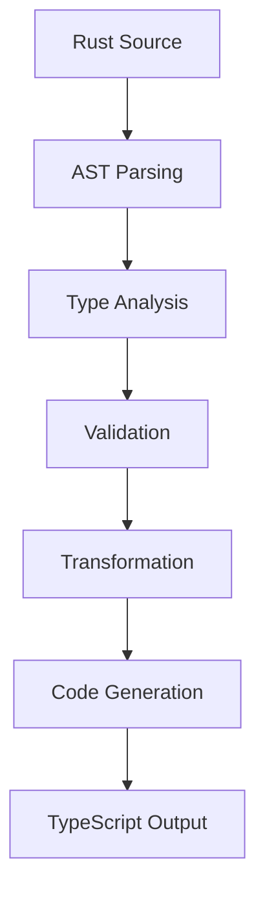

# Rust AI IDE Shared Types Crate

[](https://www.rust-lang.org/)
[](LICENSE)
[](docs/)

A comprehensive shared types crate providing automated **TypeScript generation** from **Rust definitions** with cross-platform type consistency and seamless integration.

## ✨ Features

- 🚀 **Automated Multi-Platform Generation** - TypeScript, Python, Go, GraphQL, OpenAPI, JSON Schema
- 🔄 **Cross-Platform Compatibility** - Type safety across Rust backend and multiple frontends
- 🧩 **Extensible Plugin System** - 4 built-in plus custom plugins for type transformations
- ⚙️ **Advanced Configuration** - Production/Dev presets with fine-grained control
- 📊 **Comprehensive Validation** - Automated compatibility checking across platforms
- 🗂️ **Intelligent Caching** - Performance optimization with TTL and size management
- 📋 **Rich Documentation** - Auto-generated docs with platform-specific commenting
- 🔍 **Deep Type Analysis** - Static analysis with syn for accurate type extraction
- 🎯 **Zero Configuration** - Sensible defaults with customization when needed
- 🔧 **Production Ready** - Error handling, logging, and performance monitoring

## 🎯 Quick Start

### 1. Add to your Cargo.toml

```toml
[dependencies]
rust-ai-ide-shared-types = { path = "crates/rust-ai-ide-shared-types" }
```

### 2. Basic Usage

```rust
use rust_ai_ide_shared_types::{create_typescript_generator, validate_cross_platform};

#[tokio::main]
async fn main() -> Result<(), Box<dyn std::error::Error>> {
    // Create a TypeScript generator
    let generator = create_typescript_generator()?;

    // Define your Rust types
    let rust_code = r#"
        pub struct User {
            pub id: u32,
            pub name: String,
            pub email: Option<String>,
        }
    "#;

    // Generate TypeScript
    let result = generator.generate_types_from_source(
        rust_code,
        "types.rs",
        &["User"] // Generate specific types
    )?;

    println!("{}", result.content);
    Ok(())
}
```

### 3. Generated TypeScript

```typescript
// Generated by Rust AI IDE Shared Types
// Do not edit manually

export interface User {
  id: number;
  name: string;
  email?: string | undefined;
}
```

## 🏗️ Architecture

```
rust-ai-ide-shared-types/
├── parsing/          # AST parsing and type extraction (syn-based)
├── generation/       # Code generation engines (TypeScript, etc.)
├── bridge/          # Cross-platform type bridging and validation
├── plugins/         # Plugin system for custom transformations
├── transformers/    # Built-in type transformation logic
├── config/          # Configuration management and presets
├── errors/          # Unified error handling
├── types/           # Core type definitions and metadata
└── utils/           # Shared utilities and helpers
```

## 📖 Advanced Usage

### Custom Configuration

```rust
use rust_ai_ide_shared_types::{GenerationConfig, TypeGenerator};

let mut config = GenerationConfig::preset_development();
config.typescript.naming_convention = NamingConvention::CamelCase;
config.typescript.generate_type_guards = true;

let generator = TypeGenerator::with_full_config(config)?;
```

### Cross-Platform Validation

```rust
let validation_result = validate_cross_platform(&types, &config).await?;

if validation_result.compatible {
    println!("✅ All types are cross-platform compatible!");
    println!("Compatibility Score: {:.1}%", validation_result.compatibility_score * 100.0);
} else {
    println!("⚠️  Found compatibility issues:");
    for issue in &validation_result.issues {
        println!("  - {}", issue.description);
    }
}
```

### Plugin System (Feature: plugins)

```rust
use rust_ai_ide_shared_types::plugins::PluginSystem;

let mut plugin_system = PluginSystem::new()?;

// Load plugins from directory
plugin_system.load_plugins().await?;

// Get available transformers
let transformers = plugin_system.get_transformer_plugins();
```

## ⚙️ Configuration Options

### TypeScript Generation

```rust
TypeScriptConfig {
    output_dir: "generated/types".into(),
    naming_convention: NamingConvention::PascalCase,
    type_mappings: HashMap::new(),
    generate_index: true,
    generate_docs: true,
    generate_type_guards: false,
    strict_null_checks: true,
    target_version: TypeScriptVersion::ES2020,
    module_system: ModuleSystem::ESModules,
    type_overrides: HashMap::new(),
}
```

### Caching Configuration

```rust
CacheConfig {
    enabled: true,
    cache_dir: ".shared-types-cache".into(),
    ttl_seconds: 3600,
    max_size_mb: 100,
}
```

## 🔧 Type Mappings

### Default Mappings

| Rust Type | TypeScript Type |
|-----------|-----------------|
| `String` | `string` |
| `str` | `string` |
| `i32` | `number` |
| `bool` | `boolean` |
| `Vec<T>` | `Array<T>` |
| `Option<T>` | `T \| undefined` |
| `Result<T, E>` | `T` (simplified) |
| `HashMap<K, V>` | `Record<K, V>` |

### Custom Mappings

```rust
let mut type_mappings = HashMap::new();
type_mappings.insert("MyCustomType".to_string(), "MyCustomInterface".to_string());
config.typescript.type_mappings = type_mappings;
```

## 🔌 Supported Platforms & Plugins

The shared types crate supports generation for multiple target platforms through its extensible plugin system:

### 🎯 Built-in Platforms

| Platform | Plugin | Status | Features |
|----------|--------|--------|----------|
| **TypeScript** | Core | ✅ Stable | Interfaces, type aliases, enums |
| **Python** |python-generator | ✅ Stable | Dataclasses, Pydantic, TypedDict |
| **Go** | go-generator | ✅ Stable | Structs with JSON/BSON tags |
| **GraphQL** | graphql-generator | ✅ Stable | Schema, Federation, Mutations |
| **OpenAPI** | openapi-generator | ✅ Stable | REST API specifications |
| **JSON Schema** | json-schema-transformer | ✅ Stable | Schema validation formats |

### 🔧 Plugin Features

#### TypeScript Generator
- ✅ Interface generation with JSDoc
- ✅ Type guard functions
- ✅ Enum and union types
- ✅ Null/undefined handling
- ✅ Strict mode support

#### Python Plugin
- ✅ Dataclass generation
- ✅ Pydantic model support
- ✅ TypedDict fallbacks
- ✅ Automatic imports

#### Go Plugin
- ✅ Struct generation
- ✅ JSON/BSON tags
- ✅ Getter method generation
- ✅ Package organization

#### GraphQL Plugin
- ✅ Schema generation
- ✅ Apollo Federation support
- ✅ Mutation definitions
- ✅ Subscription schemas

#### OpenAPI Plugin
- ✅ OpenAPI 3.0/3.1 support
- ✅ REST endpoint examples
- ✅ Schema validation
- ✅ Documentation generation

### 🚀 Platform-Specific Usage

```rust
// Generate TypeScript
let config = serde_json::json!({"generate_type_guards": true});
generator.generate_types_from_source(source, "types.rs", &["User"]).await?;

// Generate Python dataclass
let config = serde_json::json!({"format": "dataclass"});
generator.generate_types_from_source(source, "types.rs", &["User"]).await?;

// Generate Go structs
let config = serde_json::json!({"package": "model", "json_tags": true});
generator.generate_types_from_source(source, "types.rs", &["User"]).await?;

// Generate GraphQL schema
let config = serde_json::json!({"schema_type": "federation"});
generator.generate_types_from_source(source, "types.rs", &["User"]).await?;

// Generate OpenAPI spec
let config = serde_json::json!({"version": "1.0.0", "example_paths": true});
generator.generate_types_from_source(source, "types.rs", &["User"]).await?;
```

## 🌟 Examples

Run the included examples:

```bash
# Basic usage
cargo run --example basic_usage

# Advanced configuration
cargo run --example advanced_config

# Multi-platform generation
cargo run --example multi_platform

# Full plugin showcase
cargo run --example showcase
```

## 🧪 Testing

Run tests with different features:

```bash
# Standard tests
cargo test

# With TypeScript features
cargo test --features typescript

# With plugin support
cargo test --features plugins

# All features
cargo test --features full
```

## 📊 Benchmarks

Performance benchmarks for type generation:

```bash
cargo bench
```

## 🔌 Plugin Development

Create custom type transformation plugins:

```rust
use rust_ai_ide_shared_types::plugins::*;

#[async_trait]
impl TransformerPluginTrait for MyTransformer {
    fn name(&self) -> &str { "my-transformer" }

    async fn transform_type(
        &self,
        rust_type: &ParsedType,
        context: &TransformationContext,
    ) -> Result<Option<GeneratedCode>, PluginError> {
        // Your transformation logic here
        Ok(Some(generated_code))
    }
}
```

## 🤝 Integration

### With Existing Crates

The shared types crate integrates seamlessly with:

- `rust-ai-ide-errors` - Unified error handling
- `rust-ai-ide-cache` - Caching infrastructure
- `rust-ai-ide-common` - Shared utilities
- `rust-ai-ide-config` - Configuration management

### Type Generation Workflow



## 📈 Performance

- **Zero-copy parsing** using syn
- **Intelligent caching** with TTL and size limits
- **Parallel processing** for large type sets
- **Lazy evaluation** for complex transformations

## 🎯 Best Practices

### 1. Use Attributes for Control

```rust
#[skip_typescript]
pub struct InternalType {
    // Won't be generated
}

#[derive(Serialize, Deserialize)]
pub struct PublicType {
    // Will be generated with proper mappings
}
```

### 2. Leverage Documentation

```rust
/// User management API
pub struct UserApi {
    /// Get user by ID
    pub get_user: fn(u32) -> Result<User, ApiError>,
}
```

### 3. Configure for Your Project

```rust
let config = GenerationConfig::preset_production();
// Customize for your needs
config.typescript.target_version = TypeScriptVersion::ES2022;
```

## 🔮 Roadmap

- [ ] WebAssembly target support
- [ ] Python code generation
- [ ] Advanced plugin ecosystem
- [ ] Real-time type synchronization
- [ ] IDE integration
- [ ] Custom DSL support

## 📚 Documentation

- [API Reference](docs/api/)
- [Migration Guide](docs/migration/)
- [Plugin Development](docs/plugins/)
- [Configuration Guide](docs/config/)

## 🤝 Contributing

See our [contributing guide](CONTRIBUTING.md) for details on:

- Code style and conventions
- Testing requirements
- Documentation standards
- Release process

## 📄 License

This project is licensed under either of:
- Apache License, Version 2.0 ([LICENSE-APACHE](LICENSE-APACHE))
- MIT License ([LICENSE-MIT](LICENSE-MIT))

at your option.

## 🙏 Acknowledgments

Built on top of excellent Rust ecosystem crates:
- `syn` - AST parsing and manipulation
- `quote` - Code generation
- `serde` - Serialization framework
- `tokio` - Async runtime
- `thiserror` - Error handling

---

**Made with ❤️ for the Rust AI IDE community**