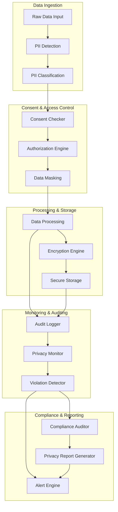

# Data Privacy and Governance Framework Architecture

## Overview

This document specifies the comprehensive data privacy and governance control architecture for the RUST_AI_IDE, ensuring compliance with GDPR, CCPA, and other privacy regulations while maintaining efficient AI operations.

## Core Components

### Personally Identifiable Information (PII) Detection Engine
- **Location**: `crates/rust-ai-ide-ethical-ai/src/privacy/pii_detector/`
- **Purpose**: Automatically identifies and classifies PII in data streams
- **Detection Methods**:
  - Regex pattern matching
  - Named Entity Recognition (NER)
  - Context-aware classification
  - Machine learning-based detection
- **Supported PII Types**:
  - Names, email addresses, phone numbers
  - IP addresses, location data, device IDs
  - Financial information, health data
  - Biometric data, government IDs

### Consent Management System
- **Location**: `crates/rust-ai-ide-ethical-ai/src/privacy/consent_manager/`
- **Purpose**: Manages user consent for data processing and AI usage
- **Features**:
  - Granular consent controls
  - Consent withdrawal mechanism
  - Audit trail of consent changes
  - Automated consent renewal
- **Consent Categories**:
  - AI training data usage
  - Personal recommendation generation
  - Code analysis data retention
  - Telemetry and usage analytics

### Data Minimization Engine
- **Location**: `crates/rust-ai-ide-ethical-ai/src/privacy/minimization/`
- **Purpose**: Ensures minimum necessary data collection and retention
- **Techniques**:
  - Field-level masking
  - Aggregation controls
  - Purpose limitation verification
  - Automated data purging
- **Retention Rules**:
  - Training data: 30 days after model deployment
  - User interaction logs: 180 days
  - Code analysis results: 90 days
  - Security audits: 7 years

### Privacy Policy Enforcement
- **Location**: `crates/rust-ai-ide-ethical-ai/src/privacy/policy_enforcement/`
- **Purpose**: Runtime enforcement of privacy policies
- **Capabilities**:
  - Policy validation engine
  - Data flow monitoring
  - Violation detection and alerting
  - Automated remediation

## Privacy Control Pipeline Architecture



## Technical Implementation

### PII Detection Engine
```rust
#[derive(Debug, Clone)]
pub struct PiiDetector {
    regex_patterns: HashMap<String, Regex>,
    ml_models: HashMap<String, Box<dyn MLModelTrait>>,
    confidence_threshold: f32,
}

impl PiiDetector {
    pub async fn detect_pii(&self, data: &str) -> Result<Vec<PiiEntity>> {
        let mut entities = Vec::new();

        // Regex-based detection
        for (category, pattern) in &self.regex_patterns {
            if let Some(matches) = self.find_regex_matches(data, pattern).await {
                entities.extend(matches);
            }
        }

        // ML-based detection for complex cases
        if let Ok(ml_entities) = self.detect_with_ml(data).await {
            entities.extend(ml_entities);
        }

        // Filter by confidence threshold
        entities.retain(|e| e.confidence > self.confidence_threshold);

        Ok(entities)
    }
}
```

### Consent Management System
```rust
#[derive(Debug, Serialize, Deserialize)]
pub struct ConsentRecord {
    pub user_id: String,
    pub consent_type: ConsentType,
    pub scope: ConsentScope,
    pub granted: bool,
    pub timestamp: chrono::DateTime<chrono::Utc>,
    pub expires_at: Option<chrono::DateTime<chrono::Utc>>,
    pub confidential: serde_json::Value,
}

#[derive(Debug)]
pub struct ConsentManager {
    store: Arc<Mutex<Web3PrivacyStore>>,
    crypto_engine: CryptoEngine,
    audit_logger: AuditLogger,
}

impl ConsentManager {
    pub async fn check_consent(
        &self,
        user_id: &str,
        operation: DataOperation,
    ) -> Result<ConsentCheckResult> {
        let consents = self.get_user_consents(user_id).await?;
        let applicable_consents = self.filter_applicable_consents(&consents, operation).await?;

        let granted = self.validate_consent_applicability(&applicable_consents, operation).await?;

        if !granted {
            // Log consent denial
            self.audit_logger.log_consent_denial(user_id, operation).await?;
        }

        Ok(ConsentCheckResult {
            granted,
            consents: applicable_consents,
            timestamp: Utc::now(),
        })
    }
}
```

### Data Masking Engine
```rust
pub trait DataMasker {
    async fn mask_pii(&self, data: &str, pii_entities: &[PiiEntity]) -> Result<MaskedData>;
    async fn unmask_data(&self, masked_data: &MaskedData) -> Result<String>;
}

pub struct ProductionDataMasker {
    crypto: Aes256Gcm,
    salt_generator: SaltGenerator,
    storage: Arc<dyn MaskedDataStore>,
}

impl DataMasker for ProductionDataMasker {
    async fn mask_pii(&self, data: &str, pii_entities: &[PiiEntity]) -> Result<MaskedData> {
        let mut masked_data = data.to_string();
        let mut masks = Vec::new();

        for entity in pii_entities {
            let mask = self.generate_secure_mask(&entity).await?;
            masked_data = masked_data.replace(&entity.text, &mask.mask_id);
            masks.push(mask);
        }

        Ok(MaskedData {
            masked_content: masked_data,
            masks,
            timestamp: Utc::now(),
        })
    }
}
```

### Governance Policy Engine
```rust
#[derive(Debug)]
pub struct GovernancePolicy {
    pub rules: Vec<GovernanceRule>,
    pub version: semver::Version,
    pub effective_date: chrono::DateTime<chrono::Utc>,
}

pub struct PolicyEnforcementEngine {
    policies: HashMap<String, GovernancePolicy>,
    context_evaluator: ContextEvaluator,
}

impl PolicyEnforcementEngine {
    pub async fn enforce_policies(
        &self,
        operation: DataOperation,
        context: ExecutionContext,
    ) -> Result<PolicyDecision> {
        let applicable_policies = self.get_applicable_policies(&operation).await?;
        let mut violations = Vec::new();

        for policy in applicable_policies {
            let evaluation = self.evaluate_policy(&policy, &operation, &context).await?;
            if !evaluation.compliant {
                violations.push(Violation {
                    policy_id: policy.id,
                    rule_violations: evaluation.rule_violations,
                    severity: evaluation.severity,
                });
            }
        }

        let decision = if violations.is_empty() {
            PolicyDecision::Allow
        } else {
            PolicyDecision::Deny(violations)
        };

        self.audit_policy_decision(&decision, &operation).await?;

        Ok(decision)
    }
}
```

## Integration Points

### LSP Server Integration
```rust
impl LanguageServer {
    pub async fn handle_code_completion_with_privacy(
        &self,
        params: CompletionParams,
    ) -> Result<CompletionResponse> {
        // Check data access consent
        let user_consent = self.privacy_controller
            .check_data_access_consent(&params.user_id).await?;

        if !user_consent.granted {
            return self.generate_generic_completion(params).await;
        }

        // Process with PII detection
        let context = self.privacy_controller
            .analyze_code_context(&params.text_document).await?;

        if context.contains_sensitive_info {
            // Apply privacy-preserving processing
            return self.process_with_privacy_guardrails(params, context).await?;
        }

        // Standard processing
        self.generate_completion(params).await
    }
}
```

### Database Integration
```rust
pub struct PrivacyAwareDatabase {
    connection_pool: Pool<Postgres>,
    encryption: EncryptionEngine,
    privacy_processor: PrivacyProcessor,
}

impl PrivacyAwareDatabase {
    pub async fn store_user_data(
        &self,
        user_id: &str,
        data_type: DataType,
        data: &serde_json::Value,
    ) -> Result<StorageReceipt> {
        // Check retention policy
        let retention_policy = self.privacy_processor
            .get_retention_policy(data_type).await?;

        // Validate data minimization requirements
        self.privacy_processor
            .validate_data_minimization(data, &retention_policy).await?;

        // Encrypt data
        let encrypted_data = self.encryption
            .encrypt_data(data).await?;

        // Store with privacy metadata
        let receipt = self.execute_privacy_aware_insert(
            user_id, data_type, encrypted_data, retention_policy
        ).await?;

        // Schedule automatic deletion
        self.schedule_data_cleanup(user_id, retention_policy).await?;

        Ok(receipt)
    }
}
```

## Compliance Monitoring

### Automated Compliance Auditing
```rust
pub struct ComplianceAuditor {
    regulations: HashMap<String, Regulation>,
    test_scenarios: Vec<ComplianceTest>,
    report_generator: ReportGenerator,
}

impl ComplianceAuditor {
    pub async fn run_compliance_audit(
        &self,
        scope: AuditScope,
        timeframe: TimeRange,
    ) -> Result<ComplianceReport> {
        let mut findings = Vec::new();

        // GDPR Article 17 - Right to Erasure
        if scope.includes("gdpr") {
            findings.extend(self.audit_data_erasure(timeframe).await?);
        }

        // CCPA Section 1798.110 - Data Deletion
        if scope.includes("ccpa") {
            findings.extend(self.audit_privacy_rights(timeframe).await?);
        }

        // General data minimization
        findings.extend(self.audit_data_minimization(timeframe).await?);

        let summary = self.generate_audit_summary(&findings).await?;
        let recommendations = self.generate_remediation_recommendations(&findings).await?;

        Ok(ComplianceReport {
            summary,
            findings,
            recommendations,
            generated_at: Utc::now(),
        })
    }
}
```

### Consent Management API
```rust
#[derive(OpenApi)]
#[openapi(paths(consent_controller::create_consent, consent_controller::update_consent))]
pub struct PrivacyAPI;

pub async fn create_consent(
    State(state): State<AppState>,
    Json(consent_request): Json<CreateConsentRequest>,
) -> Result<impl IntoResponse, Error> {
    let consent = state.consent_manager
        .create_consent(consent_request).await?;

    state.audit_logger
        .log_consent_creation(&consent.user_id, &consent.purpose).await?;

    Ok(Json(consent))
}
```

## Security Measures

### Encryption Standards
- **Data at Rest**: AES-256-GCM encryption
- **Data in Transit**: TLS 1.3 with perfect forward secrecy
- **Key Management**: AWS KMS or HashiCorp Vault integration
- **Key Rotation**: Automatic monthly rotation

### Access Control
- **Role-Based Access**: Admin, Developer, User roles
- **Attribute-Based Access**: Context-aware permissions
- **Time-Based Restrictions**: Handling hours limitations
- **Geographic Restrictions**: Region-specific data access

## Monitoring and Alerting

### Privacy Violation Alerting
```rust
pub struct PrivacyAlertEngine {
    thresholds: HashMap<String, AlertThreshold>,
    reporters: Vec<Box<dyn AlertReporter>>,
}

impl PrivacyAlertEngine {
    pub async fn check_violations(&self, metrics: &PrivacyMetrics) -> Result<()> {
        for (metric_name, threshold) in &self.thresholds {
            if let Some(value) = metrics.get(metric_name) {
                if value > threshold.max_value {
                    let alert = Alert {
                        severity: threshold.severity,
                        message: format!("{} exceeded threshold: {} > {}",
                                       metric_name, value, threshold.max_value),
                        context: metrics.clone(),
                    };

                    for reporter in &self.reporters {
                        reporter.report_alert(&alert).await?;
                    }
                }
            }
        }

        Ok(())
    }
}
```

### Audit Logging
```rust
pub struct AuditLogger {
    storage: Arc<dyn AuditStorage>,
    crypto: Argon2,
}

impl AuditLogger {
    pub async fn log_event(&self, event: AuditEvent) -> Result<()> {
        let encrypted_event = self.encrypt_event(&event).await?;
        let hash = self.compute_event_hash(&event).await?;

        let audit_entry = AuditEntry {
            event: encrypted_event,
            hash,
            timestamp: Utc::now(),
            sequence_number: self.get_sequence_number().await?,
        };

        self.storage.store_entry(&audit_entry).await?;
        Ok(())
    }
}
```

## Performance Optimization

### Caching Strategies
- **Consent Cache**: In-memory cache for valid consents (5-minute TTL)
- **PII Pattern Cache**: Compiled regex patterns with LRU eviction
- **Policy Cache**: Governance policies with invalidation on updates

### Asynchronous Processing
- **PII Detection**: Background processing with configurable parallelism
- **Audit Logging**: Separate thread pool for non-blocking logging
- **Compliance Auditing**: Scheduled background jobs

## Error Handling and Failures

### Graceful Degradation
- **Consent System Failure**: Fallback to explicit consent required
- **PII Detection Failure**: Conservative masking of potential PII
- **Audit Failure**: Queue for retry with exponential backoff

### Recovery Procedures
- **Data Restoration**: Encrypted backup recovery with key rotation
- **Consent Recovery**: Automated consent synchronization from backups
- **Audit Recovery**: Integrity verification and gap analysis

This comprehensive privacy and governance framework provides the necessary controls to ensure regulatory compliance while maintaining operational efficiency and user trust in the AI-powered development environment.