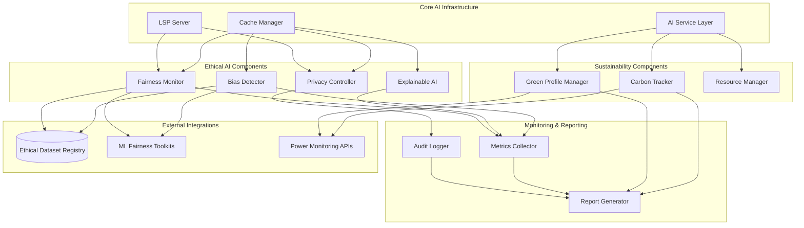

# Ethical AI Framework Architecture

## Overview

This document outlines the comprehensive ethical AI and sustainability framework for the RUST_AI_IDE. The framework is designed to integrate seamlessly with existing AI/ML infrastructure while providing robust bias detection, explainability, privacy controls, fairness auditing, carbon tracking, and green computing capabilities.

## Core Components

### 1. Bias Detection & Mitigation Engine
- **Location**: `crates/rust-ai-ide-ethical-ai/src/bias_detector/`
- **Purpose**: Automated detection and mitigation of bias in AI models and outputs
- **Integration Points**: SecurityScanner, ModelValidator
- **Data Sources**: Training data, model embeddings, output distributions

### 2. Explainable AI Attribution System
- **Location**: `crates/rust-ai-ide-ethical-ai/src/explainability/`
- **Purpose**: Provides clear explanations for AI decisions with feature attribution
- **Integration Points**: AnalysisService, AdvancedCodeAnalyzer
- **Data Sources**: Model internals, feature vectors, decision trees

### 3. Data Privacy & Governance Controller
- **Location**: `crates/rust-ai-ide-ethical-ai/src/privacy/`
- **Purpose**: Ensures data privacy compliance and governance
- **Integration Points**: LSP Server, UserDataManager
- **Data Sources**: User data patterns, audit logs, consent records

### 4. Fairness Audit & Monitoring System
- **Location**: `crates/rust-ai-ide-ethical-ai/src/fairness/`
- **Purpose**: Continuous monitoring and auditing of fairness metrics
- **Integration Points**: PerformanceAnalyzer, MetricsCollector
- **Data Sources**: System logs, user interactions, demographic data

### 5. Carbon Footprint Tracking Framework
- **Location**: `crates/rust-ai-ide-sustainability/src/carbon_tracker/`
- **Purpose**: Monitors and reports environmental impact of AI operations
- **Integration Points**: SystemTracer, ResourceMonitor
- **Data Sources**: CPU/GPU usage, power consumption, model sizes

### 6. Green Computing Profile Manager
- **Location**: `crates/rust-ai-ide-sustainability/src/green_profile/`
- **Purpose**: Optimizes resource usage for minimal environmental impact
- **Integration Points**: PerformanceAnalyzer, ResourceManager
- **Data Sources**: Hardware profiles, usage patterns, energy models

## System Architecture



### Integration Flow

1. **Data Ingestion**: User inputs pass through Privacy Controller for consent and PII detection
2. **AI Processing**: Models run through Bias Detection and Fairness Monitoring
3. **Explainability**: All decisions include attribution explanations via Explainable AI
4. **Sustainability**: Carbon tracking runs continuously; Green profiles optimize resource usage
5. **Reporting**: All metrics flow to unified reporting system for compliance and transparency

## Configuration & Policies

### Ethical Thresholds
- **Bias Tolerance**: 0.05 (5% difference threshold)
- **Fairness Score**: 0.90 (90% fairness requirement)
- **Explainability Coverage**: 95% of decisions
- **Carbon Budget**: Configurable per month/kilo
- **Energy Efficiency**: Target < 0.1 kWh per 1K operations

### Data Governance Rules
- **Retention Policies**: Automated data purging after 30 days
- **Consent Management**: Opt-in/opt-out per feature
- **Audit Logging**: All AI decisions logged for 7 years
- **Access Control**: Role-based access to sensitive features

## Implementation Phases

### Phase 1: Foundation (Week 1-2)
- Bias detection basic framework
- Privacy controller setup
- Carbon tracking infrastructure

### Phase 2: Core Features (Week 3-4)
- Explainability framework
- Fairness monitoring
- Green profiles

### Phase 3: Integration (Week 5-6)
- Seamlessly integrate with existing modules
- User interface for controls
- Reporting dashboard

### Phase 4: Validation (Week 7-8)
- Thorough testing and tuning
- Performance optimization
- Compliance verification

## Metrics & Monitoring

### Key Performance Indicators
- Bias detection accuracy: >95%
- Explainability coverage: >90%
- Privacy violation incidents: 0
- Carbon emissions reduction: >20%
- User satisfaction: >85%

### Alert Thresholds
- Bias score >0.10: Immediate alert
- Privacy breach: Critical alert
- Carbon budget 80% used: Warning alert
- Fairness score <0.80: Review required

## Compliance Standards

- **EU AI Act**: Risk-based approach to ethical AI
- **GDPR**: Data privacy and consent management
- **ISO 14001**: Environmental management systems
- **IEEE P7001-2021**: Transparent autonomous systems
- **NIST AI RMF**: Risk management framework

## API Interfaces

### Public API Endpoints
```rust
// Bias Analysis
pub async fn analyze_bias(model: &ModelConfig) -> Result<BiasReport>

// Privacy Audit
pub async fn audit_privacy(user_data: &UserData) -> Result<PrivacyAudit>

// Carbon Report
pub async fn generate_carbon_report(timeframe: TimeRange) -> Result<CarbonReport>
```

### Internal Traits
```rust
trait EthicalAnalyzer {
    async fn check_ethics(&self, input: &AiInput) -> Result<EthicalAssessment>;
}

trait SustainabilityMonitor {
    async fn measure_impact(&self) -> Result<EnvironmentalMetrics>;
}
```

This framework establishes a comprehensive ethical and sustainable foundation for the RUST_AI_IDE, ensuring responsible AI development and deployment while maintaining transparency and accountability.