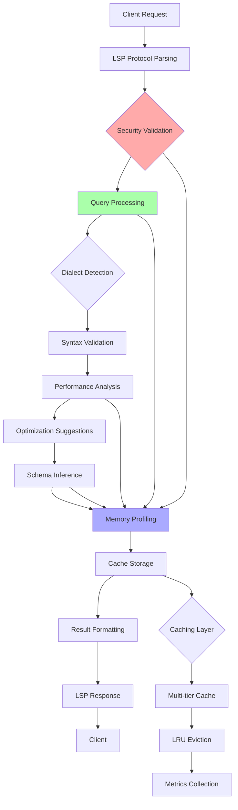

# SQL Language Server Protocol (LSP) Server Documentation

## Architecture Overview

### Module Structure

The SQL LSP Server is implemented as a modular, production-ready Rust application (`crates/rust-ai-ide-lsp/src/sql_lsp_server.rs`) with the following architectural layers:

```
┌─────────────────────────────────────────────────────────────────┐
│                    Enterprise SQL LSP Server                   │
│                        (enterprise_sql_lsp_server.rs)          │
├─────────────────────────────────────────────────────────────────┤
│                    Base SQL LSP Server                          │
│                       (sql_lsp_server.rs)                      │
├─────────────────┬─────────────────┬─────────────────┬───────────┤
│ MemoryProfiler │ SecurityMonitor │ PerformanceOpt  │ HealthChkr│
│                 │                 │ imizer          │           │
├─────────────────┴─────────────────┴─────────────────┴───────────┤
│               Production Components Layer                      │
│                    (sql_lsp_server_prod_features.rs)           │
├─────────────────────────────────────────────────────────────────┤
│                 LSP Protocol Implementation                      │
│                        (sql_lsp.rs)                            │
├─────────────────────────────────────────────────────────────────┤
│                 Async Tokio Runtime                            │
└─────────────────────────────────────────────────────────────────┘
```

### Key Components

#### Core Server (SqlLspServer)
- **State Management**: Uses `Arc<RwLock<SqlLspState>>` for thread-safe configuration access
- **Feature Flags**: Implements conditional compilation for monitoring, security, and performance features
- **Async Initialization**: Double-locking pattern for lazy service initialization

#### Production Components
Each component is conditionally compiled based on feature flags and can be enabled/disabled at compile time:

- **MemoryProfiler**: Real-time memory usage tracking with component-level analysis and alert thresholds
- **SecurityMonitor**: SQL injection detection, audit logging, and rate limiting
- **PerformanceOptimizer**: Query optimization suggestions, load balancing, and bottleneck identification
- **HealthChecker**: Production monitoring with system health assessment

#### LSP Protocol Layer
- **Message Handling**: Implements LSP protocol for SQL language features
- **Dialect Support**: PostgreSQL, MySQL, SQLite with dialect-specific syntax validation
- **Collaborative Editing**: Live edit operations with session management

### Data Flow



## API Endpoints and Protocols

### LSP Message Types Handled

The server implements standard LSP protocol messages for SQL language support:

#### Initialize Messages
- **initialize**: Server capability declaration with SQL-specific extensions
- **initialized**: Begin LSP session with dialect detection activation

#### TextDocument Messages
- **textDocument/didOpen**: Document indexing and initial validation
- **textDocument/didChange**: Incremental syntax validation and suggestions
- **textDocument/didSave**: Query execution suggestions and optimization checks
- **textDocument/completion**: Context-aware completion for:
  - SQL keywords and functions
  - Table and column names (schema-aware)
  - JOIN conditions and WHERE clauses
  - Dialect-specific completions

#### SQL-Specific Extensions
- **sql/complexity**: Query complexity analysis with bottleneck identification
- **sql/optimize**: Performance optimization suggestions with confidence scores
- **sql/schema**: Real-time schema inference from query patterns
- **sql/security**: Security analysis and injection detection
- **sql/batch**: Bulk analysis for multiple queries with parallel processing

### Request/Response Formats

All messages follow LSP protocol with `jsonrpc: "2.0"` format:

#### Query Analysis Request
```json
{
  "jsonrpc": "2.0",
  "id": 1,
  "method": "sql/analyze",
  "params": {
    "query": "SELECT u.name FROM users u JOIN orders o ON u.id = o.user_id;",
    "dialect": "postgresql",
    "include_performance": true,
    "include_optimizations": true,
    "include_schema": true
  }
}
```

#### Query Analysis Response
```json
{
  "jsonrpc": "2.0",
  "id": 1,
  "result": {
    "syntax_valid": true,
    "performance_metrics": {
      "execution_time_us": 1250,
      "memory_usage_bytes": 4096,
      "complexity_score": 85,
      "bottleneck_category": "Io"
    },
    "optimizations": [
      {
        "confidence_score": 0.92,
        "explanation": "Consider creating index on user_id column",
        "expected_improvement_percent": 75.0
      }
    ],
    "schema_inference": {
      "tables": {
        "users": {
          "columns": [
            {"name": "id", "type": "integer", "nullable": false},
            {"name": "name", "type": "varchar", "nullable": true}
          ]
        }
      }
    }
  }
}
```

### Notification Handling

- **$/cancelRequest**: Query processing cancellation with cleanup
- **textDocument/publishDiagnostics**: Security, performance, and syntax warnings
- **$/status**: Server status updates including memory usage and health metrics

## Schema Definitions

### Core Data Structures

#### QueryResult
```rust
#[derive(Debug, Clone, Serialize, Deserialize)]
pub struct QueryResult {
    pub syntax_valid: bool,
    pub security_warnings: Vec<String>,
    pub performance_metrics: Option<QueryPerformanceMetrics>,
    pub optimizations: Vec<OptimizedQuerySuggestion>,
    pub schema_inference: Option<InferredSchema>,
    pub errors: Vec<SqlError>,
    pub total_processing_time_ms: u64,
}
```

#### QueryPerformanceMetrics
```rust
#[derive(Debug, Clone, Serialize, Deserialize)]
pub struct QueryPerformanceMetrics {
    pub execution_time_us: u64,
    pub memory_usage_bytes: u64,
    pub io_operations: u64,
    pub complexity_score: u8,  // 0-100 scale
    pub bottleneck_category: QueryBottleneck,  // Cpu, Memory, Io, Other
}
```

#### CollaborativeSession
```rust
#[derive(Debug, Clone, Serialize, Deserialize)]
pub struct CollaborativeSession {
    pub session_id: String,
    pub document_uri: DocumentUri,
    pub participants: Vec<String>,
    pub session_state: SessionState,  // Active, Completed, Suspended
    pub start_time: DateTime<Utc>,
    pub edit_operations: Vec<LiveEditOperation>,
    pub cursor_positions: HashMap<String, CursorPosition>,
}
```

### Trait Definitions

#### SqlDialectDetector
```rust
#[async_trait]
pub trait SqlDialectDetector: Send + Sync {
    async fn detect_dialect(&self, query: &str) -> SqlLspResult<String>;
    async fn validate_syntax(&self, query: &str, dialect: &str) -> SqlLspResult<bool>;
    async fn get_completions(&self, prefix: &str, position: usize, dialect: &str)
        -> SqlLspResult<Vec<CompletionItem>>;
}
```

#### LSP Client Interface
```rust
pub trait LspClientTrait: Send + Sync {
    fn show_message(&self, msg: String);
    fn show_error(&self, msg: String);
}
```

### Error Types

#### SqlLspError
```rust
#[derive(Debug, Clone, Error)]
pub enum SqlLspError {
    #[error("Configuration error: {0}")]
    ConfigurationError(String),

    #[error("Validation error: {0}")]
    ValidationError(String),

    #[error("Performance error: {0}")]
    PerformanceError(String),

    #[error("Cache error: {0}")]
    CacheError(String),

    #[error("Security error: {0}")]
    SecurityError(String),

    #[error("Collaboration error: {0}")]
    CollaborationError(String),

    #[error("Memory error: {0}")]
    MemoryError(String),
}
```

## Integration Points

### Database Driver Integration

The server integrates with database drivers through:

- **Dialect Detection**: Runtime database dialect identification from query patterns
- **Connection Pooling**: `ConnectionPool<T>` from infrastructure layer
- **Schema Metadata**: Real-time table and column information extraction
- **Execution Performance**: Database-specific performance metrics and optimization rules

### AI Completion Engine Integration

- **Model Loading**: Through dedicated LSP service (`ai_lsp_server`)
- **Predictive Engine**: `Arc<rust_ai_ide_ai_predictive::PredictiveEngine>`
- **Context Analysis**: AI-powered context understanding for intelligent completions
- **Suggestion Ranking**: ML models for completion ranking and filtering

### Main Language Server Integration

- **LSP Router**: Integration with `language_router.rs` for multi-language support
- **Web Language Servers**: Compatibility with web LSP implementations
- **Event Bus**: `EventBus` pattern for cross-component communication
- **Lifecycle Manager**: Coordinated initialization with other LSP services

### Enterprise Features

- **Security Enhancements**: Integration with token managers, RBAC systems, and secure storage
- **Compliance Monitoring**: SOC2 and GDPR compliance validation
- **Horizontal Scaling**: Load balancer integration for multi-instance deployments
- **Audit Integration**: Audit trail generation and compliance reporting

## Testing Strategies

### Unit Testing

Unit tests focus on individual components with comprehensive coverage:

```rust
#[cfg(test)]
mod tests {
    #[tokio::test]
    async fn test_query_complexity_calculation() {
        let config = SqlLspConfig::default();
        let complexity = SqlLspServer::calculate_query_complexity(
            "SELECT u.name FROM users u JOIN posts p ON u.id = p.user_id",
            &config
        );

        assert!(complexity >= 50 && complexity <= 100);
    }

    #[tokio::test]
    async fn test_bottleneck_identification() {
        let query = "SELECT u.* FROM users u JOIN orders o ON u.id = o.user_id";
        let bottleneck = SqlLspServer::identify_bottleneck(query, 0);

        assert_eq!(bottleneck, QueryBottleneck::Io);
    }
}
```

### Integration Testing

Integration tests validate component interactions (`sql_tests.rs`):

- **End-to-End Query Processing**: Full pipeline from input to response
- **Cache Layer Integration**: Multi-tier caching with eviction policies
- **Parallel Processing**: Concurrent query execution with resource limits
- **Memory Profiling**: Memory usage tracking during QueryAnalysis operations

### Performance Benchmarks

Performance testing includes:
- **Baseline Performance**: Query processing throughput and latency
- **Memory Usage**: Component-specific memory allocation tracking
- **Caching Efficiency**: Hit/miss ratios and eviction patterns
- **Concurrent Load**: Multi-query execution under load

```rust
#[bench]
fn bench_query_processing_performance(bencher: &mut Bencher) {
    let mut group = c.benchmark_group("query_processing");
    group.bench_function("complex_join_analysis", |b| {
        // Benchmark complex query processing
    });
}
```

### End-to-End Testing

Full workflow testing covers:
- **Document Lifecycle**: Open, change, save, close operations
- **Collaborative Scenarios**: Multi-user editing sessions
- **Error Recovery**: Fault tolerance and graceful degradation
- **Large Dataset**: Performance with substantial SQL files

## Deployment Procedures

### Service Setup

#### Build Configuration
```bash
# Build workspace with SQL LSP server
cargo build --workspace --release

# Build with specific feature flags
cargo build --workspace --release \
  --features monitoring,security-hardening,performance-optimization
```

#### Feature Flags
- `--features monitoring`: Enables Prometheus-style metrics
- `--features security-hardening`: Activates advanced security features
- `--features performance-optimization`: Enables adaptive optimization

### Configuration Requirements

#### Core Configuration (SqlLspConfig)
```rust
pub struct SqlLspConfig {
    // Feature toggles
    pub enable_optimization_suggestions: bool,
    pub enable_performance_profiling: bool,
    pub enable_advanced_caching: bool,

    // Dialect support
    pub supported_sql_dialects: Vec<String>,

    // Resource limits
    pub max_memory_per_layer_mb: u64,
    pub max_entries_per_layer: u64,

    // Performance settings
    pub performance_settings: SqlPerformanceSettings,
    pub cache_settings: SqlCacheConfig,
}
```

#### Environment Variables
- `SQL_LSP_MAX_MEMORY_MB`: Maximum memory allocation per layer
- `SQL_LSP_CACHE_TTL_SECONDS`: Cache time-to-live settings
- `SQL_LSP_PERFORMANCE_MODE`: Performance optimization level

### Monitoring Setup

#### Health Check Endpoint
The server exposes health check endpoints:
- `/health`: Overall system health status
- `/health/detailed`: Component-level health metrics
- `/metrics`: Prometheus- compatible metrics export

#### Monitoring Dashboard
Web-based monitoring provides:
- **Real-time Metrics**: CPU, memory, and I/O usage
- **Cache Performance**: Hit ratios and eviction statistics
- **Security Events**: Audit logs and threat detection
- **Performance Analysis**: Query processing bottlenecks and optimization impact

### Scaling Guidelines

#### Horizontal Scaling
- **Instance Management**: Load balancer configuration for multiple instances
- **Session Affinity**: Sticky session support for collaborative editing
- **State Synchronization**: Cross-instance state management for shared context

#### Vertical Scaling
- **Resource Allocation**: Memory allocation based on workspace size
- **Worker Threads**: Configurable thread pool sizing
- **Cache Scaling**: Multi-tier cache capacity adjustment

#### Performance Tuning
- **Memory Profiling**: Automatic memory limit adjustment based on usage patterns
- **Query Complexity Limits**: Configurable complexity threshold detection
- **Batch Processing**: Configurable batch size for bulk operations

### Backup and Recovery

#### Data Persistence
- **Cache Persistence**: Optional cache state persistence and recovery
- **Session State**: Collaborative session state backup and restoration
- **Audit Logs**: Security audit trail retention and archival

#### Disaster Recovery
- **Graceful Degradation**: Automatic service degradation under resource pressure
- **Failover Procedures**: Multi-instance failover mechanism
- **Data Consistency**: Cache consistency guarantees across restart scenarios

This documentation provides comprehensive coverage of the SQL LSP Server implementation, focusing on production readiness, enterprise scalability, and maintainability following best practices from the larger codebase architecture.