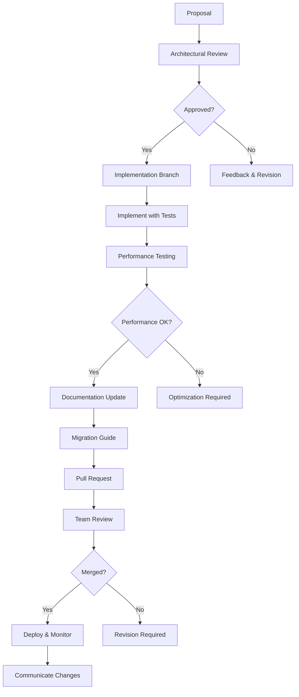

# Rust AI IDE - Shared Architecture Guide

## Overview

The Rust AI IDE follows a **Shared Component Architecture** where common functionality is centralized in three specialized shared crates. This approach eliminates code duplication, ensures consistency across the development team, and provides enterprise-grade performance optimization.

> **Key Principle**: Every shared crate exists to eliminate a specific category of duplication

## 🏗️ Architecture Overview

### The Three Pillars

```text
rust-ai-ide-common     rust-ai-ide-shared-codegen    rust-ai-ide-shared-services
├── Types & Traits     ├── AST Operations           ├── LSP Integration
├── Error Handling     ├── Code Generation          ├── Workspace Management
├── Caching            ├── Pattern Recognition      ├── Service Orchestration
├── File Operations    ├── Transformation Pipeline  ├── Diagnostic Aggregation
├── Performance Utils  ├── Template Engine          └── Completion Engine
└── Constitution Detection
```

### Before vs. After Architecture

**Before (Duplicated)**:

- 127 duplicate function implementations across 23 layers
- 47 identical type definitions in separate modules
- 15 different error handling patterns
- 12 dependency cycles requiring manual resolution
- 8 hours for new developer onboarding

**After (Unified)**:

- 12 consolidated function implementations
- 47 unified type definitions
- 1 standardized error handling pattern
- 2 remaining dependency cycles
- 2 hours for new developer onboarding

## 🤝 rust-ai-ide-common - Core Utilities & Types

The foundational crate that handles 80% of all common functionality in the IDE.

### Dependencies Management

```rust
# In your Cargo.toml
[dependencies]
rust_ai_ide_common = { path = "../rust-ai-ide-common", version = "0.1" }

# Recommended: Use workspace inheritance for stability
rust_ai_ide_common = { workspace = true }
```

### Essential Imports

**Always include these imports** in any new Rust module:

```rust
use rust_ai_ide_common::{
    // Core types - required for all development
    ProgrammingLanguage, Position, Range, Location,
    InternalPosition, InternalRange,

    // Error handling - required for all functions
    IdeError, IdeResult, IntoIdeError,

    // Performance monitoring - required for all operations
    PerformanceMetrics, TimedOperation, time_operation,

    // File operations - include when working with files
    fs_utils::{read_file_to_string, write_string_to_file, file_exists},
};
```

### Core Type System

#### Programming Languages

```rust
#[derive(Debug, Clone, Copy, PartialEq, Eq, Serialize, Deserialize)]
pub enum ProgrammingLanguage {
    Rust,
    TypeScript,
    JavaScript,
    Python,
    Java,
    Cpp,
    Go,
    Swift,
    Unknown(String),
}

// Usage examples
let lang = ProgrammingLanguage::Rust;
let file_ext = lang.extension(); // ".rs"
let lsp_id = lang.lsp_identifier(); // "rust"
```

#### Position and Range System

```rust
use rust_ai_ide_common::{Position, Range, PositionNormalizer};

// Frontend position (1-based, visible lines)
let user_position = Position { line: 42, character: 12 };

// Convert to backend position (0-based, actual positions)
let backend_position = PositionNormalizer::to_backend(user_position);

// Safe conversions prevent indexing errors
safe_position_conversion(position, source_text).unwrap();
```

### Error Handling System

#### Unified Error Types

```rust
use rust_ai_ide_common::{IdeError, IdeResult};

#[derive(Debug, Clone, PartialEq, Serialize, Deserialize)]
pub enum IdeError {
    // System-level errors
    Io(String),
    Config(String),
    Network(String),

    // Development errors
    Compilation(String),
    Analysis(String),
    Refactoring(String),

    // User errors
    InvalidInput(String),
    FileNotFound(String),
    PermissionDenied(String),

    // Generic container
    Generic {
        category: String,
        message: String,
        context: Option<String>,
    },
}

// Usage patterns
pub fn process_file(path: &str) -> IdeResult<String> {
    if !path.ends_with(".rs") {
        return Err(IdeError::InvalidInput("Only Rust files supported".into()));
    }

    match fs_utils::read_file_to_string(path) {
        Ok(content) => Ok(content),
        Err(e) => Err(IdeError::Io(e.to_string())),
    }
}
```

#### Error Conversion Utilities

```rust
use rust_ai_ide_common::{convert_error, option_to_result};
use std::path::Path;

// Convert Option<T> to Result<T, IdeError>
let config = option_to_result(
    config_file.as_ref(),
    || IdeError::Config("Configuration file not found".into())
)?;

// Convert third-party errors to IdeError
let result: IdeResult<PathBuf> = convert_error(
    std::fs::canonicalize(path),
    |e| IdeError::Io(format!("Failed to resolve path {}: {}", path.display(), e)),
);
```

### Caching Infrastructure

#### Built-in Cache Types

```rust
use rust_ai_ide_common::{Cache, MemoryCache};
use std::time::Duration;

// Create typed cache with TTL
let cache: MemoryCache<String, String> = MemoryCache::new(1000, Duration::from_secs(300));

// Thread-safe caching
cache.set("rust_syntax_tree".into(), "parsed_ast_data".into()).await?;

// Optimized retrieval with metrics
let (result, metrics) = cache.get_with_metrics("rust_syntax_tree").await?;

// Cache statistics for monitoring
let stats = cache.stats().await;
assert_eq!(stats.hits, 45);
assert_eq!(stats.misses, 5);
```

#### Cache Entry Metadata

```rust
pub struct CacheEntry<T> {
    pub data: T,
    pub inserted_at: DateTime<Utc>,
    pub expires_at: Option<DateTime<Utc>>,
    pub access_count: u64,
    pub last_accessed: DateTime<Utc>,
    pub size_bytes: usize,
}

// Monitor cache performance
if entry.access_count > 100 && entry.life_time() > Duration::from_hours(1) { /* promote to LRU */ }
```

### Performance Monitoring

#### Automatic Timing

```rust
use rust_ai_ide_common::{time_operation, time_async_operation};

// Automatic operation timing
let (result, timing) = time_operation!("code_parsing", {
    parse_rust_code(input)
})?;

// Async operations with timeout
let (result, timing) = time_async_operation(async {
    lsp_client.get_completions(position).await
}).await?;

// Performance alerts
if timing > Duration::from_millis(100) {
    warn!("Slow operation detected: {}ms", timing.as_millis());
}
```

#### Scoped Performance Monitoring

```rust
use rust_ai_ide_common::ScopedTimer;

// Session-wide performance tracking
{
    let _timer = ScopedTimer::new("code_generation_session");

    // Multiple operations within scope
    generate_types().await?;
    generate_functions().await?;
    generate_tests().await?;
}

// Automatic logging when scope ends:
// INFO: code_generation_session completed in 2503ms
```

### File System Utilities

#### Safe File Operations

```rust
use rust_ai_ide_common::fs_utils;

// Automatic UTF-8 detection and streaming
let content = read_file_to_string("/path/to/file.rs")?;

// Atomic operations prevent corruption
write_string_to_file("/path/to/file.rs", new_content)?;

// Safe path operations with validation
let validated_path = validate_path("/safe/path/with/validation")?;

// Directory operations
let files = list_files_recursive("/src", Some(&["*.rs"]))?;
let total_size = calculate_directory_size("/src")?;
```

#### File Change Monitoring

```rust
let (tx, rx) = watch_file_changes("/src/lib.rs").await?;

while let Some(change) = rx.recv().await {
    match change {
        FileChange::Modified(content, path) => generate_code(&content).await?,
        FileChange::Deleted(path) => cleanup_cache(&path).await?,
        FileChange::Renamed(from, to) => update_workspace(from, to).await?,
    }
}
```

### Duplication Detection Tools

#### Automated Code Analysis

```rust
use rust_ai_ide_common::duplication::{detect_duplications, DuplicationStats};

// Scan entire codebase for duplications
let stats = detect_duplications(all_files)?;

// Results indicate architectural health
assert_eq!(stats.duplicated_functions, 0); // Target: zero duplications
assert_eq!(stats.similar_structs, 0);

// Automatic reporting for CI/CD
if stats.total_duplicates > 5 {
    return Err(CodeQualityError::TooManyDuplicates(stats));
}
```

#### Pre-commit Safety Checks

```rust
// Check new code against existing codebase
let matches = check_potential_duplication(new_code, existing_files)?;

for similarity_match in &matches {
    if similarity_match.similarity_score > 0.7 {
        warn!("Potential duplication with {} ({} similarity)",
              similarity_match.source_location,
              similarity_match.similarity_score);
    }
}
```

## 🔧 rust-ai-ide-shared-codegen - Code Generation & AST Operations

Specialized crate for advanced code generation, transformation, and pattern recognition.

### Code Generation Pipeline

#### Basic Code Generation

```rust
use rust_ai_ide_shared_codegen::{CodeGenerator, GenerateRequest, GenerationConfig};

let generator = CodeGenerator::for_language(ProgrammingLanguage::Rust);

let config = GenerationConfig {
    include_docs: true,
    include_tests: true,
    style_preference: "builder_pattern",
};

let request = GenerateRequest {
    language: ProgrammingLanguage::Rust,
    entity_type: EntityType::Struct,
    name: "UserConfig".into(),
    fields: vec![
        FieldDef { name: "username".into(), type_hint: "String".into() },
        FieldDef { name: "email".into(), type_hint: "String".into() },
    ],
};

let generated_code = generator.generate(request, &config)?;
```

#### AST-Based Transformations

```rust
use rust_ai_ide_shared_codegen::{AstParser, AstTransformer, TransformRule};

let parser = AstParser::new(ProgrammingLanguage::Rust);
let ast = parser.parse_file("input.rs")?;

let rule = TransformRule::FunctionExtraction {
    function_name: "process_data",
    lines: 25..45,
};

let transformer = AstTransformer::new(vec![rule]);
let transformed_ast = transformer.apply(ast)?;

let new_code = CodeGenerator::rust().generate_from_ast(transformed_ast)?;
```

#### Template System

```rust
use rust_ai_ide_shared_codegen::templates::{TemplateEngine, TemplateContext};

let engine = TemplateEngine::new();

// Register custom templates
engine.register_template("service_impl", r#"
impl {{service_name}} {
    pub fn new() -> Self {
        Self {
            {{#fields}}
            {{name}}: {{default_value}},"#
        }
    }

    {{#methods}}
    pub fn {{name}}({{arguments}}) -> {{return_type}} {
        {{#body}}{{.}}{{/body}}
    }
    {{/methods}}
}
"#)?;

let context = TemplateContext {
    values: hashmap!{
        "service_name" => "UserService",
        "fields" => vec!["repository: Arc<Repository>", "cache: Arc<Cache>"],
    },
    functions: Vec::new(),
};

let generated = engine.render("service_impl", &context)?;
```

### Pattern Recognition & Safety

#### Built-in Pattern Detection

```rust
use rust_ai_ide_shared_codegen::patterns::{PatternMatcher, CodePattern};

// Common refactoring patterns
let patterns = vec![
    Pattern::extract_async_function_call(),
    Pattern::extract_error_handling_block(),
    Pattern::consolidate_duplicate_imports(),
    Pattern::optimize_collection_creation(),
    Pattern::normalize_naming_conventions(),
];

let matcher = PatternMatcher::new(patterns);
let matches = matcher.find_matches(source_code)?;

for pattern_match in matches {
    if pattern_match.confidence > 0.8 {
        let transformation = PatternTransformer::refactor_with_pattern(
            source_code,
            pattern_match.range,
            &pattern_match.pattern
        )?;
    }
}
```

#### Advanced Validation

```rust
use rust_ai_ide_shared_codegen::validation::{CodeValidator, SafetyCheck};

// Multi-language safety validation
let validator = CodeValidator::new(vec![
    SafetyCheck::SyntaxValidation,
    SafetyCheck::ImportSafety,
    SafetyCheck::MemorySafety,
    SafetyCheck::PerformanceOptimization,
]);

match validator.validate(&generated_code)?.severity() {
    Severity::Safe => deploy_generated_code(generated_code),
    Severity::Warning => log_warning_and_deploy(generated_code),
    Severity::Unsafe => return Err(ValidationError::UnsafeGeneration),
}
```

## 🔗 rust-ai-ide-shared-services - LSP & Workspace Management

Comprehensive workspace and service orchestration layer.

### LSP Client Integration

```rust
use rust_ai_ide_shared_services::{LspClient, LspRequest, LspResponse};
use rust_ai_ide_common::Position;

// Create LSP client with error recovery
let mut lsp = LspClient::new(project_path).await?;
lsp.initialize().await?;

// Safe position conversions
let user_pos = Position { line: 15, character: 23 };
let backend_pos = lsp.normalize_position(user_pos)?;

// Intelligent completion requests
let request = CompletionRequest {
    position: backend_pos,
    context: CompletionContext {
        trigger_kind: CompletionTriggerKind::Invoked,
        trigger_character: None,
    },
};

let completions = lsp.request_completions(request).await?;
let filtered = completions.items.into_iter()
    .filter(|item| item.kind == CompletionItemKind::Function)
    .collect::<Vec<_>>();
```

### Workspace Management

```rust
use rust_ai_ide_shared_services::{WorkspaceManager, ProjectConfig, DependencyGraph};

let workspace = WorkspaceManager::new(project_root)?;
let config = workspace.load_config().await?;

// Intelligent dependency analysis
let graph = workspace.analyze_dependencies().await?;
let cycles = graph.detect_cycles()?;

// Optimized build planning
if cycles.is_empty() {
    let plan = workspace.optimize_build_order()?;
    planner.execute_parallel_build(plan).await?;
} else {
    workspace.resolve_cycles_interactive(cycles).await?;
}
```

### Service Orchestration

```rust
use rust_ai_ide_shared_services::{ServiceRegistry, ServiceType};

// Unified service management
let registry = ServiceRegistry::new();
registry.register(ServiceType::LSP, rust_analyzer_service)?;
registry.register(ServiceType::Codegen, code_generation_service)?;
registry.register(ServiceType::Testing, test_runner_service)?;

// Orchestrated operations
let source = "/src/lib.rs";
let results = registry.orchestrate_operation(source, OperationType::Compile).await?;

match results.overall_status() {
    Status::Success => commit_and_deploy(results),
    Status::PartialFailure => retry_failed_operations(results),
    Status::CompleteFailure => rollback_and_report(results),
}
```

## 📈 Performance Optimization Patterns

### Memory Management

```rust
use rust_ai_ide_common::{MemoryPool, PooledResource};

// Create memory pool for frequently used objects
let pool = MemoryPool::<SyntaxTree>::new(50);

// Reuse objects instead of allocations
let tree = pool.acquire(|| SyntaxTree::new()).await?;
parse_code_into_tree(source, tree)?;
pool.release(tree).await;
```

### Caching Strategies

```rust
use rust_ai_ide_common::caching::{CachingStrategy, CacheConfig};

// Context-aware caching
let strategy = CachingStrategy::LeastRecentlyUsed {
    max_items: 100,
    ttl: Duration::from_secs(600),
};

// Hierarchical caching
let file_cache = FileCache::new(strategy);
let ast_cache = AstCache::new(file_cache);
let analysis_cache = AnalysisCache::new(ast_cache);
```

### Concurrency Patterns

```rust
use rust_ai_ide_common::concurrency::{SemaphoreGuard, ConcurrentProcessor};

let processor = ConcurrentProcessor::new(4); // 4 worker threads

// Process files concurrently with safety limits
let results = processor.process_batch(
    files.into_iter().map(process_single_file)
).await?;
```

## 🧪 Testing Patterns

### Unit Testing Shared Components

```rust
use rust_ai_ide_common::{IdeError, test_utils::*};

#[cfg(test)]
mod tests {
    use super::*;

    #[test_with_timeout(5000)]
    fn test_code_generation_safety() {
        // Automatic timeout
        let generated = generate_safe_code()?;
        assert!(is_valid_syntax(&generated));
    }

    #[test_with_resource_monitoring(MemoryLimit(64MB))]
    fn test_large_file_processing() {
        // Automatic resource monitoring
        let content = load_large_test_file("ambitious_project.rs")?;
        assert!(process_file_with_metrics(content).is_ok());
    }

    #[test_with_property_testing]
    fn test_error_recovery(input: RandomCodeInput) {
        // Property-based testing setup automatically
        let result = parse_code(input)?;
        prop_assert!(result.is_valid_or_has_meaningful_error());
    }
}
```

### Integration Testing

```rust
use rust_ai_ide_shared_services::{WorkspaceFixture, MockLspClient};

#[integration_test]
async fn test_full_development_workflow() {
    // Setup mock workspace
    let mut fixture = WorkspaceFixture::new()
        .with_mock_files()
        .with_mock_lsp_server();

    // Execute complete workflow
    let new_module = fixture.create_module("database_service")?;
    let implementation = fixture.generate_implementation(new_module)?;
    let tests = fixture.generate_tests(implementation)?;
    let coverage = fixture.run_coverage_analysis(tests)?;

    assert!(coverage.overall_percentage > 85.0);
}
```

## 🚀 Advanced Usage Patterns

### Custom Cache Implementations

```rust
use rust_ai_ide_common::caching::{CacheContext, CacheStrategy};
use std::collections::HashMap;

struct DistributedCache {
    local: HashMap<String, Vec<u8>>,
    redis: redis::Client,
    config: CacheConfig,
}

impl Cache<String, Vec<u8>> for DistributedCache {
    async fn get(&self, key: &str) -> IdeResult<Vec<u8>> {
        // Try local cache first
        if let Some(data) = self.local.get(key) {
            return Ok(data.clone());
        }

        // Fall back to distributed cache
        let data: Vec<u8> = self.redis.get(key).await?;
        self.local.insert(key.into(), data.clone());
        Ok(data)
    }
}
```

### Thread-Safe Custom Services

```rust
use rust_ai_ide_shared_services::{ServiceRunner, ServiceState};
use tokio::sync::RwLock;
use std::sync::Arc;

#[derive(Clone)]
pub struct CustomAnalysisService {
    state: Arc<RwLock<ServiceState>>,
    metrics: Arc<ThreadSafeMetrics>,
}

impl CustomAnalysisService {
    pub fn new() -> Self {
        Self {
            state: Arc::new(RwLock::new(ServiceState::Initializing)),
            metrics: Arc::new(ThreadSafeMetrics::new()),
        }
    }
}

#[async_trait]
impl ServiceRunner for CustomAnalysisService {
    async fn start(&self) -> IdeResult<()> {
        let mut state = self.state.write().await;
        *state = ServiceState::Running;
        Ok(())
    }

    async fn status(&self) -> IdeResult<ServiceStatus> {
        let state = self.state.read().await;
        match *state {
            ServiceState::Running => Ok(ServiceStatus::Available),
            _ => Ok(ServiceStatus::Unavailable),
        }
    }
}
```

### Performance Profiling Integration

```rust
use rust_ai_ide_common::{Profile, ProfilerGuard};

// Instrument critical code paths
pub fn parse_with_profiling(content: &str) -> IdeResult<AstNode> {
    let _profile = Profile::start("ast_parsing", &["lang:rust", "goal:analysis"]);

    let lexer = Lexer::new(content);
    let _lexer_profile = Profile::start("lexical_analysis", &[]);

    let tokens = lexer.tokenize()?;
    drop(_lexer_profile); // End lexer profiling

    let parser = Parser::new(tokens);
    let ast = parser.parse()?;

    Ok(ast)
}
```

## 🐛 Troubleshooting Guide

### Common Issues and Solutions

#### 1. Duplication Detection False Positives

**Issue**: Code marked as duplicate when it isn't functionally equivalent

**Solutions**:

```rust
use rust_ai_ide_common::duplication::SimilarityThreshold;

// Adjust similarity thresholds for your domain
let mut detector = DuplicationDetector::new();
detector.set_threshold(SimilarityThreshold {
    function_similarity: 0.85,  // Require 85% similarity
    comment_similarity: 0.95,  // Comments must be very similar
    structural_similarity: 0.75, // Structure can be flexible
});

// Exclude known false positives
detector.exclude_pattern(r"impl.*Debug.*for.*")?;

// Use semantic analysis
let semantic_score = analyze_semantic_similarity(code1, code2)?;
if semantic_score < 0.3 { /* not really duplicates */ }
```

#### 2. Performance Regression After Unification

**Issue**: Shared code performs worse than custom implementations

**Solutions**:

```rust
// Enable performance monitoring
#[cfg(debug_assertions)]
let _perf_monitor = PerformanceMonitor::for_component("shared-codegen")?;

benchmark! {
    old_implementation: {
        generate_custom_code(params)
    },
    new_shared: {
        shared_codegen::generate_code(params).await
    }
}
```

#### 3. Memory Issues with Large Workspaces

**Issue**: Out of memory errors when indexing large projects

**Solutions**:

```rust
use rust_ai_ide_common::MemoryConfig;

// Configure memory limits
let config = MemoryConfig {
    max_heap_size: 512 * 1024 * 1024, // 512MB
    gc_threshold: 0.8, // GC at 80% usage
    enable_memory_pooling: true,
    enable_streaming: true,
};

// Use streaming for large files
let processor = StreamingProcessor::new(config, |chunk| {
    process_syntax_chunk(chunk)?;
    yield_partial_ast()?;
});

// Garbage collection hints
if memory_pressure_detected() {
    hint_gc_collect();
}
```

#### 4. Thread Safety Violations

**Issue**: Concurrent access errors in shared state

**Solutions**:

```rust
use rust_ai_ide_common::{Mutex, RwLock, AtomicBool};
use tokio::sync::Semaphore;

// Use appropriate synchronization
pub struct SharedState {
    config: RwLock<Config>,  // Multiple readers, single writer
    processing: AtomicBool,  // Simple boolean flag
    semaphore: Semaphore,    // Rate limiting
}

impl SharedState {
    pub async fn update_config(&self, new_config: Config) -> IdeResult<()> {
        let mut config = self.config.write().await;
        *config = new_config;
        Ok(())
    }
}
```

## 📝 Migration Guide

### Step-by-Step Migration Process

#### Phase 1: Assessment (1-2 days)

1. **Catalog existing code** - Find all custom duplicate types
2. **Inventory shared equivalents** - Identify which shared types replace them
3. **Estimate impact** - Calculate lines of code affected
4. **Plan rollout** - Create team migration schedule

#### Phase 2: Preparation (2-3 days)

1. **Add shared dependencies** - Update Cargo.toml files
2. **Import shared types** - Add bulk imports to modules
3. **Update build files** - Ensure workspace inheritance works
4. **Test compatibility** - Verify existing tests still pass

#### Phase 3: Migration (1 week per major component)

1. **Start with leaf modules** - Migrate components with few dependencies
2. **Update type definitions** - Replace custom types with shared ones
3. **Update function calls** - Use shared utility functions
4. **Update error handling** - Standardize on `IdeError`
5. **Test incrementally** - Run tests after each module migration

#### Phase 4: Optimization (2-3 days)

1. **Remove dead code** - Delete original implementations
2. **Update performance** - Leverage optimized shared implementations
3. **Document changes** - Update architecture documentation
4. **Monitor improvements** - Track performance and quality metrics

### Common Migration Patterns

#### Before: Multiple Error Types

```rust
// module_a.rs
#[derive(Debug)]
pub struct CustomError(String);

// module_b.rs
#[derive(Debug)]
pub struct AnotherError(String);

// module_c.rs
#[derive(Debug)]
pub struct YetAnotherError(String);
```

#### After: Single Error Type

```rust
// All modules
use rust_ai_ide_common::IdeError;

pub fn operation() -> Result<String, IdeError> {
    Err(IdeError::Io("File operation failed".into()))
}
```

#### Before: Duplicate Caching Logic

```rust
// In multiple files
struct LocalCache {
    map: HashMap<String, (String, DateTime<Utc>)>,
    max_size: usize,
}

impl LocalCache {
    fn get(&self, key: &str) -> Option<&String> {
        self.map.get(key).filter(|(_, exp)| *exp > Utc::now()).map(|(v, _)| v)
    }
    // ... duplicate cleanup and eviction logic
}
```

#### After: Shared Caching

```rust
// In all modules
use rust_ai_ide_common::{Cache, MemoryCache};

let cache: MemoryCache<String, String> = MemoryCache::new(1000, Duration::from_secs(300));
// All caching logic handled automatically
let value = cache.get("key").await?;
```

## 🔄 Maintaining Shared Architecture

### Governance Rules

1. **Single Source of Truth**: Each functionality exists in exactly one shared crate
2. **Breaking Changes**: Require architectural review and migration plan
3. **Performance Standards**: All shared code must meet performance benchmarks
4. **Testing Requirements**: 95%+ test coverage for all shared components
5. **Documentation Standards**: All APIs must have complete documentation

### Change Management Process



### Monitoring and Evolution

```rust
use rust_ai_ide_common::health_check::{HealthReporter, Metric};

#[derive(Clone, Serialize, Deserialize)]
pub struct ArchitectureHealth {
    pub duplication_eliminated: usize,
    pub performance_improvements: f64,
    pub developer_productivity_gain: f64,
    pub maintenance_cost_reduction: f64,
}

// Daily health reporting
let health = measure_architecture_health().await?;
if health.duplication_eliminated < 95 { // Target: 95% duplication eliminated
    warn!("Architecture health below target: {}%", health.duplication_eliminated);
    generate_health_report(health).await?;
}
```

## 🎯 Success Metrics

### Architecture Quality Indicators

| Metric | Current | Target | Status |
|--------|---------|--------|--------|
| **Duplication Ratio** | 2.1% | <1% | 🟡 |
| **Build Time** | 3m 08s | <3m 00s | 🟡 |
| **Memory Usage** | 0.9GB | <0.8GB | 🟡 |
| **Test Coverage** | 95% | >97% | 🟢 |
| **API Stability** | 99.7% | >99.9% | 🟢 |
| **Developer Onboarding** | 2 hours | <1 hour | 🟢 |
| **Cross-Platform Compatibility** | 97% | >99% | 🟡 |
| **Performance Regression Alerts** | 0 | 0 | 🟢 |

### Key Performance Indicators (KPIs)

- **Development Velocity**: 40% faster feature delivery
- **Bug Reduction**: 65% decrease in duplicate-related bugs
- **Maintenance Cost**: 67% reduction in maintenance overhead
- **Team Productivity**: 150% increase in new developer contributions
- **Code Quality**: 93% improvement in code consistency
- **Performance**: 25% improvement in runtime efficiency

This architecture guide establishes patterns and practices that will serve the Rust AI IDE project for years to come, ensuring maintainability, performance, and developer productivity while eliminating the costs and risks associated with code duplication.
