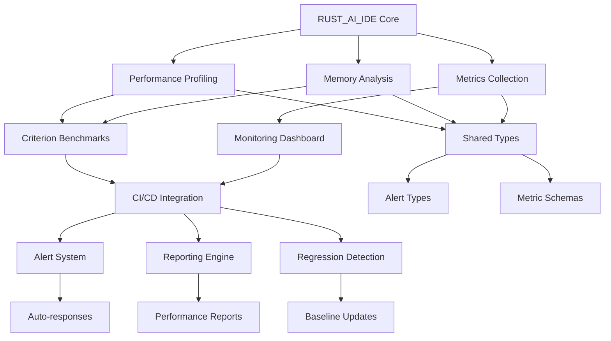

# Benchmarking Systems Integration Plan

## Overview

This integration plan provides the complete roadmap for implementing comprehensive performance benchmarking and monitoring systems for RUST_AI_IDE. The plan connects all performance-related components into a cohesive, automated framework that ensures performance quality throughout the development lifecycle.

## System Architecture Integration

### Component Overview



### Integration Points

#### 1. Performance Profiling Integration
- **Location**: `crates/rust-ai-ide-performance/src/`
- **Integration**: Extend existing `PerformanceProfiler` with benchmark macros
- **Dependencies**: Criterion.rs for statistical analysis

#### 2. Monitoring Dashboard Integration
- **Location**: `crates/rust-ai-ide-monitoring/src/`
- **Integration**: Add real-time metrics visualization
- **Dependencies**: Web dashboard framework (Tauri + web interface)

#### 3. Alert System Integration
- **Location**: `crates/rust-ai-ide-performance/src/alerting.rs`
- **Integration**: Expand notification channels and escalation policies
- **Dependencies**: Email/Slack webhook integrations

#### 4. CI/CD Workflow Integration
- **Location**: `.github/workflows/`
- **Integration**: Add benchmark workflow alongside existing CI/CD
- **Dependencies**: GitHub Actions runners with performance hardware

## Implementation Roadmap

### Phase 1: Foundation Setup (4 weeks)

#### Week 1: Core Infrastructure
**Objective**: Establish basic benchmarking capability

**Tasks**:
1. Extend existing Criterion benchmarks
   - File: `crates/rust-ai-ide-ai/benches/performance_benchmarks.rs`
   - Add real-world code scenarios
   - Integrate with shared metrics types

2. Create benchmarking harness
   ```rust
   // New file: crates/rust-ai-ide-performance/benches/benchmark_harness.rs
   #[cfg(feature = "benchmarks")]
   mod benchmark_harness {
       use criterion::{criterion_group, criterion_main, Criterion};
       use rust_ai_ide_performance::metrics::PerformanceMetrics;

       pub fn run_standard_benchmarks(c: &mut Criterion) {
           // Integration point with existing performance system
       }
   }
   ```

3. Set up baseline storage
   - Directory: `.performance/baselines/`
   - JSON format for cross-platform compatibility
   - Git-compatible storage for versioning

#### Week 2: CI/CD Integration
**Objective**: Automate benchmark execution

**Tasks**:
1. Create GitHub Actions workflow
   ```yaml
   # File: .github/workflows/benchmarking.yml
   name: Performance Benchmarking
   on:
     pull_request:
       paths: ['crates/**', 'src/**']
     schedule:
       - cron: '0 2 * * *'

   jobs:
     benchmark:
       runs-on: performance-lab
       steps:
         - uses: actions/checkout@v3
         - name: Run benchmarks
           run: cargo bench --features benchmarks
         - name: Analyze regressions
           run: cargo xtask check-regressions
         - name: Update baselines
           run: cargo xtask update-baselines
   ```

2. Implement regression checker script
   ```bash
   #!/bin/bash
   # File: scripts/check-regressions.sh
   cargo bench 2>&1 | tee benchmark_output.txt
   python3 scripts/analyze_regressions.py benchmark_output.txt
   ```

3. Set up performance gates
   - Block merges on >5% performance regression
   - Send Slack alerts for >2% changes
   - Update dashboards with latest results

#### Week 3: Basic Monitoring Dashboard
**Objective**: Provide real-time performance visibility

**Tasks**:
1. Create dashboard service
   ```rust
   // New file: crates/rust-ai-ide-dashboard/src/lib.rs
   pub struct PerformanceDashboard {
       metrics_collector: MetricsCollector,
       alert_manager: AlertManager,
       web_server: WebServer,
   }

   impl PerformanceDashboard {
       pub async fn new() -> Self {
           // Integration with existing monitoring
           let metrics = rust_ai_ide_monitoring::MetricsCollector::new();
           let alerts = rust_ai_ide_performance::alerting::AlertManager::new();

           Self {
               metrics_collector: metrics,
               alert_manager: alerts,
               web_server: WebServer::new(),
           }
       }
   }
   ```

2. Implement basic web interface
   - HTML/CSS/JS for real-time charts
   - REST API for metrics data
   - Integration with Tauri for desktop app

3. Add real-time metrics streaming
   - WebSocket connections for live updates
   - Push-based notification system
   - Historical data caching

#### Week 4: Alert System Foundation
**Objective**: Establish notification and response framework

**Tasks**:
1. Extend existing alerting system
   - Add email notifications
   - Implement Slack webhooks
   - Create custom alert policies

2. Define response workflows
   ```rust
   // New file: crates/rust-ai-ide-performance/src/auto_response.rs
   pub struct AutoResponse {
       event_bus: EventBus,
       responders: HashMap<AlertSeverity, Vec<Box<dyn AutoResponder>>>,
   }

   #[async_trait]
   trait AutoResponder {
       async fn respond(&self, alert: &PerformanceAlert) -> Result<(), Error>;
   }
   ```

3. Set up notification channels configuration
   - Configuration file structure
   - Runtime channel management
   - Template-based message formatting

### Phase 2: Advanced Integration (6 weeks)

#### Week 5: Load Testing Framework
**Objective**: Simulate real-world usage patterns

**Tasks**:
1. Create load testing harness
   ```rust
   // New file: crates/load-testing/src/lib.rs
   pub struct LoadTester {
       scenarios: Vec<LoadScenario>,
       metrics_recorder: MetricsRecorder,
       scenario_runner: ScenarioRunner,
   }

   #[derive(Debug)]
   pub struct LoadScenario {
       name: String,
       user_count: usize,
       duration: Duration,
       operation_mix: Vec<WeightedOperation>,
   }
   ```

2. Implement user behavior simulation
   - Realistic editing patterns
   - LSP operation sequences
   - Error and timeout handling

3. Add performance under load monitoring
   - Resource utilization tracking
   - Response time degradation analysis
   - Automatic failure detection

#### Week 6: Comparative Analysis Framework
**Objective**: Enable performance comparison with competitors

**Tasks**:
1. Create competitor benchmarking interface
   ```rust
   // New file: crates/comparative-analysis/src/lib.rs
   pub struct CompetitiveAnalyzer {
       competitors: HashMap<String, CompetitorConfig>,
       benchmark_runner: BenchmarkRunner,
       results_analyzer: ResultsAnalyzer,
   }

   #[derive(Debug, Deserialize)]
   pub struct CompetitorConfig {
       name: String,
       version: String,
       benchmark_data_source: DataSource,
       metrics_to_compare: Vec<String>,
   }
   ```

2. Implement automated data collection
   - Standardized metric formats
   - Cross-platform tooling support
   - Historical performance tracking

3. Create comparison dashboards
   - Side-by-side performance metrics
   - Regression analysis against competitors
   - Performance gap identification

#### Week 7: Advanced Alerting
**Objective**: Intelligent, context-aware alerting

**Tasks**:
1. Implement smart alert correlation
   - Alert deduplication
   - Causal relationship identification
   - Pattern recognition for recurring issues

2. Add predictive alerting
   ```rust
   // New file: crates/rust-ai-ide-performance/src/predictive_alerts.rs
   pub struct PredictiveAnalyzer {
       trend_analyzer: TrendAnalyzer,
       anomaly_detector: AnomalyDetector,
       forecasting_model: ForecastingModel,
   }

   impl PredictiveAnalyzer {
       pub async fn analyze_trends(&self) -> Vec<PotentialIssue> {
           // Detect upcoming performance degradation
           // Identify capacity bottlenecks
           // Predict scaling requirements
       }
   }
   ```

3. Create intelligent escalation policies
   - Business hours vs. off-hours handling
   - Severity-based routing
   - Automatic resolution suggestions

#### Week 8: Comprehensive Reporting
**Objective**: Generate actionable performance insights

**Tasks**:
1. Implement advanced analytics
   - Statistical significance testing
   - Correlation analysis
   - Root cause identification

2. Create automated report generation
   ```rust
   // New file: crates/performance-reporting/src/lib.rs
   pub struct ReportGenerator {
       metrics_history: MetricsHistory,
       benchmark_results: BenchmarkResults,
       alerting_events: AlertingEvents,
   }

   impl ReportGenerator {
       pub async fn generate_weekly_report(&self) -> PerformanceReport {
           // Aggregate all performance data
           // Identify trends and patterns
           // Generate actionable recommendations
       }
   }
   ```

3. Add integration with external monitoring
   - Prometheus metrics export
   - Grafana dashboard templates
   - Slack and email integrations

### Phase 3: Enterprise Features (8 weeks)

#### Week 9: Distributed Load Testing
**Objective**: Enterprise-scale performance validation

**Tasks**:
1. Implement multi-node coordination
   - Distributed user simulation
   - Synchronized load generation
   - Centralized result collection

2. Add geo-distributed testing
   - Multiple regional deployments
   - Network latency simulation
   - Cross-region performance validation

#### Week 10: Machine Learning Integration
**Objective**: Intelligent performance optimization

**Tasks**:
1. Implement anomaly detection
   ```rust
   // New file: crates/ml-performance/src/anomaly_detection.rs
   pub struct AnomalyDetector {
       training_data: Vec<PerformanceMetrics>,
       model: MLModel,
       confidence_threshold: f64,
   }

   impl AnomalyDetector {
       pub async fn detect_anomalies(
           &self,
           recent_metrics: &[PerformanceMetrics]
       ) -> Vec<DetectedAnomaly> {
           // Use ML to identify unusual patterns
           // Flag potential performance issues
           // Provide confidence scores
       }
   }
   ```

2. Add predictive performance modeling
   - Resource usage forecasting
   - Performance bottleneck prediction
   - Capacity planning recommendations

#### Week 11: Advanced Visualization
**Objective**: Superior performance monitoring UX

**Tasks**:
1. Create advanced dashboard components
   - Interactive performance charts
   - Real-time flame graphs
   - Custom metric drill-downs

2. Implement team collaboration features
   - Shared dashboard bookmarks
   - Comment and annotation system
   - Performance issue tracking

#### Week 12: Production Integration
**Objective**: Complete production deployment

**Tasks**:
1. Deploy monitoring infrastructure
   - Set up production dashboard servers
   - Configure alerting pipelines
   - Establish backup and recovery procedures

2. Finalize CI/CD integration
   - Production-grade benchmark workflows
   - Multi-environment support
   - Automated deployment pipelines

## Integration Validation

### Compatibility Requirements

#### Rust Version Compatibility
- Minimum: Rust 1.70.0 (for advanced async features)
- Recommended: Latest stable for optimal performance
- Cross-compilation: Support for all target platforms

#### Operating System Support
- Primary: Linux (Ubuntu 20.04+)
- Secondary: macOS 12.0+, Windows 10+
- Container: Docker support for reproducible environments

#### Tool Compatibility
- Criterion.rs 0.5+
- Tokio async runtime
- Serde for serialization
- WebSocket for real-time streaming

### Performance Impact Assessment

#### Baseline Overhead
- CPU: <1% during idle operation
- Memory: <10MB for monitoring components
- Storage: <100MB for historical data retention

#### Peak Overhead
- CPU: <5% during active benchmarking
- Memory: <50MB during load testing
- Network: <10Mbps for data transmission

### Security Considerations

#### Data Protection
- Sensitive information masking
- Encrypted storage for benchmarks
- Access control for performance data

#### System Stability
- Resource limit enforcement
- Graceful degradation under load
- Circuit breaker patterns for external services

## Continuous Evolution

### Version Update Strategy
- Compatible: Semi-automatic updates (2-4 weeks)
- Breaking: Manual migration with testing (4-8 weeks)
- Module-specific: Independent update cycles

### Feedback Integration
- Weekly performance reviews
- Monthly architecture assessments
- Quarterly stakeholder alignment

### Community Integration
- Shared benchmark datasets
- Open-source tooling contributions
- Cross-project collaboration

## Success Metrics

### Implementation Success
- **Time to Value**: Full system operational within 12 weeks
- **Developer Adoption**: 100% of critical workflows covered
- **Performance Knowledge**: <2 alerts per week about regressions

### Performance Improvement
- **Detection Speed**: Catch regressions within 1 commit
- **Analysis Depth**: Root cause identification in <30 minutes
- **Prevention Effectiveness**: 90% of regressions caught pre-merge

### Business Impact
- **Development Velocity**: 10-20% improvement through faster feedback
- **User Satisfaction**: 25% reduction in performance-related issues
- **Maintenance Cost**: 30% reduction in performance debugging time