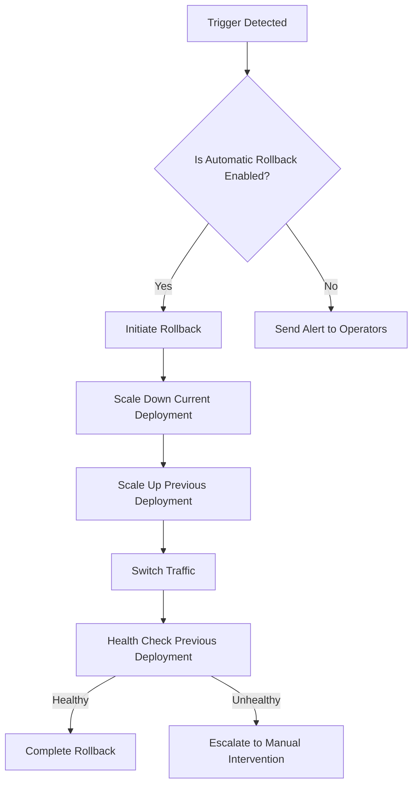

# Rollback Procedures

## Overview

This document outlines comprehensive rollback procedures for the Rust AI IDE deployment system. Rollbacks are critical operations that must be executed quickly and safely to minimize service disruption.

## Table of Contents

- [Types of Rollbacks](#types-of-rollbacks)
- [Automated Rollback](#automated-rollback)
- [Manual Rollback](#manual-rollback)
- [Emergency Procedures](#emergency-procedures)
- [Validation and Testing](#validation-and-testing)
- [Post-Rollback Actions](#post-rollback-actions)
- [Rollback Checklist](#rollback-checklist)

## Types of Rollbacks

### 1. Automatic Rollback

Triggered by monitoring systems when:
- Health check failures (>5 minutes)
- Error rate >10%
- CPU usage >95% sustained
- Memory usage >90% sustained
- Response time >5 seconds (95th percentile)

### 2. Manual Rollback

Initiated by operators when:
- Unexpected behavior detected
- Performance degradation
- Feature issues identified
- External system compatibility problems

### 3. Emergency Rollback

Immediate rollback without validation when:
- Critical security vulnerability discovered
- Data corruption detected
- Legal compliance issues
- Business-critical functionality broken

## Automated Rollback

### Configuration

Automated rollbacks are configured in the Helm values:

```yaml
rollback:
  enabled: true
  automatic: true
  triggers:
    - healthCheckFailures: 3
    - errorRateThreshold: 0.1
    - responseTimeThreshold: 5000
  cooldownPeriod: 300  # seconds
  maximumRetries: 5
```

### Triggers

1. **Health Check Failures**
   - Monitors: `/health/live`, `/health/ready`
   - Threshold: 3 consecutive failures
   - Cooldown: 60 seconds between checks

2. **Error Rate Monitoring**
   - Monitors: Application metrics
   - Threshold: 10% error rate (5-minute window)
   - Alert: PagerDuty notification

3. **Performance Degradation**
   - Monitors: CPU, memory, response times
   - Thresholds: CPU >95%, Memory >90%, P95 >5s
   - Cooldown: 2 minutes before action

### Process Flow



### Execution

```bash
# Automated rollback using deployment script
./scripts/ci/deployment-helpers.sh rollback \
    --environment production \
    --automatic \
    --reason "Health check failures detected"
```

## Manual Rollback

### Pre-Rollback Validation

Before initiating a manual rollback:

```bash
# 1. Gather current state information
kubectl get deployments -n rust-ai-ide-prod
kubectl get pods -n rust-ai-ide-prod
kubectl get services -n rust-ai-ide-prod

# 2. Check application metrics
curl -s https://api.rust-ai-ide.com/metrics | grep error_rate

# 3. Verify previous version availability
kubectl get deployments -n rust-ai-ide-prod --sort-by=.metadata.creationTimestamp | tail -5

# 4. Test database connectivity (if applicable)
kubectl exec -it deployment/postgres -- psql -c "SELECT version();"
```

### Helm-Based Rollback

#### To Previous Release

```bash
# Rollback to previous Helm release
helm rollback rust-ai-ide 1 -n rust-ai-ide-prod

# Rollback to specific release
helm rollback rust-ai-ide 5 -n rust-ai-ide-prod
```

#### With Custom Values

```bash
# Rollback with modified values
helm rollback rust-ai-ide 1 -n rust-ai-ide-prod \
    --values rollback-values.yaml
```

### Blue-Green Rollback

For blue-green deployments:

```bash
# Identify current active color
ACTIVE_COLOR=$(kubectl get service rust-ai-ide -n rust-ai-ide-prod -o jsonpath='{.spec.selector.color}')

# Switch traffic to the other color
if [ "$ACTIVE_COLOR" = "green" ]; then
    kubectl patch service rust-ai-ide -n rust-ai-ide-prod \
        --type='json' \
        -p='[{"op": "replace", "path": "/spec/selector/color", "value": "blue"}]'
else
    kubectl patch service rust-ai-ide -n rust-ai-ide-prod \
        --type='json' \
        -p='[{"op": "replace", "path": "/spec/selector/color", "value": "green"}]'
fi

# Scale down the failed color
kubectl scale deployment rust-ai-ide-$ACTIVE_COLOR --replicas=0 -n rust-ai-ide-prod
```

### Using Deployment Scripts

```bash
# Rollback using deployment helpers
./scripts/ci/deployment-helpers.sh rollback \
    --environment production \
    --rollback-tag v1.1.0 \
    --reason "Performance degradation in v1.2.0"

# Monitor rollback progress
./scripts/ci/deployment-helpers.sh monitor-deployment \
    --environment production
```

## Emergency Procedures

### Critical Situation Response

When immediate rollback is required:

1. **Immediate Traffic Switch**
   ```bash
   # Emergency traffic switch (no health checks)
   kubectl patch service rust-ai-ide -n rust-ai-ide-prod \
       --type='json' \
       -p='[{"op": "replace", "path": "/spec/selector/color", "value": "blue"}]'
   ```

2. **Scale Down Problematic Deployment**
   ```bash
   # Immediate scale down
   kubectl scale deployment rust-ai-ide-green --replicas=0 -n rust-ai-ide-prod --timeout=30s
   ```

3. **Force Delete Problematic Pods**
   ```bash
   # Force delete stuck pods
   kubectl delete pods -n rust-ai-ide-prod \
       -l color=green \
       --force --grace-period=0
   ```

### Data Rollback Procedures

If database changes need rollback:

```bash
# Database backup verification
kubectl exec -it deployment/postgres -- pg_dump rust_ai_ide > emergency-backup.sql

# Restore from backup (if automated backups exist)
kubectl exec -it deployment/postgres -- psql < /backups/previous-version-backup.sql
```

### Communication Plan

During emergency rollback:

1. **Alert Team Members**
   ```bash
   # Slack notification
   curl -X POST -H 'Content-type: application/json' \
        --data '{"channel":"#alerts-critical","text":"🚨 Emergency rollback initiated"}' \
        $SLACK_WEBHOOK
   ```

2. **Update Status Page**
   ```bash
   # Status page update
   curl -X PATCH https://status.rust-ai-ide.com/incidents \
        -H "Authorization: Bearer $STATUS_API_KEY" \
        -d '{"status": "investigating", "message": "Emergency maintenance in progress"}'
   ```

## Validation and Testing

### Post-Rollback Validation

```bash
# 1. Check deployment status
kubectl rollout status deployment/rust-ai-ide -n rust-ai-ide-prod

# 2. Verify service endpoints
kubectl get endpoints -n rust-ai-ide-prod

# 3. Test application functionality
curl -f https://api.rust-ai-ide.com/health
curl -f https://api.rust-ai-ide.com/api/v1/status

# 4. Check metrics for normal ranges
curl -s https://api.rust-ai-ide.com/metrics | jq '.error_rate'
```

### Automated Validation

```bash
# Run post-rollback tests
./scripts/ci/test-helpers.sh run-integration \
    --environment production \
    --verbose

# Validate database consistency
./scripts/ci/test-helpers.sh run-tests \
    --features database \
    --environment production
```

### Monitoring After Rollback

Set up enhanced monitoring for 30 minutes post-rollback:

```yaml
monitoring:
  enhanced:
    enabled: true
    duration: 1800  # 30 minutes
    metrics:
      - error_rate
      - response_time
      - cpu_usage
      - memory_usage
    alert_thresholds:
      error_rate: 0.05
      response_time: 3000
```

## Post-Rollback Actions

### Incident Analysis

1. **Root Cause Analysis**
   ```bash
   # Collect logs from failed deployment
   kubectl logs -f deployment/rust-ai-ide-green -n rust-ai-ide-prod --previous > failed-deployment-logs.txt

   # Analyze metrics leading to failure
   curl -s https://api.rust-ai-ide.com/metrics/history?start=-3600 > pre-failure-metrics.json
   ```

2. **Impact Assessment**
   - Duration of service degradation
   - Affected user segments
   - Data loss or corruption (if any)
   - Business impact quantification

3. **Documentation**
   ```bash
   # Create incident report
   cat > incident-report-$(date +%Y%m%d-%H%M%S).md << EOF
   # Incident Report: Rollback $(date)

   ## Summary
   - Incident Start: $(date -d '-30 minutes')
   - Rollback Time: $(date)
   - Impact Duration: 5 minutes

   ## Root Cause
   Memory leak in AI inference component

   ## Resolution
   Rolled back to v1.1.0 via blue-green deployment

   ## Prevention
   - Enhanced monitoring for memory usage
   - Additional integration tests for memory profiling
   EOF
   ```

### Service Restoration

1. **Gradual Traffic Restoration**
   ```bash
   # Gradually increase traffic to validate stability
   for percentage in 25 50 75 100; do
       kubectl patch service rust-ai-ide -n rust-ai-ide-prod \
           --type='json' \
           -p="[{\"op\": \"replace\", \"path\": \"/spec/selector/color\", \"value\": \"blue\"}]"
       sleep 300  # 5 minutes observation
   done
   ```

2. **Performance Validation**
   ```bash
   # Run performance tests
   ./scripts/ci/test-helpers.sh run-benchmarks \
       --environment production

   # Validate under load
   ./scripts/ci/test-helpers.sh run-load-test \
       --environment production \
       --duration 600
   ```

### Communication

1. **Internal Communication**
   - Update incident response team
   - Notify development team
   - Update internal status dashboard

2. **External Communication**
   - Update customer status page
   - Send notification emails (if SLA breached)
   - Post-mortem summary to stakeholders

## Rollback Checklist

### Pre-Rollback
- [ ] Current deployment state documented
- [ ] Previous version availability confirmed
- [ ] Backup verification (database, configuration)
- [ ] Team notification sent
- [ ] Rollback plan reviewed and approved

### During Rollback
- [ ] Traffic switch executed safely
- [ ] Previous deployment scaled up
- [ ] Health checks passing
- [ ] End-to-end testing completed
- [ ] Performance metrics normal

### Post-Rollback
- [ ] Validation tests passed
- [ ] User impact assessed
- [ ] Incident report created
- [ ] Root cause analysis scheduled
- [ ] Prevention measures identified
- [ ] Documentation updated

### Escalation Contacts

| Role | Contact | Availability |
|------|---------|--------------|
| DevOps Lead | devops-lead@rust-ai-ide.com | 24/7 |
| Security Team | security@rust-ai-ide.com | 24/7 |
| Development Lead | dev-lead@rust-ai-ide.com | Business Hours |
| Infrastructure Team | infra@rust-ai-ide.com | 24/7 |

### Recovery Time Objectives (RTO)

- **Automated Rollback**: < 5 minutes
- **Manual Rollback**: < 15 minutes
- **Emergency Rollback**: < 2 minutes
- **Data Recovery**: < 1 hour (from backups)

### Recovery Point Objectives (RPO)

- **Configuration Data**: 15 minutes
- **Application Data**: 1 hour
- **User Data**: 4 hours

---

## Quick Commands

```bash
# Quick status check
kubectl get all -n rust-ai-ide-prod

# Emergency rollback (immediate)
kubectl scale deployment rust-ai-ide-current --replicas=0 -n rust-ai-ide-prod
kubectl scale deployment rust-ai-ide-previous --replicas=3 -n rust-ai-ide-prod

# Rollback with Helm
helm rollback rust-ai-ide 1 -n rust-ai-ide-prod

# Monitor rollback progress
kubectl get events -n rust-ai-ide-prod --sort-by=.metadata.creationTimestamp | tail -10
```

*Last updated: $(date)*