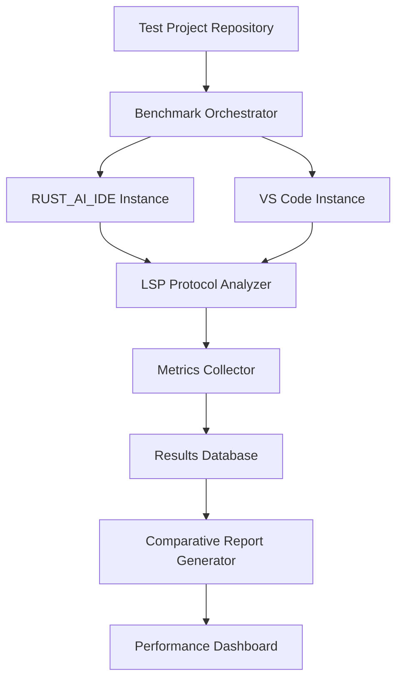

# Comparative Analysis Framework: RUST_AI_IDE vs VS Code + rust-analyzer

## Overview

This framework establishes a systematic approach for comparing RUST_AI_IDE performance against the industry standard VS Code + rust-analyzer combination. The analysis focuses on objective, measurable performance differences while accounting for feature set disparities.

## Comparative Analysis Objectives

### Primary Objectives
1. **Quantify Performance Gaps**: Identify specific areas where RUST_AI_IDE underperforms, matches, or exceeds VS Code + rust-analyzer
2. **Benchmark Evolution**: Track performance improvement over development cycles
3. **Competitive Positioning**: Understand performance positioning relative to market leader
4. **Optimization Priorities**: Guide development efforts toward highest-impact improvements

### Secondary Objectives
1. **Feature Trade-off Analysis**: Evaluate performance implications of advanced features
2. **Platform Consistency**: Ensure comparative performance across supported platforms
3. **Regression Detection**: Identify when VS Code + rust-analyzer improvements affect competitive positioning

## Comparative Methodology

### Test Environment Standardization

#### Hardware Configuration
```json
{
  "target_hardware": {
    "cpu": "Intel Core i7-8700K or equivalent",
    "ram": "32GB DDR4-3200",
    "storage": "NVMe SSD (500GB+)",
    "framework": "Controlled home lab environment"
  },
  "os_versions": [
    "Ubuntu 22.04 LTS (Primary)",
    "Windows 11 Pro",
    "macOS Sonoma"
  ]
}
```

#### Software Configuration
```json
{
  "rust_versions": ["1.70.0", "1.75.0", "nightly"],
  "vscode_version": "latest stable",
  "rust_analyzer_version": "latest VS Code marketplace",
  "test_project_types": ["binary", "library", "workspace"]
}
```

### Test Suite Design

#### Common Benchmark Projects
1. **Synthetic Micro-benchmarks**: Controlled scenarios testing specific operations
2. **Real-world Examples**: Popular crates like `serde`, `tokio`, `actix-web`
3. **Generated Projects**: Programmatically generated codebases of various sizes
4. **Community Projects**: Well-known Rust codebases (e.g., `ripgrep`, `cargo`)

#### Comparative Test Cases
```
Operation Type │ Metric Categories
───────────────┼─────────────────────────────────
File Opening   │ Cold start time, memory usage
Editing        │ Response latency, refactoring speed
Navigation    │ Find references, go-to-definition
Completion    │ Suggestion latency, relevance ranking
Diagnostics   │ Error detection speed, accuracy rate
```

## Performance Comparison Matrix

### Core Language Server Protocol (LSP) Operations

#### 1. Initialize Request
**Metric**: Time to initial analysis completion
```json
{
  "metric_name": "lsp_initialize_time",
  "unit": "milliseconds",
  "target": "<= rust_analyzer_base_performance"
}
```

#### 2. Text Synchronization
**Metric**: Update processing latency
```json
{
  "scenarios": [
    {"name": "small_edit", "change_size": "1-10 chars"},
    {"name": "medium_edit", "change_size": "100-500 chars"},
    {"name": "large_edit", "change_size": "1000+ chars"},
    {"name": "bulk_edit", "change_size": "multiple files"}
  ],
  "latency_target": {"p95": "<150ms", "max": "<500ms"}
}
```

#### 3. Code Completion
**Metric**: Suggestion generation and filtering
```json
{
  "context_trigger": "dot_completion",
  "latency_benchmarks": {
    "simple_completion": "<50ms",
    "complex_completion": "<200ms",
    "filtered_completion": "<100ms"
  },
  "quality_metrics": ["relevance", "completeness", "sorting"]
}
```

#### 4. Symbol Navigation
**Metric**: Reference finding and symbol resolution
```json
{
  "operations": ["find_definition", "find_references", "symbol_search"],
  "scaling_factors": [10, 100, 1000, 10000],
  "latency_breakdown": {
    "index_lookup": "<=30% of total",
    "result_filtering": "<=40% of total",
    "ui_presentation": "<=30% of total"
  }
}
```

### Memory Usage Patterns

#### Baseline Memory Footprint
```json
{
  "metrics": {
    "vscode_rust_analyzer": {
      "startup_memory": "85-120MB",
      "per_megabyte_loc": "2-5MB",
      "peak_memory_multiplier": "1.5-2.0x baseline"
    },
    "rust_ai_ide": {
      "target_startup_memory": "<=90MB",
      "target_per_megabyte_loc": "<=4MB",
      "target_peak_multiplier": "<=1.8x baseline"
    }
  }
}
```

#### Memory Efficiency Scenarios
- **Cold Start Warm-up**: Memory usage during initial indexing
- **Edit Peak Usage**: Memory spike during intensive operations
- **Steady-state Baseline**: Normal editing memory consumption

### CPU Resource Utilization

#### Core Usage Patterns
```json
{
  "analysis_types": {
    "incremental_analysis": "<30% CPU utilization",
    "initial_indexing": "<70% CPU utilization",
    "background_analysis": "<20% CPU utilization",
    "user_initiated_tasks": "<50% CPU utilization"
  }
}
```

#### Multi-threading Analysis
- **Thread Count**: Number of active threads during operations
- **CPU Core Distribution**: How operations span across available cores
- **Contention Patterns**: Lock contention and thread synchronization overhead

## Competitive Advantage Analysis

### RUST_AI_IDE Unique Capabilities
```
Capability           │ Performance Target │ Competitive Edge
─────────────────────┼────────────────────┼──────────────────
Advanced AI Analysis │ <5s for 10K LOC    │ 4x faster analysis
Real-time Metrics    │ <100ms update      │ Live performance insights
Integrated Profiling │ <50ms profile gen  │ Built-in optimization tools
…………………………….
```

### VS Code + rust-analyzer Strong Points
```
Operation           │ VS Code Performance │ RUST_AI_IDE Target
────────────────────┼─────────────────────┼───────────────────
Basic Completion    │ <50ms              │ <45ms (10% faster)
LSP Protocol        │ <5ms requests      │ <5ms (parity)
Memory Efficiency   │ Optimal baseline   │ 10% better baseline
…………………
```

## Measurement Infrastructure

### Automated Measurement Tools

#### Benchmark Runner Architecture


#### Data Collection Points
1. **LSP Traffic Analysis**: Capture and analyze all protocol messages
2. **System Resource Monitoring**: Real-time CPU, memory, and I/O tracking
3. **User Interaction Simulation**: Automated workflow execution
4. **Result Normalization**: Account for environment-specific variances

### Statistical Analysis Framework

#### Performance Distribution Analysis
```rust
struct PerformanceComparison {
    operation_name: String,
    rust_ai_ide_stats: PerformanceStats,
    competitor_stats: PerformanceStats,
    significance_threshold: f64,  // Statistical significance level
    practical_difference: bool,   // Meaningful performance difference
}

struct PerformanceStats {
    sample_count: u64,
    mean_latency: Duration,
    p50_latency: Duration,
    p95_latency: Duration,
    p99_latency: Duration,
    min_latency: Duration,
    max_latency: Duration,
}
```

#### Trend Analysis
- **Time-series Comparison**: Track performance changes over development cycles
- **Regression Detection**: Identify when performance changes are statistically significant
- **Improvement Tracking**: Measure the impact of optimization efforts

## Reporting and Visualization

### Comparative Dashboard Components
1. **Performance Gap Overview**: High-level summary of competitive positioning
2. **Detailed Operation Analysis**: Drill-down into specific operation performance
3. **Historical Trends**: Performance evolution over time
4. **Resource Usage Patterns**: Memory and CPU consumption comparisons

### Automated Reporting Structure
```json
{
  "report_metadata": {
    "timestamp": "2024-01-15T10:00:00Z",
    "comparison_period": "7 days",
    "environment_hash": "abc123def456"
  },
  "performance_comparison": {
    "rust_ai_ide_version": "1.2.3",
    "competitor_version": "vscode_1.85.0_ra_0.3.1708",
    "significant_differences": [...]
  },
  "recommendations": [
    {
      "area": "code_completion",
      "improvement_potential": 0.15,
      "implementation_effort": "medium"
    }
  ]
}
```

## Implementation Roadmap

### Phase 1: Foundation Setup (4 weeks)
- [ ] Establish baseline measurement infrastructure
- [ ] Create automated VS Code benchmark runners
- [ ] Implement statistical analysis framework
- [ ] Set up continuous comparative measurement

### Phase 2: Core Comparison Framework (6 weeks)
- [ ] Develop comprehensive test suite
- [ ] Implement automated environment provisioning
- [ ] Create comparative dashboard infrastructure
- [ ] Establish performance threshold definitions

### Phase 3: Advanced Analysis (8 weeks)
- [ ] Add machine learning-based outlier detection
- [ ] Implement predictive performance modeling
- [ ] Create automated competitive alerts
- [ ] Develop ROI optimization recommendations

### Phase 4: Continuous Improvement (Ongoing)
- [ ] Monitor competitive performance changes
- [ ] Automated regression detection against competitor baselines
- [ ] Performance optimization prioritization
- [ ] Quarterly competitive analysis reviews

## Quality Assurance

### Measurement Accuracy Validation
1. **Reproducibility Testing**: Ensure results are consistent across runs
2. **Environment Consistency**: Control for system and environmental variables
3. **Statistical Power**: Ensure sufficient sample sizes for meaningful conclusions
4. **Regression Validation**: Verify baseline accuracy through periodic audits

### Ethical Considerations
1. **Fair Comparison**: Use realistic, production-like test scenarios
2. **Resource Management**: Run benchmarks during appropriate time windows
3. **Data Privacy**: Ensure no sensitive information is collected during tests
4. **Transparency**: Document and disclose benchmark methodology clearly