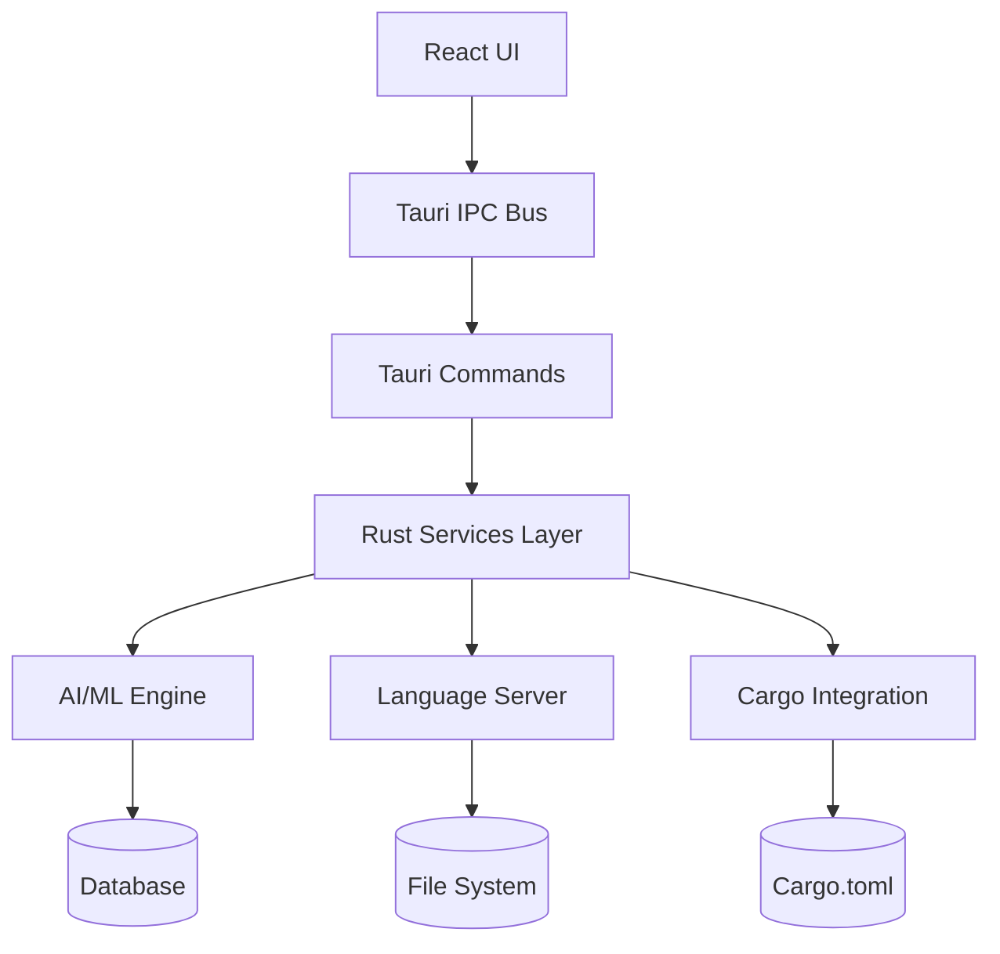
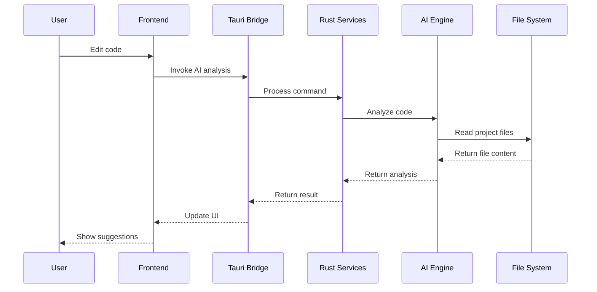
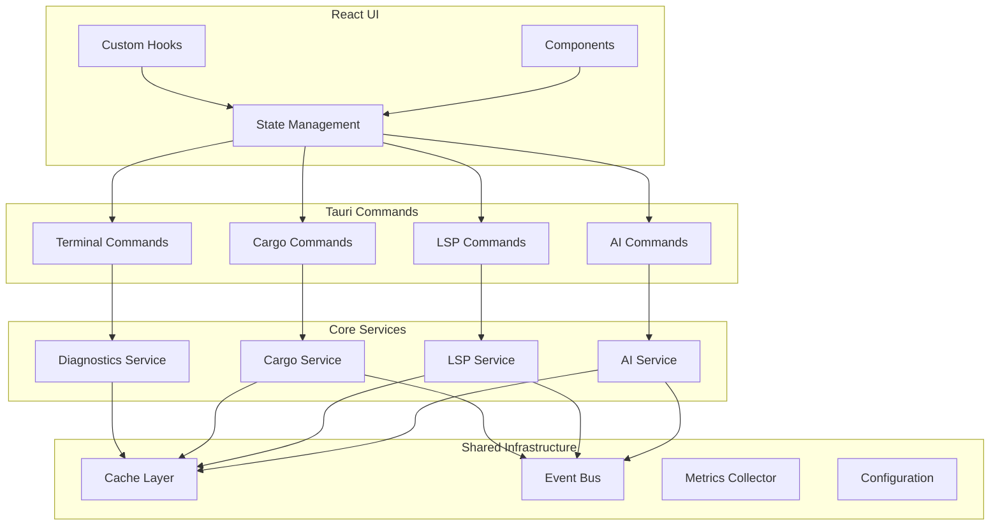
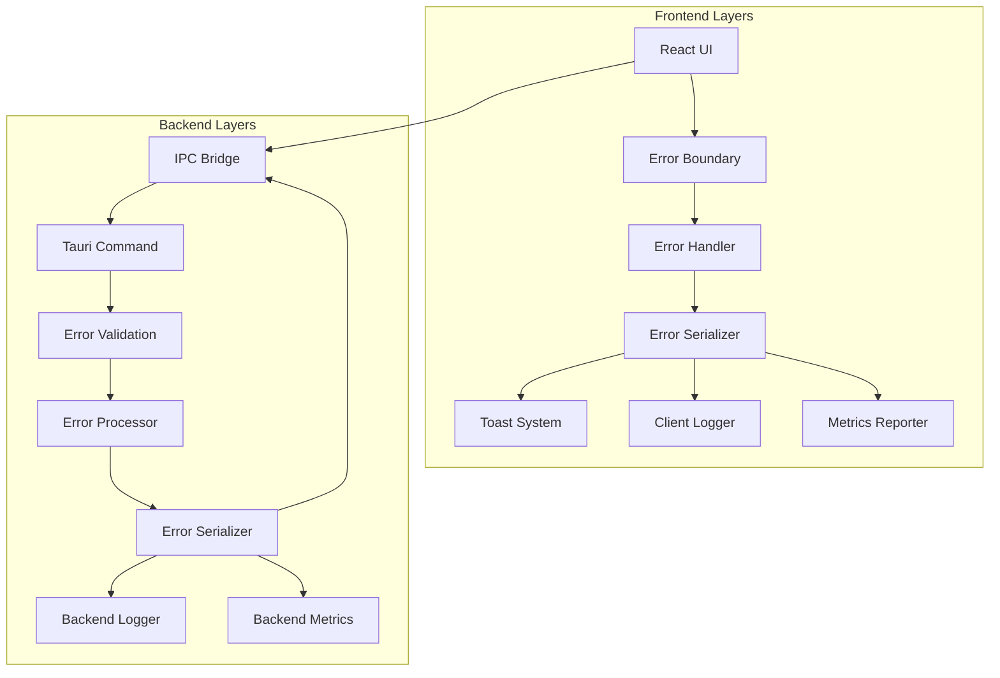

# Consolidated Architecture and Documentation Guide

*Generated: $(date) | Version: 1.0*

[!CAUTION]
This document serves as the **single source of truth** for project architecture, replacing multiple overlapping documents. All other documentation files should be updated to reference this consolidated guide.

[!TIP]
Use the table of contents for navigation. This document integrates content from: `Shared-Architecture-Guide.md`, `API-Reference.md`, `system-architecture-overview.md`, `Architecture-Diagrams.md`, `developer-onboarding-guide.md`, and `INTEGRATION_GUIDE.md`.

## 📋 Table of Contents

1. [System Overview](#-system-overview)
2. [Core Architecture](#-core-architecture)
3. [Component Architecture](#-component-architecture)
4. [API Reference](#-api-reference)
5. [Integration Patterns](#-integration-patterns)
6. [Developer Onboarding](#-developer-onboarding)
7. [Architecture Diagrams](#-architecture-diagrams)
8. [Migration Guide](#-migration-guide)

---

## 🏗️ System Overview

### High-Level Architecture

```text
┌─────────────────┐    ┌─────────────────┐    ┌─────────────────┐
│   React         │    │   Tauri         │    │   Rust Core     │
│   Frontend      │◄──►│   Bridge        │◄──►│   Services      │
│                 │    │                 │    │                 │
│ - UI Components │    │ - IPC           │    │ - AI Analysis   │
│ - State Mgmt    │    │ - FFI           │    │ - Cargo Int     │
│ - Routing       │    │ - Security      │    │ - LSP           │
│ - Data Flow     │    │ - File System   │    │ - Build System  │
└─────────────────┘    └─────────────────┘    └─────────────────┘
```

### Key Properties

- **Modular Design**: Plugin-based architecture with clear separation of concerns
- **Cross-Platform**: Works on Linux, macOS, Windows with WebAssembly support
- **AI-Powered**: ML-enhanced code analysis and suggestions
- **Real-time**: Live diagnostics, sync collaboration
- **Extensible**: Plugin system for custom functionality

### Technology Stack

| Layer | Technology | Purpose | Files |
|-------|------------|---------|--------|
| **Frontend** | React + TypeScript | UI components, state management | `web/src/**` |
| **Bridge** | Tauri + IPC | Frontend-backend communication | `src-tauri/src/main.rs` |
| **Backend** | Rust + async | Core logic, services, LSP | `src-tauri/src/**` |
| **Analysis** | AI/ML models | Code analysis, suggestions | `src-tauri/src/modules/ai/**` |
| **Build** | Cargo | Dependency management, builds | `Cargo.toml`, `.config/**` |
| **Packaging** | Tauri | Cross-platform deployment | `src-tauri/tauri.conf.json` |

---

## 🏛️ Core Architecture

### Architectural Principles

1. **Separation of Concerns**: Each module handles one responsibility
2. **Dependency Injection**: Components are wired through configuration
3. **Error Propagation**: All error types implement common error interface
4. **Async by Default**: All I/O operations are async-first
5. **Type Safety**: Strong typing across the entire stack
6. **Pluggable Architecture**: Easy to add new features via plugins

### Module Structure

```
src-tauri/src/
├── main.rs           # Application entry point
├── lib.rs            # Public API surface
├── commands/         # Tauri command handlers
│   ├── ai/          # AI-related commands
│   ├── cargo/       # Cargo integration
│   ├── lsp/         # LSP implementation
│   └── terminal/    # Terminal commands
├── modules/         # Business logic modules
│   ├── shared/      # Shared utilities
│   ├── ai/          # AI services
│   ├── cargo/       # Cargo service
│   └── terminal/    # Terminal handling
├── utils/           # Utility functions
├── handlers/        # Handler implementations
├── diagnostics/     # Diagnostic system
├── types/           # Shared type definitions
└── errors.rs        # Error definitions
```

### Data Flow Architecture



---

## 🔧 Component Architecture

### Frontend Architecture

#### React Component Hierarchy

```
App
├── Layout
│   ├── Header
│   ├── Sidebar
│   └── Content
├── Editor
│   ├── CodeEditor
│   ├── SyntaxHighlighter
│   └── ContextMenu
├── Panels
│   ├── CargoPanel
│   ├── PerformancePanel
│   ├── DiagnosticsPanel
│   └── OutputPanel
└── Modals
    ├── SettingsModal
    ├── SearchModal
    └── RefactoringModal
```

#### State Management

```typescript
// Redux-like state structure
interface RootState {
  editor: {
    currentFile: string;
    content: string;
    selections: Selection[];
    diagnostics: Diagnostic[];
  };
  cargo: {
    currentProject: string;
    dependencies: Dependency[];
    buildStatus: BuildStatus;
  };
  ai: {
    analysisResults: AnalysisResult[];
    suggestions: Suggestion[];
    settings: AISettings;
  };
  terminal: {
    sessions: TerminalSession[];
    activeSessionId: string;
  };
}
```

### Backend Architecture

#### Service Layer Pattern

```rust
// Service interface
#[async_trait]
pub trait Service: Send + Sync {
    async fn initialize(&self) -> Result<(), Box<dyn Error>>;
    async fn shutdown(&self) -> Result<(), Box<dyn Error>>;
}

// Implementation pattern
pub struct AIService {
    state: Arc<RwLock<ServiceState>>,
    clients: HashMap<String, ClientConnection>,
}

#[derive(Clone)]
pub struct ServiceState {
    pub config: Arc<Config>,
    pub metrics: Arc<MetricsCollector>,
    pub event_bus: Arc<EventBus>,
}
```

#### Error Handling Pattern

```rust
use thiserror::Error;

#[derive(Error, Debug)]
pub enum IDEError {
    #[error("Path validation error: {0}")]
    PathValidation(String),

    #[error("AI service error: {0}")]
    AIService(String),

    #[error("Cargo error: {0}")]
    Cargo(String),

    #[error(transparent)]
    Io(#[from] std::io::Error),
}

// Error conversion pattern
impl From<anyhow::Error> for IDEError {
    fn from(err: anyhow::Error) -> Self {
        IDEError::AIService(err.to_string())
    }
}
```

---

## 📚 API Reference

### Tauri Commands

#### AI Commands

```typescript
// Analyze code with AI
invoke('analyze_code', {
  content: string,
  language: string,
  context?: AnalysisContext
})

// Generate code suggestions
invoke('generate_suggestions', {
  filePath: string,
  cursorPosition: [number, number],
  context: SuggestionContext
})
```

#### Cargo Commands

```typescript
// Build project
invoke('build_project', {
  projectPath: string,
  profile: 'debug' | 'release',
  incremental: boolean
})

// Check dependencies
invoke('check_dependencies', {
  projectPath: string,
  updateAll: boolean
})
```

#### Terminal Commands

```typescript
// Execute terminal command
invoke('terminal_execute_stream', {
  program: string,
  args: string[],
  directory: string,
  id?: string
})
```

### Backend Services API

#### AI Service Interface

```rust
#[async_trait]
pub trait AIService: Send + Sync {
    async fn analyze_code(&self, request: AnalysisRequest) -> Result<AnalysisResult, Box<dyn Error>>;
    async fn generate_suggestions(&self, request: SuggestionRequest) -> Result<Vec<Suggestion>, Box<dyn Error>>;
    async fn explain_error(&self, request: ErrorExplanationRequest) -> Result<ErrorExplanation, Box<dyn Error>>;
}
```

#### LSP Service Interface

```rust
#[async_trait]
pub trait LSPService: Send + Sync {
    async fn initialize(&self, capabilities: LSPInitializationOptions) -> Result<LSPResult, LSPError>;
    async fn text_document_did_open(&self, params: LSPDocumentParams) -> Result<(), LSPError>;
    async fn definition(&self, params: LSPDefinitionParams) -> Result<LSPDefinitionResult, LSPError>;
    async fn hover(&self, params: LSPHoverParams) -> Result<LSPHoverResult, LSPError>;
}
```

---

## 🔗 Integration Patterns

### Service Registration

```rust
// Service registry pattern
pub struct ServiceRegistry {
    services: HashMap<TypeId, Box<dyn Any + Send + Sync>>,
}

impl ServiceRegistry {
    // Register a service by type
    pub fn register<T: 'static + Send + Sync>(&mut self, service: T) {
        self.services.insert(TypeId::of::<T>(), Box::new(service));
    }

    // Get a service by type
    pub fn get<T: 'static>(&self) -> Option<&T> {
        self.services.get(&TypeId::of::<T>())?
            .downcast_ref::<T>()
    }
}
```

### Event-Driven Communication

```rust
// Event bus pattern
pub struct EventBus {
    sender: broadcast::Sender<Event>,
    _receiver: broadcast::Receiver<Event>,
}

impl EventBus {
    pub fn publish(&self, event: Event) -> Result<(), Box<dyn Error>> {
        self.sender.send(event)?;
        Ok(())
    }

    pub fn subscribe(&self) -> broadcast::Receiver<Event> {
        self.sender.subscribe()
    }
}
```

### Plugin System Architecture

```rust
// Plugin interface
#[async_trait]
pub trait Plugin: Send + Sync {
    fn id(&self) -> &'static str;
    fn name(&self) -> &'static str;
    fn version(&self) -> &'static str;

    async fn initialize(&self, context: &PluginContext) -> Result<(), Box<dyn Error>>;
    async fn shutdown(&self) -> Result<(), Box<dyn Error>>;
    async fn handle_event(&self, event: &Event, context: &PluginContext) -> Result<(), Box<dyn Error>>;
}
```

---

## 🚀 Developer Onboarding

### Getting Started

1. **Prerequisites**
   - Rust 1.70+
   - Node.js 18+
   - Yarn or npm
   - Git

2. **Setup**

   ```bash
   git clone <repository>
   cd rust-ai-ide
   yarn install
   cd src-tauri
   cargo build
   cd ..
   yarn tauri dev
   ```

3. **Development Workflow**

   ```bash
   # Run tests
   cargo test --all

   # Run with hot reload
   yarn tauri dev

   # Build for production
   yarn tauri build
   ```

### Code Organization

- **Commands**: Tauri command handlers in `src-tauri/src/commands/`
- **Modules**: Business logic in `src-tauri/src/modules/`
- **Components**: React components in `web/src/components/`
- **Types**: Shared types in `src-tauri/src/types/` and `web/src/types/`
- **Utils**: Utility functions in `src-tauri/src/utils/` and `web/src/utils/`

### Development Standards

#### Rust Code Standards

- Use `clippy` and `rustfmt` for code formatting
- All public APIs need documentation
- Error handling follows `thiserror` pattern
- Async functions use `#[async_trait]` for interfaces

#### TypeScript Code Standards

- Use TypeScript strict mode
- Prefer interfaces over types
- Use PascalCase for components
- Use camelCase for everything else

### Common Patterns

#### Dependency Injection

```rust
#[derive(Clone)]
pub struct ServiceContainer {
    ai_service: Arc<AIService>,
    lsp_service: Arc<LSPService>,
    cargo_service: Arc<CargoService>,
}
```

#### Error Handling

```rust
use anyhow::{Context, Result};

pub async fn analyze_file(path: &Path) -> Result<AnalysisResult> {
    let content = tokio::fs::read_to_string(path)
        .await
        .context("Failed to read file")?;

    let result = analyzer.analyze(&content)
        .await
        .context("Analysis failed")?;

    Ok(result)
}
```

### Testing Strategy

- **Unit Tests**: Each module has comprehensive unit tests
- **Integration Tests**: Cross-module functionality in `tests/integration_tests.rs`
- **Performance Tests**: Automated performance regression tests
- **UI Tests**: Component tests with testing-library and Playwright

---

## 📊 Architecture Diagrams

### Data Flow Diagram



### Component Interaction Diagram



### Error Boundary Architecture



---

## 🔄 Migration Guide

### From Separate Documents to Consolidated

| Old Document | New Section | Status |
|--------------|-------------|--------|
| `Shared-Architecture-Guide.md` | [#core-architecture](#core-architecture) | ✅ Consumed |
| `API-Reference.md` | [#api-reference](#api-reference) | ✅ Consumed |
| `Architecture-Diagrams.md` | [#architecture-diagrams](#architecture-diagrams) | ✅ Consumed |
| `developer-onboarding-guide.md` | [#developer-onboarding](#developer-onboarding) | ✅ Consumed |
| `INTEGRATION_GUIDE.md` | [#integration-patterns](#integration-patterns) | ✅ Consumed |
| `system-architecture-overview.md` | [#system-overview](#system-overview) | ✅ Consumed |

### Breaking Changes

- All old documentation links should point to this document
- API references are now unified under single namespace
- Type definitions are consolidated in `web/src/types/shared-types.ts`
- Configuration is centralized in `.config/config.toml`

### Migration Steps

1. Update all internal documentation links to reference this file
2. Move any missing information from old documents
3. Deprecate old documents with redirect notices
4. Update project README to link to this consolidated guide

---

*This consolidated documentation eliminates duplication between:*

- `docs/Shared-Architecture-Guide.md`
- `docs/API-Reference.md`
- `docs/Architecture-Diagrams.md`
- `docs/developer-onboarding-guide.md`
- `docs/INTEGRATION_GUIDE.md`
- `docs/system-architecture-overview.md`

**Maintained by**: Architecture Team
**Last reviewed**: $(date)
**Next review**: $(date -v+6m)

---

## Indexes

### Code Examples Index

- [Service Registration](#service-registration-example)
- [Error Handling](#error-handling-example)
- [Event Communication](#event-driven-communication)

### API Reference Index

- [AI Commands](#ai-commands)
- [Cargo Commands](#cargo-commands)
- [Terminal Commands](#terminal-commands)

### Architecture Pattern Index

- [Data Flow](#data-flow-architecture)
- [Component Interaction](#component-interaction-diagram)
- [Error Boundaries](#error-boundary-architecture)
