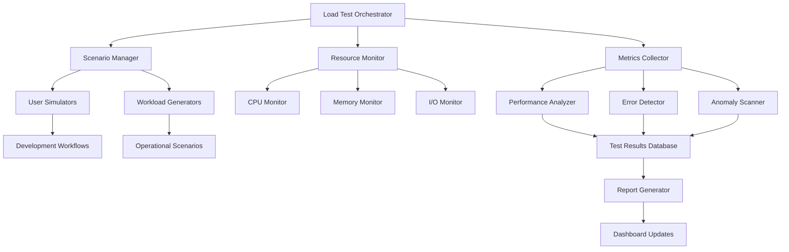

# Load Testing Scenarios and Infrastructure

## Overview

This document defines comprehensive load testing scenarios for RUST_AI_IDE, focusing on realistic user behavior patterns, system stress testing, and performance validation under various conditions. The scenarios simulate development workflows ranging from individual developer usage to large team collaboration environments.

## Load Testing Fundamentals

### Scenario Design Principles
1. **Realistic Workload Patterns**: Based on actual development behavior analysis
2. **Progressive Load Increase**: Start at normal levels, progressively increase complexity
3. **Failure Mode Testing**: Include resource exhaustion, network issues, and system degradation
4. **Recovery Validation**: Ensure graceful degradation and recovery capabilities

### Performance Validation Goals
- **Throughput Validation**: Maximum concurrent operations per second
- **Resource Efficiency**: CPU, memory, and I/O utilization under load
- **Scalability Metrics**: Performance degradation patterns with increased load
- **Stability Indicators**: Error rates, crash probability, recovery times

## Core Load Testing Scenarios

### Scenario 1: Individual Developer Workflow

#### Primary Use Case
Simulates a single developer working intensively on a Rust codebase with regular analysis, code completion, and refactoring operations.

#### Load Characteristics
```json
{
  "users": 1,
  "duration": "2 hours",
  "peak_operations_per_second": {
    "completion_requests": 5-10,
    "hover_requests": 10-20,
    "definition_requests": 3-8,
    "reference_requests": 1-3
  },
  "file_operations": {
    "files_open_concurrently": 5-15,
    "average_file_size": "2-5KB",
    "modification_rate": "2-5 changes/minute"
  }
}
```

#### Expected Performance
- **Completion Latency**: <150ms P95
- **Memory Usage**: <150MB average
- **CPU Usage**: <25% average
- **Response Time Degradation**: <2x baseline

### Scenario 2: Small Team Development

#### Primary Use Case
Simulates 3-5 developers working simultaneously on a shared Rust codebase with frequent code reviews, branching, and CI/CD integration.

#### Load Characteristics
```json
{
  "users": 5,
  "duration": "4 hours",
  "concurrent_operations": {
    "file_openings": "15-30/session",
    "bulk_analysis": "3-5/minute",
    "cross_references": "10-20/minute",
    "range_formatting": "5-10/minute"
  },
  "shared_resources": {
    "common_libraries": "tracked in 50+ files",
    "shared_components": "modified by multiple team members"
  }
}
```

#### Stress Factors
- **Cache Invalidation**: High frequency of cache invalidation due to team changes
- **Memory Pressure**: Anchor memory usage patterns across users
- **Network Latency**: Simulate realistic network delays for remote development

### Scenario 3: Large Scale Codebase Analysis

#### Primary Use Case
Simulates working with large, complex Rust codebases like compilers, large applications, or enterprise systems with 100k+ LOC.

#### Load Characteristics
```json
{
  "codebase_size": "100000-500000 LOC",
  "file_count": "500-2000 files",
  "analysis_operations": {
    "initial_scan": "5000-15000 operations",
    "incremental_updates": "100-500 operations/minute",
    "deep_analysis": "20-50 complex operations"
  },
  "memory_profiles": {
    "baseline_allocation": "200-500MB",
    "peak_allocation": "1-2GB",
    "working_set_size": "800MB-1.5GB"
  }
}
```

#### Performance Challenges
- **Scalability Boundaries**: Test memory and CPU scaling with codebase size
- **Incremental Analysis**: Verify efficiency of incremental updates
- **Background Processing**: Monitor interference between foreground and background tasks

### Scenario 4: High-Frequency Editing Sessions

#### Primary Use Case
Simulates rapid prototyping, debugging, or refactoring sessions with very frequent, small code changes.

#### Load Characteristics
```json
{
  "operation_rate": {
    "total_operations_per_second": "20-50",
    "edit_operations": "10-30/second",
    "analysis_triggers": "5-15/second",
    "ui_updates": "15-40/second"
  },
  "edit_patterns": {
    "rapid_typing": "continuous character insertion",
    "paste_operations": "medium code blocks (50-500 chars)",
    "delete_operations": "character-by-character deletion",
    "undo_redo": "frequent undo/redo operations"
  },
  "timing_constraints": {
    "max_delay_between_ops": "100ms",
    "analysis_debounce": "200ms window",
    "ui_feedback_required": "50ms target"
  }
}
```

### Scenario 5: Multi-File Refactoring Operations

#### Primary Use Case
Simulates large-scale refactoring across multiple files, simulating complex code reorganization tasks.

#### Load Characteristics
```json
{
  "refactoring_scope": {
    "files_affected": "20-100 files",
    "total_changes": "500-2000 individual edits",
    "dependencies": "3-5 levels deep"
  },
  "operation_sequence": [
    {"phase": "analysis", "duration": "30-90 seconds"},
    {"phase": "modification", "duration": "2-5 minutes"},
    {"phase": "validation", "duration": "1-3 minutes"},
    {"phase": "follow_up_analysis", "duration": "30-60 seconds"}
  ]
}
```

## Stress Testing Scenarios

### Resource Exhaustion Testing

#### Memory Pressure Testing
```json
{
  "stress_profile": {
    "name": "memory_pressure_test",
    "allocation_pattern": ["gradual", "stepped", "spike"],
    "memory_limits": ["256MB", "512MB", "1GB"],
    "recovery_actions": ["garbage_collection", "cache_eviction", "process_restart"]
  },
  "validation_criteria": {
    "graceful_degradation": true,
    "data_preservation": true,
    "recovery_time": "<30 seconds"
  }
}
```

#### CPU Contention Testing
```json
{
  "stress_profile": {
    "name": "cpu_contention_test",
    "cpu_utilization_targets": ["80%", "90%", "95%"],
    "execution_model": ["single_thread", "multi_thread", "thread_pool"],
    "throttling_mechanisms": ["OS_scheduling", "process_priority"]
  }
}
```

### Network Latency Simulation

#### Remote Development Simulation
```json
{
  "latency_profiles": [
    {
      "name": "local_network",
      "base_latency": "1ms",
      "jitterness": "0.5ms",
      "packet_loss": "0.01%"
    },
    {
      "name": "satellite_internet",
      "base_latency": "800ms",
      "jitterness": "200ms",
      "packet_loss": "2%"
    },
    {
      "name": "mobile_network",
      "base_latency": "150ms",
      "jitterness": "50ms",
      "bandwidth_limit": "50Mbps"
    }
  ]
}
```

## Load Testing Infrastructure

### Automated Test Framework Architecture



### User Simulation Framework

#### Realistic User Behavior Models
```rust
#[derive(Debug, Clone)]
pub struct UserBehavior {
    operation_patterns: Vec<OperationPattern>,
    timing_distributions: TimingProfile,
    error_probabilities: ErrorRates,
    environmental_factors: EnvironmentConfig,
}

#[derive(Debug, Clone)]
pub struct OperationPattern {
    operation_type: OperationType,
    frequency_per_minute: f64,
    duration_distribution: StatisticalDistribution,
    success_probability: f64,
}
```

#### Behavior-specific Simulators
- **Explorative User**: Frequent navigation, minimal editing (think pair programming)
- **Intensive Developer**: High frequency editing and analysis (feature development)
- **Code Reviewer**: Heavy focus on reading, occasional targeted modifications
- **Refactoring Specialist**: Large-scale changes requiring careful validation

### Resource Monitoring and Alert Systems

#### Real-time Monitoring
```json
{
  "monitoring_endpoints": {
    "performance_metrics": "/api/metrics/performance",
    "resource_usage": "/api/metrics/resources",
    "error_tracking": "/api/metrics/errors",
    "health_checks": "/api/health"
  },
  "alert_thresholds": {
    "memory_usage_high": "80%",
    "cpu_usage_high": "70%",
    "error_rate_high": "5%",
    "response_time_degraded": "2x normal"
  }
}
```

#### Automated Recovery Testing
- **Process Restart**: Test restart time and state restoration
- **Cache Recovery**: Verify cache robustness during interruptions
- **Connection Recovery**: Test network reconnection scenarios

## Performance Validation Framework

### Benchmark Execution and Analysis

#### Statistical Validation
```rust
pub struct LoadTestResults {
    pub scenario_name: String,
    pub execution_timestamp: DateTime<Utc>,
    pub sample_count: usize,
    pub performance_stats: PerformanceStats,
    pub error_stats: ErrorStats,
    pub resource_usage: ResourceUsage,
}

pub struct PerformanceStats {
    pub response_time: StatisticalSummary,
    pub throughput: StatisticalSummary,
    pub concurrency_safety: SafetyMetrics,
    pub scalability_slope: RegressionMetrics,
}
```

#### Performance Regression Detection
- **Baseline Comparison**: Compare against known good performance baselines
- **Trend Analysis**: Identify gradual performance degradation over time
- **Environmental Normalization**: Account for system-specific variations

### Capacity Planning and Scaling Analysis

#### Vertical Scaling Analysis
```json
{
  "scaling_analysis": {
    "cpu_cores": [4, 8, 16, 32],
    "memory_capacity": ["8GB", "16GB", "32GB", "64GB"],
    "storage_types": ["SSD", "NVMe", "RAM_disk"],
    "scaling_factors": {
      "linear_threshold": "8 CPU cores",
      "memory_saturation": "16GB RAM",
      "io_bottleneck": "500 IOPS"
    }
  }
}
```

#### Performance Bottleneck Identification
- **CPU-bound vs. Memory-bound**: Identify primary system constraints
- **I/O bottlenecks**: Disk and network performance limitations
- **Lock contention**: Thread synchronization overhead analysis

## Continuous Performance Testing

### CI/CD Integration

#### Automated Performance Gates
```yaml
# GitHub Actions performance gate example
name: Performance Validation
on: [pull_request, push]

jobs:
  performance-gate:
    runs-on: performance-lab
    steps:
      - name: Run Load Tests
        run: cargo xtask load-test --scenario=critical-path
      - name: Compare Baselines
        run: cargo xtask compare-baseline
      - name: Block on Regression
        run: cargo xtask regression-check --threshold=5%
```

#### Performance Budget Enforcement
```json
{
  "performance_budget": {
    "response_time": {
      "target": "100ms",
      "warning": "150ms",
      "violation": "200ms"
    },
    "memory_usage": {
      "target": "200MB",
      "warning": "300MB",
      "violation": "400MB"
    }
  }
}
```

## Quality Assurance and Validation

### Test Data Management
- **Deterministic Seeds**: Ensure test reproducibility across runs
- **Progressive Complexity**: Start simple, increase complexity progressively
- **Real-world Correlation**: Validate against actual usage patterns

### Risk Mitigation
- **Graceful Failure**: Ensure non-destructive testing environment
- **Resource Isolation**: Prevent load tests from affecting production systems
- **Data Security**: Protect sensitive code and performance data

### Continuous Improvement
- **Test Evolution**: Regularly update scenarios based on user behavior analysis
- **Coverage Validation**: Ensure comprehensive coverage of use cases
- **Performance Target Adjustment**: Maintain realistic and achievable goals

## Implementation Roadmap

### Phase 1: Core Infrastructure (4 weeks)
- [ ] Implement basic user simulators
- [ ] Create resource monitoring framework
- [ ] Develop performance data collection

### Phase 2: Scenario Development (6 weeks)
- [ ] Build comprehensive scenario library
- [ ] Add statistical analysis framework
- [ ] Implement automated regression detection

### Phase 3: Enterprise Load Testing (8 weeks)
- [ ] Simulate large team environments
- [ ] Add distributed load generation
- [ ] Create performance trend analysis

### Phase 4: Production Integration (Ongoing)
- [ ] Integrate with CI/CD pipelines
- [ ] Establish continuous performance monitoring
- [ ] Implement automated performance budgeting