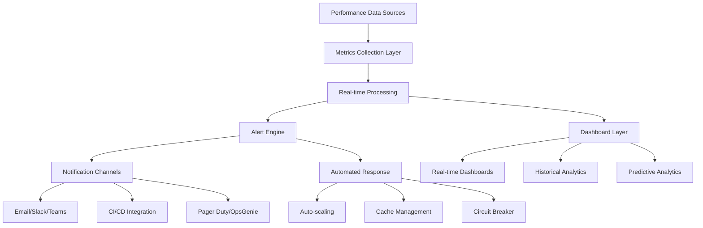
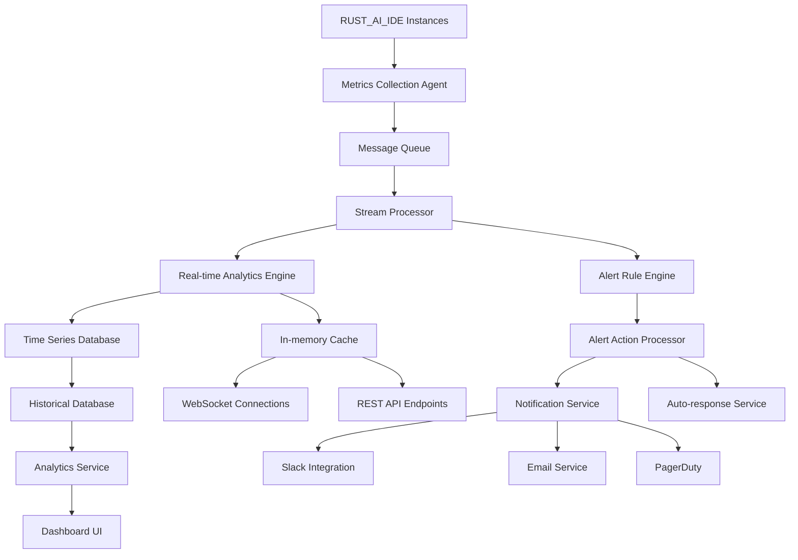

# Real-time Monitoring Dashboards and Alert System

## Overview

This specification defines the architecture and implementation plan for comprehensive real-time performance monitoring dashboards and intelligent alerting system for RUST_AI_IDE. The system provides immediate visibility into performance health, predictive analytics, and automated response capabilities.

## Dashboard Architecture

### Multi-tiered Monitoring Framework



### Data Collection Hierarchy

#### Primary Metrics Sources
1. **System-level Monitoring**
   ```json
   {
     "cpu_metrics": {
       "usage_percent": "current CPU utilization",
       "core_distribution": "per-core usage breakdown",
       "context_switches": "thread scheduling overhead"
     },
     "memory_metrics": {
       "allocated_bytes": "current memory usage",
       "peak_allocation": "maximum memory usage",
       " fragmentation_ratio": "memory efficiency indicator"
     },
     "io_metrics": {
       "disk_throughput": "MB/second read/write",
       "network_latency": "average response time",
       "cache_hit_ratio": "cache efficiency percentage"
     }
   }
   ```

2. **Application-level COVID Metrics**
   ```json
   {
     "lsp_operations": {
       "completion_response_time": "code completion latency",
       "definition_lookup": "symbol resolution speed",
       "diagnostic_processing": "error/warning detection"
     },
     "user_interactions": {
       "ui_refresh_latency": "interface update speed",
       "command_execution": "user action processing",
       "search_performance": "symbol/code search speed"
     }
   }
   ```

#### Secondary Metrics Sources
1. **Business Metrics**: User satisfaction, feature adoption rates
2. **Environmental Metrics**: System temperature, power consumption
3. **Custom Extension Metrics**: Plugin-specific performance data

## Dashboard Components

### Executive Dashboard

#### High-level Performance Overview
```
┌─────────────────────────────────────────────────────────────┐
│ RUST_AI_IDE Performance Health Overview               today │
├─────────────────────────────────────────────────────────────┤
│ CPU │██████████████▍                                     84% │
│ MEM │███████████████                                     89% │
│ LSP │███████████████▉                                    96% │
│     │███████████████▩                                    94% │
├─────────────────────────────────────────────────────────────┤
│  🚨 Critical Alerts          │   ⚠️  Warnings Active       │
│     none                      │     2 alerts               │
├─────────────────────────────────────────────────────────────┤
│ RESPONSE TIME TREND                           MEMORY TREND  │
│      █████████ torno▌ ####█▌█▌████▏▋▋▋██████████ [88%] 4m │
│      █████████ torno▌ ####█▌█▌████▏▋▋▋██████████ [86%] 3m │
│      █████████ torno▌ ####█▌█▌████▏▋▋▋██████████ [90%] 2m │
│      █████████ torno▌ ####█▌█▌████▏▋▋▋██████████ [87%] 1m │
│      █████████ torno▌ ####█▌█▌████▏▋▋▋██████████ [89%] now │
└─────────────────────────────────────────────────────────────┘
```

#### Key Performance Indicators Display
- **Green → Healthy** (< 80% resource usage, normal response times)
- **Yellow → Warning** (80-90% resource usage, slightly elevated response times)
- **Red → Critical** (> 90% resource usage, significantly degraded performance)

### Technical Performance Dashboard

#### Real-time Metrics Grid
```plaintext
PERFORMANCE METRICS DASHBOARD
═══════════════════════════════════════════════════════════════
Operation          │ P95 Latency │ Throughput │ Error Rate │ Trend
───────────────────┼─────────────┼────────────┼────────────┼─────
Code Completion    │    145ms    │  12 req/s  │   0.02%    │ 📈↑
Find References    │    234ms    │   8 req/s  │   0.01%    │ 📉↓
Go to Definition   │     67ms    │  25 req/s  │   0.00%    │ ➡️→
Hover Information  │     45ms    │  35 req/s  │   0.00%    │ ➡️→
Symbol Search      │    456ms    │   6 req/s  │   0.05%    │ 📈↑
```

#### Resource Utilization Charts
```
SYSTEM RESOURCE UTILIZATION
CPU:     ████████▍                     84%   ┌─────────────────────┐
Memory:  ████████▌                     85%   │ Peak Memory Usage    │
Disk I/O: █████▌                        55%   │  1.2 GB (max 1.4GB) │
Network: ████▌                          45%   │ Use Recommended     │
                                               └─────────────────────┘
```

### Alert Management Interface

#### Active Alerts Table
```plaintext
ACTIVE PERFORMANCE ALERTS
═══════════════════════════════════════════════════════════════
Severity │ Alert Name                │ Status   │ Age        │ Assigned
─────────┼───────────────────────────┼──────────┼────────────┼──────────
🔴 High  │ Memory Usage > 90%        │ New      │ 5 minutes  │ unassigned
🟡 Medium│ Response Time Degraded    │ Active   │ 12 minutes │ auto-assigned
🟡 Medium│ Cache Hit Ratio Low       │ Active   │ 28 minutes │ SRE on-call
🟢 Low   │ LSP Operation Timeout     │ Resolved │ 1 hour     │ monitoring
```

#### Alert Trend Visualization
```
ALERT FREQUENCY OVER TIME
Weekend       Monday       Tuesday      Wednesday    Thursday     Today
████████▎     ████████▌    ████████▊    ████████▉    ████████▌    ██████████
░░ CRITICAL ░░░░░░░░ ░░░  MEDIUM ░░░░░░░░░░░░░░░░░░░░░░░ MY LOW ░░░
    2 req       5 req        3 req         8 req        6 req       12 req
```

## Intelligent Alerting System

### Alert Classification Framework

#### Severity Levels and Response Criteria
```json
{
  "severity_levels": {
    "critical": {
      "criteria": "Service affecting or >95% resource usage",
      "response_time": "5 minutes",
      "notification_channels": ["email", "slack", "pagerduty", "sms"],
      "auto_response": true
    },
    "high": {
      "criteria": "Significant degradation or >85% resource usage",
      "response_time": "15 minutes",
      "notification_channels": ["email", "slack"],
      "auto_response": true
    },
    "medium": {
      "criteria": "Moderate issues or >75% resource usage",
      "response_time": "1 hour",
      "notification_channels": ["slack"],
      "auto_response": false
    },
    "low": {
      "criteria": "Minor issues or informational",
      "response_time": "24 hours",
      "notification_channels": ["log"],
      "auto_response": false
    }
  }
}
```

#### Alert Type Categories
1. **Performance Degradation**
   - Response time above thresholds
   - Throughput below minimums
   - Resource exhaustion approaching

2. **Resource Consumption**
   - Memory usage critical levels
   - CPU saturation
   - Disk I/O bottlenecks

3. **Reliability Issues**
   - Error rate spikes
   - Connection failures
   - Recovery time extensions

4. **Predictive Alerts**
   - Trend-based warnings
   - Capacity approaching limits
   - Seasonal pattern anomalies

### Automated Response System

#### Response Action Categories
```json
{
  "auto_response_actions": {
    "scale_resources": {
      "trigger": "cpu_usage > 85% for 5 minutes",
      "action": "increase instance size or add nodes",
      "rollback_condition": "usage < 60% for 10 minutes"
    },
    "restart_components": {
      "trigger": "memory_leak detected > 20% growth/hr",
      "action": "graceful component restart",
      "rollback_condition": "normal memory behavior restored"
    },
    "circuit_breaker": {
      "trigger": "error_rate > 10% for 2 minutes",
      "action": "activate circuit breaker for degraded features",
      "rollback_condition": "error_rate < 2% for 5 minutes"
    },
    "cache_invalidation": {
      "trigger": "cache_hit_ratio < 60% sustained",
      "action": "selective cache invalidation",
      "rollback_condition": "hit ratio > 70% maintained"
    }
  }
}
```

#### Escalation Procedures
1. **Level 0**: Automatic system response
2. **Level 1**: On-call engineer notification (15 minutes)
3. **Level 2**: Engineering team page (5 minutes for critical)
4. **Level 3**: Leadership and customer communication
5. **Level 4**: Public incident declaration

## Historical Analytics and Predictive Intelligence

### Trend Analysis Dashboard

#### Performance Changes Over Time
```
PERFORMANCE TREND ANALYSIS
═══════════════════════════════════════════════
Metric                │ Last 7 days │ Trend │ Prediction │ Action
──────────────────────┼─────────────┼───────┼────────────┼───────
Response Time (P95)   │ -8.3%       │ 📉    │ Stable     │ Monitor
Memory Usage Average │ +12.4%      │ 📈    │ Increasing │ Investigate
Error Rate %         │ +234.5%     │ 📈    │ Trending   │ 🚨 Alert
Cache Hit Rate %     │ -2.1%       │ 📉    │ Stable     │ OK
```

#### Week-over-Week Comparison
```
METRIC COMPARISON: TODAY vs LAST WEEK
══════════════════════════════════════
Response Times                    Memory Usage
Today ─── ▄▄▄▄▄▄▄▄▄▄▄▄▄▄▄▄▄▄       Today ─── ▄▄▄▄▄▄▄▄▄▄
Week Ago ─── ▄▄▄▄▄▄▄▄▄▄▄▄          Week Ago ─── ▄▄▄▄▄▄▄▄▄▄▄▄▄
         Averages: 234ms           Averages: 756MB

LSP Operations                      Error Rates
Today ─── ▄▄▄▄▄▄▄▄▄▄▄▄▄▄▄▄▄▄       Today ─── ▄▄▄▄▄▄▄▄▄▄▄▄
Week Ago ─── ▄▄▄▄▄▄▄▄▄▄▄▄▄▄        Week Ago ─── ▄▄▄▄▄▄▄▄▄▄▄
         12 req/s average           Down 8.3% this week
```

### Predictive Analytics Engine

#### Forecasting Models
```json
{
  "forecasting_models": {
    "response_time_prediction": {
      "algorithm": "linear_regression",
      "training_window": "30 days",
      "prediction_horizon": "7 days",
      "confidence_interval": 0.95,
      "accuracy_metric": "MAPE < 15%"
    },
    "resource_utilization_forecast": {
      "algorithm": "time_series_arima",
      "seasonal_analysis": "daily/weekend patterns",
      "outlier_detection": "3-sigma rule",
      "threshold_prediction": "capacity warnings"
    }
  }
}
```

#### Predictive Alert Types
1. **Capacity Warnings**: Predict when resources will be exhausted
2. **Performance Degradation**: Early warning of trending issues
3. **Seasonal Adjustments**: Account for predictable usage patterns
4. **Anomaly Detection**: Identify unusual behavior patterns

## Dashboard Integration and Data Flow

### Real-time Data Pipeline



### API Endpoints for Dashboard

#### Real-time Metrics Streaming
```typescript
// WebSocket endpoint for real-time updates
const ws = new WebSocket('/api/metrics/stream');

// REST endpoint for current snapshot
fetch('/api/metrics/snapshot')
  .then(res => res.json())
  .then(data => updateDashboard(data));

// Historical data endpoint
const history = await fetch('/api/metrics/history?range=1h&resolution=1m');
```

#### Alert Management API
```typescript
// Get active alerts
const alerts = await fetch('/api/alerts/active');

// Acknowledge alert
await fetch(`/api/alerts/${alertId}/acknowledge`, {
  method: 'POST',
  body: JSON.stringify({ acknowledgeBy: 'user-id' })
});

// Create resolution note
await fetch(`/api/alerts/${alertId}/resolve`, {
  method: 'POST',
  body: JSON.stringify({ resolution: 'details' })
});
```

## Security and Access Control

### Dashboard Access Levels
1. **Public Dashboard**: Basic health indicators (no sensitive data)
2. **Team Dashboard**: Detailed metrics and alerts
3. **Admin Dashboard**: Full control and configuration access
4. **API Access**: Programmatic access for integrations

### Audit Logging
- **Alert Actions**: Who acknowledged/dismissed alerts and when
- **Configuration Changes**: Dashboard configuration modifications
- **Access Patterns**: User access and usage patterns for security monitoring
- **Performance Data**: Historical performance data retention and access

## Implementation Roadmap

### Phase 1: Core Monitoring Framework (4 weeks)
- [ ] Implement metrics collection agents
- [ ] Create basic alert system
- [ ] Develop real-time dashboard UI
- [ ] Set up notification channels

### Phase 2: Advanced Analytics (6 weeks)
- [ ] Add predictive analytics engine
- [ ] Implement automated response system
- [ ] Create trend analysis capabilities
- [ ] Build historical data archiving

### Phase 3: Intelligence and Automation (8 weeks)
- [ ] Machine learning-based anomaly detection
- [ ] Advanced alerting with context
- [ ] Self-learning threshold adjustment
- [ ] Predictive capacity planning

### Phase 4: Enterprise Integration (Ongoing)
- [ ] Multi-region deployment support
- [ ] Enterprise security integration
- [ ] Custom dashboard builder
- [ ] Advanced API integrations

## Quality Assurance

### Dashboard Validation
- **Visual Consistency**: Ensure dashboards work across different screen sizes
- **Data Accuracy**: Validate metrics calculations and display
- **Alert Fidelity**: Test alert triggering against known conditions
- **Performance Overhead**: Monitor dashboard impact on system performance

### Testing Strategy
- **Unit Tests**: Individual component functionality
- **Integration Tests**: End-to-end dashboard workflows
- **Load Tests**: Dashboard performance under concurrent users
- **Chaos Tests**: System behavior during simulated failures

### Continuous Improvement Metrics
- **Dashboard Usage**: Track feature adoption and usage patterns
- **Alert Effectiveness**: Measure alert response and resolution times
- **False Positive Rate**: Monitor accuracy of alerting system
- **User Satisfaction**: Gather feedback on dashboard usability