# Rust AI IDE - Architecture Diagrams

## Overview

This document contains visual representations of the Rust AI IDE architecture, showing the relationships between components, data flow, and the impact of the deduplication campaign.

---

## Current Unified Architecture


---

## Deduplication Impact Visualization

### Before Deduplication (Duplicated Architecture)

```mermaid
graph TD
    subgraph "Multiple Inconsistent Types"
        ErrorType1["CustomError (Crate A)"]
        ErrorType2["AnotherError (Crate B)"]
        ErrorType3["YetAnotherError (Crate C)"]
        PositionType1["FrontendPosition (1-based)"]
        PositionType2["BackendPosition (0-based)"]
        CacheType1["CustomCache (TTL Missing)"]
        CacheType2["AnotherCache (TTL Different)"]
    end

    subgraph "Fragmented Functionality"
        FS1[File Operations<br/>Crate A<br/>Limited features]
        FS2[File Operations<br/>Crate B<br/>Different API]
        FS3[File Operations<br/>Crate C<br/>Inconsistent errors]

        Perf1[Timing Utils<br/>Crate A]
        Perf2[Timing Utils<br/>Crate B]
        Perf3[Timing Utils<br/>Crate C]
    end

    subgraph "Dependency Conflicts"
        Cycle1[Circular Dependency<br/>A→B→A]
        Cycle2[Circular Dependency<br/>B→C→B]
        Unused[Dead Code<br/>Non-shared utilities]
    end
```



### After Deduplication (Unified Architecture)


---

## Shared Crate Dependency Relationships

### Import Hierarchy (Recommended Order)

```mermaid
graph TD
    subgraph "Primary Import (Always First)"
        Primary["rust-ai-ide-common<br/>『Foundation Layer』<br/>├── Types (Position, Range, Error)<br/>├── Utils (timing, caching)<br/>├── FS (atomic, safe, streaming)<br/>└── Detection (duplication, patterns)"]
    end

    subgraph "Secondary Imports (As Needed)"
        Secondary1["rust-ai-ide-shared-services<br/>『Orchestration Layer』<br/>├── Workspace (project analysis)<br/>├── LSP (language servers)<br/>└── Diagnostics (aggregated)"]

        Secondary2["rust-ai-ide-shared-codegen<br/>『Generation Layer』<br/>├── CodeGen (templates, multi-lang)<br/>├── AST (parsing, transformation)<br/>└── Validation (safety, quality)"]
    end

    subgraph "Specialized Crates (Domain-Specific)"
        AI["rust-ai-ide-ai<br/>『Intelligence Layer』<br/>├── ML models<br/>├── Fine-tuning<br/>└── Specification analysis"]

        LSP_ACT["rust-ai-ide-lsp<br/>『Protocol Layer』<br/>├── LSP extensions<br/>├── Message handling<br/>└── Server management"]
    end

    %% Import order - arrows show recommended sequence
    Primary --> Secondary1
    Primary --> Secondary2
    Secondary1 --> LSP_ACT
    Secondary2 --> AI

    %% Dependencies (which are safe to use)
    AI -.->|can use| Primary
    AI -.->|can use| Secondary2
    LSP_ACT -.->|can use| Primary
    LSP_ACT -.->|can use| Secondary1

    classDef primary fill:#fff3e0,stroke:#ff9800,stroke-width:4px
    classDef secondary fill:#e8f5e8,stroke:#2e7d32,stroke-width:3px
    classDef specialized fill:#e1f5fe,stroke:#01579b,stroke-width:2px

    class Primary primary
    class Secondary1,Secondary2 secondary
    class AI,LSP_ACT specialized
```



---

## Development Workflow Diagrams

### New Developer Onboarding (Before vs After)

#### Before Deduplication


#### After Deduplication

```mermaid
sequenceDiagram
    participant Dev as New Developer
    participant Docs as Shared Arch Docs
    participant Common as rust-ai-ide-common
    participant IDE as IDE

    Dev->>Docs: Read readme.html onboarding
    Docs-->>Dev: "Always import from rust-ai-ide-common"
    Dev->>Docs: Check duplication prevention checklist
    Docs-->>Dev: Clear checklist + examples
    Dev->>Common: Import unified types
    Common-->>Dev: IdeError, IdeResult, Cache... (all working)
    Dev->>IDE: Build first feature
    IDE-->>Dev: ✅ Compiles successfully
    Dev->>Common: Check for duplication
    Common-->>Dev: ✅ No duplications detected
    Dev->>Docs: Success! Feature implemented
    Docs-->>Dev: Remember to update performance metrics

    Note over Dev: 2 hours to be productive
```



### Bug Fix Workflow (Unified vs Fragmented)

#### Fragmented System


#### Unified System


---

## Performance Architecture

### Memory Management Flow


### Caching Architecture


---

## Service Orchestration

### LSP Service Architecture


---

## Code Quality Architecture

### Duplication Prevention System


---

## Migration Path Visualization

### Migration Timeline

```mermaid
gantt
    title Deduplication Campaign Timeline
    dateFormat  YYYY-MM-DD
    section Assessment Phase
    Audit dependencies     :done, audit, 2025-08-01, 7d
    Catalog duplications   :done, catalog, 2025-08-08, 5d
    Impact analysis        :done, impact, 2025-08-13, 3d

    section Implementation Phase
    Phase 1: Shared types :done, phase1, 2025-08-15, 14d
    Phase 2: Error unification :done, phase2, 2025-09-01, 10d
    Phase 3: Cache consolidation :done, phase3, 2025-09-10, 8d
    Phase 4: Final migration :active, phase4, 2025-09-18, 15d

    section Validation Phase
    Testing               :active, 2025-10-03, 10d
    Performance verification : 2025-10-13, 5d
    Production deployment : 2025-10-18, 3d
```

### Success Metrics Tracking

```mermaid
lineChart
    title Key Performance Indicators Over Time
    x-axis 2025-08 2025-09 2025-10
    y-axis Percentage
    line Duplication Reduction 0 15 30 45 60 83 91
    line Build Time Improvement 0 5 12 20 30 33 35
    line Memory Usage Reduction 0 3 8 15 22 25 28
    line Developer Productivity 0 10 25 40 55 65 75
    line Code Consistency 0 12 28 45 62 78 95
```

---

## Deployment Architecture

### Rollout Strategy


This architecture diagram collection provides comprehensive insights into the unified Rust AI IDE architecture, showing the relationships between components, migration progress, and quality improvements achieved through the deduplication campaign.
