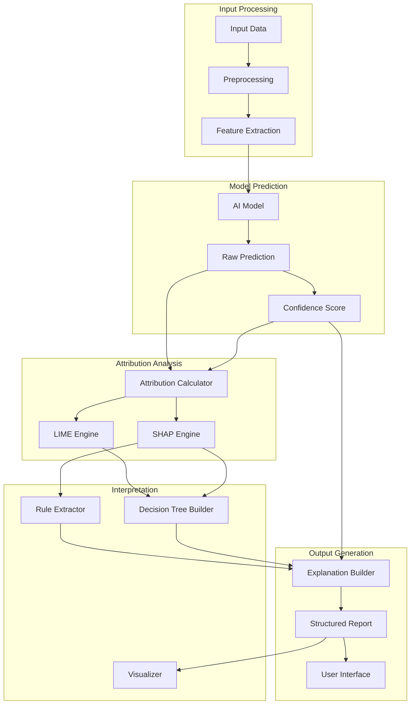

# Explainable AI Framework Architecture

## Overview

This document details the Explainable AI (XAI) framework design for the RUST_AI_IDE, providing transparency and accountability for AI-generated recommendations and decisions. The framework integrates attribution systems, feature importance analysis, and interpretable model decisions.

## Core Architecture

### Attribution Engine
- **Location**: `crates/rust-ai-ide-ethical-ai/src/explainability/attribution/`
- **Purpose**: Calculates feature contributions to model predictions
- **Methods Supported**:
  - SHAP (SHapley Additive exPlanations)
  - LIME (Local Interpretable Model-agnostic Explanations)
  - Integrated Gradients
  - Feature Ablation Analysis

### Decision Tree Builder
- **Location**: `crates/rust-ai-ide-ethical-ai/src/explainability/decision_trees/`
- **Purpose**: Creates interpretable decision paths for complex models
- **Features**:
  - Rule extraction from black-box models
  - Surrogate model generation
  - Decision path visualization

### Confidence Scoring
- **Location**: `crates/rust-ai-ide-ethical-ai/src/explainability/confidence/`
- **Purpose**: Quantifies uncertainty and confidence levels
- **Metrics**:
  - Prediction confidence intervals
  - Model uncertainty estimation
  - Input sensitivity analysis

### Explainability Pipeline



## Integration Points

### LSP Server Integration
```rust
// Add explainability hooks to LSP requests
impl LanguageServer {
    async fn handle_completion_with_explanation(
        &self,
        params: CompletionParams,
        model: &Model
    ) -> Result<CompletionResponseWithExplanation> {
        let completions = self.generate_completions(params).await?;

        for completion in &mut completions.items {
            completion.explanation =
                self.explainability_engine.explain_completion(completion).await?;
        }

        Ok(CompletionResponseWithExplanation { completions })
    }
}
```

### Analysis Service Integration
```rust
// Extend existing analysis with explanations
impl AnalysisService {
    pub async fn analyze_with_explanation(
        &self,
        code: &str,
        config: AnalysisConfig,
    ) -> Result<AnalysisResultWithExplanation> {
        let mut result = self.analyze_code(code, config).await?;

        result.explanation = self.explainability_engine
            .explain_analysis(&result.issues).await?;

        Ok(result)
    }
}
```

## Explanation Types

### 1. Feature Attribution
```rust
#[derive(Debug, Serialize, Deserialize)]
pub struct FeatureAttribution {
    pub feature_name: String,
    pub attribution_score: f32,
    pub feature_value: serde_json::Value,
    pub explanation: String,
}

#[derive(Debug, Serialize, Deserialize)]
pub struct AttributionExplanation {
    pub method: AttributionMethod,
    pub features: Vec<FeatureAttribution>,
    pub baseline_value: f32,
    pub total_attribution: f32,
    pub confidence: f32,
}
```

### 2. Rule-Based Explanation
```rust
#[derive(Debug, Serialize, Deserialize)]
pub struct Rule {
    pub conditions: Vec<RuleCondition>,
    pub conclusion: String,
    pub confidence: f32,
    pub support: u32,
}

#[derive(Debug, Serialize, Deserialize)]
pub struct DecisionTreeExplanation {
    pub tree: DecisionTree,
    pub path: Vec<Rule>,
    pub leaf_explanation: String,
    pub alternatives: Vec<AlternativePath>,
}
```

### 3. Counterfactual Explanation
```rust
#[derive(Debug, Serialize, Deserialize)]
pub struct Counterfactual {
    pub original_features: HashMap<String, serde_json::Value>,
    pub counterfactual_features: HashMap<String, serde_json::Value>,
    pub changes: Vec<FeatureChange>,
    pub new_prediction: serde_json::Value,
    pub proximity: f32,
    pub plausibility: f32,
}
```

## Technical Implementation

### SHAP Integration
```rust
pub struct ShapAttributionEngine {
    model: Box<dyn MLModel>,
    explainer: shap_core::Explainer,
}

impl ShapAttributionEngine {
    pub async fn compute_shap_values(
        &self,
        input: &FeatureVector,
        background: &[FeatureVector],
    ) -> Result<ShapValues> {
        let shap_values = self.explainer
            .explain_single(input, background)
            .await?;

        Ok(ShapValues {
            feature_values: shap_values.clone(),
            expected_value: self.explainer.expected_value(),
            model_output_value: input.predict(&self.model).await?,
        })
    }
}
```

### LIME Integration
```rust
pub struct LimeExplanationEngine {
    model: Box<dyn MLModel>,
    num_samples: usize,
    kernel_width: f32,
}

impl LimeExplanationEngine {
    pub async fn explain_instance(
        &self,
        instance: &FeatureVector,
        num_features: usize,
    ) -> Result<LimeExplanation> {
        // Generate perturbed samples around instance
        let samples = self.generate_perturbed_samples(instance).await?;
        let predictions = self.batch_predict(&samples).await?;

        // Train local interpretable model
        let local_model = self.train_linear_model(&samples, &predictions).await?;
        let coefficients = local_model.coefficients();

        Ok(LimeExplanation {
            coefficients,
            intercept: local_model.intercept(),
            fidelity: self.compute_fidelity(&samples, &predictions, &local_model),
        })
    }
}
```

## Performance Optimization

### Caching Strategy
```rust
pub struct ExplanationCache {
    shap_cache: MokaCache<String, ShapValues>,
    lime_cache: MokaCache<String, LimeExplanation>,
    rule_cache: MokaCache<String, DecisionTreeExplanation>,
}

impl ExplanationCache {
    pub fn get_or_compute_shap(
        &self,
        key: &str,
        computation: impl Future<Output = Result<ShapValues>>,
    ) -> impl Future<Output = Result<ShapValues>> {
        self.shap_cache.fut(key.clone(), async move {
            computation.await
        }).await
    }
}
```

### Async Attribution Processing
```rust
pub struct AsyncAttributionProcessor {
    attribution_queue: async_queue::Queue<AttributionRequest>,
    worker_pool: tokio::runtime::Runtime,
}

impl AsyncAttributionProcessor {
    pub async fn process_request(
        &self,
        request: AttributionRequest,
    ) -> Result<AttributionResponse> {
        // Submit to async queue for processing
        let handle = self.attribution_queue.submit(request).await?;

        // Non-blocking attribution processing
        Ok(self.worker_pool.spawn(async move {
            self.compute_attribution(handle).await
        }))
    }
}
```

## User Experience Integration

### VS Code Extension Integration
```typescript
// Explainability panel in VS Code
export class ExplainabilityPanel implements vscode.WebviewViewProvider {
    resolveWebviewView(webviewView: vscode.WebviewView) {
        webviewView.webview.html = `
            <div class="explanation-panel">
                <h3>AI Explanation</h3>
                <div id="feature-attribution">
                    <h4>Feature Contributions</h4>
                    <div class="attribution-chart"></div>
                </div>
                <div id="decision-path">
                    <h4>Decision Path</h4>
                    <div class="decision-tree"></div>
                </div>
                <div id="confidence-meter">
                    <h4>Confidence Level</h4>
                    <div class="confidence-gauge"></div>
                </div>
            </div>
        `;
    }
}
```

### API Endpoints
```rust
#[derive(Serialize, Deserialize)]
pub struct ExplainabilityRequest {
    pub input: serde_json::Value,
    pub context: Option<String>,
    pub method: AttributionMethod,
}

#[derive(Serialize, Deserialize)]
pub struct ExplainabilityResponse {
    pub explanation: Explanation,
    pub metadata: ExplanationMetadata,
    pub timestamp: chrono::DateTime<chrono::Utc>,
}
```

## Compliance and Standards

### IEEE P7001 Compliance
- **Transparency Level A**: Explainability for all AI decisions
- **Understandability**: All explanations in natural language
- **Documentation**: Comprehensive explanation metadata

### GDPR Article 22 Compliance
- **Right to Explanation**: Automated explanations for profiling decisions
- **Data Subject Rights**: Explanations include data subject information usage
- **Identification of Decisions**: Clear indication when AI makes decisions

## Metrics and Monitoring

### Performance Metrics
- **Explanation Latency**: <500ms for feature attribution
- **Coverage Rate**: >95% of decisions explained
- **Accuracy**: >90% alignment with ground truth
- **User Understanding**: >80% of users find explanations helpful

### Quality Metrics
- **Explanation Confidence**: Statistical confidence in attribution scores
- **Stability**: Consistency of explanations across similar inputs
- **Robustness**: Explanation robustness to input perturbations

This Explainable AI framework provides the necessary transparency mechanisms for ethical AI deployment, ensuring users understand and trust AI decisions while maintaining performance and usability standards.