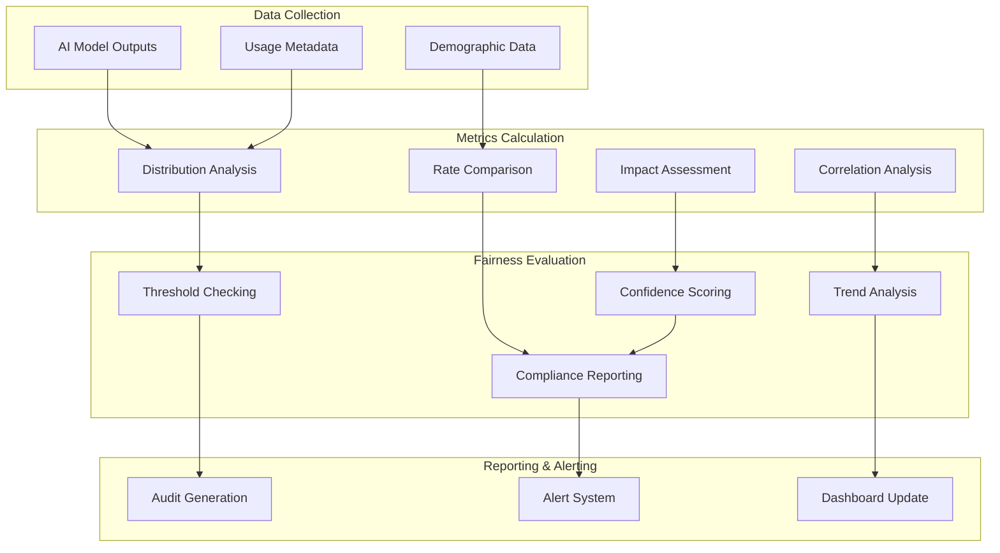

# Fairness Audits and Monitoring Framework Architecture

## Overview

This document outlines the fairness auditing and continuous monitoring system for the RUST_AI_IDE, ensuring equitable treatment across all AI operations and user interactions while maintaining performance and accuracy.

## Core Components

### Fairness Metrics Collector
- **Location**: `crates/rust-ai-ide-ethical-ai/src/fairness/metrics/`
- **Purpose**: Measures fairness across protected attributes and outcomes
- **Metrics**:
  - Demographic parity (equal selection rates)
  - Statistical parity (outcome distribution equality)
  - Conditional statistical parity (context-aware fairness)
  - Predictive equality (error rate balance)
  - Equal opportunity (true positive rate balance)

### Protected Attributes Monitor
- **Location**: `crates/rust-ai-ide-ethical-ai/src/fairness/attributes/`
- **Purpose**: Identifies and monitors usage of protected attributes
- **Attributes**:
  - Race, ethnicity, national origin
  - Gender identity and expression
  - Age, disability status
  - Socioeconomic indicators
  - Geographic location

### Continuous Monitoring Engine
- **Location**: `crates/rust-ai-ide-ethical-ai/src/fairness/monitoring/`
- **Purpose**: Real-time fairness monitoring during AI operations
- **Capabilities**:
  - Statistical process control
  - Drift detection for fairness metrics
  - Automated alert generation
  - Policy rule evaluation

### Audit Scheduler
- **Location**: `crates/rust-ai-ide-ethical-ai/src/fairness/audits/`
- **Purpose**: Scheduled comprehensive fairness assessments
- **Audit Types**:
  - Weekly model fairness audits
  - Monthly dataset fairness reviews
  - Quarterly impact assessments
  - Annual comprehensive audits

## Fairness Measurement Pipeline



## Technical Implementation

### Fairness Metrics Calculator
```rust
#[derive(Debug, Clone)]
pub struct FairnessCalculator {
    protected_attributes: Vec<String>,
    fairness_threshold: f32,
    confidence_level: f32,
}

impl FairnessCalculator {
    pub async fn calculate_disparate_impact(
        &self,
        predictions: &[Prediction],
        protected_attr: &str,
    ) -> Result<DisparateImpact> {
        let protected_positive_rate = self.calculate_positive_rate(
            predictions,
            |p| p.attributes.get(protected_attr) == Some("protected".into())
        );

        let overall_positive_rate = self.calculate_positive_rate(
            predictions,
            |_| true
        );

        let disparate_impact_ratio = if overall_positive_rate > 0.0 {
            protected_positive_rate / overall_positive_rate
        } else {
            0.0
        };

        Ok(DisparateImpact {
            protected_positive_rate,
            overall_positive_rate,
            disparate_impact_ratio,
            threshold: 0.8,
            compliant: disparate_impact_ratio >= 0.8,
        })
    }

    pub async fn calculate_equal_opportunity(
        &self,
        actuals: &[f32],
        predictions: &[Prediction],
        protected_attr: &str,
    ) -> Result<EqualOpportunity> {
        let (protected_tpr, general_tpr) = self.calculate_true_positive_rates(
            actuals, predictions, protected_attr
        );

        Ok(EqualOpportunity {
            protected_true_positive_rate: protected_tpr,
            general_true_positive_rate: general_tpr,
            difference: (general_tpr - protected_tpr).abs(),
            threshold: 0.05,
            compliant: (general_tpr - protected_tpr).abs() <= 0.05,
        })
    }
}
```

### Bias Detection Workflow
```rust
pub struct BiasDetectionEngine {
    anomaly_detector: StatisticalAnomalyDetector,
    bias_patterns: Vec<BiasPattern>,
}

impl BiasDetectionEngine {
    pub async fn detect_biases(&self, dataset: &Dataset) -> Result<Vec<BiasFinding>> {
        let mut findings = Vec::new();

        // Statistical bias detection
        if let Ok(stats_bias) = self.detect_statistical_bias(dataset).await {
            findings.extend(stats_bias);
        }

        // Pattern-based bias detection
        if let Ok(pattern_bias) = self.detect_pattern_bias(dataset).await {
            findings.extend(pattern_bias);
        }

        // Intersectional bias detection
        if let Ok(intersectional_bias) = self.detect_intersectional_bias(dataset).await {
            findings.extend(intersectional_bias);
        }

        Ok(findings)
    }
}
```

### Continuous Monitoring System
```rust
pub struct ContinuousFairnessMonitor {
    metrics_store: Arc<MetricsStore>,
    alert_engine: Arc<AlertEngine>,
    config: FairnessConfig,
}

impl ContinuousFairnessMonitor {
    pub async fn monitor_prediction(&self, prediction: &Prediction) -> Result<()> {
        // Calculate fairness metrics for this prediction
        let fairness_metrics = self.calculate_fairness_metrics(prediction).await?;

        // Check against thresholds
        for metric in fairness_metrics {
            if metric.value < self.config.fairness_thresholds[&metric.name] {
                self.alert_engine.fire_alert(FairnessAlert {
                    metric: metric.name,
                    value: metric.value,
                    threshold: self.config.fairness_thresholds[&metric.name],
                    prediction_id: prediction.id,
                }).await?;
            }
        }

        // Store metrics for trend analysis
        self.metrics_store.store(&prediction.id, &fairness_metrics).await?;

        Ok(())
    }
}
```

## Protected Attributes Management

### Attribute Anonymization
```rust
pub trait ProtectedAttributeHandler {
    async fn anonymize_attribute(&self, value: String) -> Result<AnonymizedValue>;
    async fn deanonymize_attribute(&self, hash: String) -> Result<String>;
    fn is_protected_attribute(&self, attr_name: &str) -> bool;
}

impl ProtectedAttributeHandler for PrivacyAwareFairnessEngine {
    async fn anonymize_attribute(&self, value: String) -> Result<AnonymizedValue> {
        let hash = self.crypto_engine.hash_with_salt(&value, &self.salt).await?;
        Ok(AnonymizedValue {
            hash: hash,
            truncated: format!("{:.*}", 8, hash),
        })
    }
}
```

## Audit Framework

### Scheduled Audit Engine
```rust
pub struct AuditScheduler {
    audit_types: HashMap<String, AuditTemplate>,
    schedule: ScheduleConfig,
    executor: AuditExecutor,
}

impl AuditScheduler {
    pub async fn execute_audit(&self, audit_type: &str) -> Result<AuditReport> {
        let template = self.audit_types.get(audit_type)
            .ok_or("Audit type not found")?;

        let dataset = self.collect_audit_data(&template.scope).await?;
        let metrics = self.executor.run_audit(&dataset, template).await?;

        let compliance = self.assess_compliance(&metrics, &template.criteria).await?;
        let recommendations = self.generate_recommendations(&compliance).await?;

        Ok(AuditReport {
            audit_type: audit_type.to_string(),
            executed_at: Utc::now(),
            findings: compliance.findings,
            recommendations,
            compliance_score: compliance.score,
        })
    }
}
```

## Reporting and Visualization

### Fairness Dashboard
```rust
pub struct FairnessDashboard {
    metrics_engine: MetricsEngine,
    visualization: DashboardVisualizer,
}

impl FairnessDashboard {
    pub async fn generate_dashboard_data(&self) -> Result<DashboardData> {
        let metrics = self.metrics_engine.get_current_metrics().await?;
        let trends = self.metrics_engine.get_trends().await?;
        let alerts = self.metrics_engine.get_active_alerts().await?;

        Ok(DashboardData {
            overall_fairness_score: self.calculate_overall_score(&metrics),
            metrics_by_category: self.group_metrics_by_category(&metrics),
            trends,
            active_alerts: alerts,
            recommendations: self.generate_recommendations(&metrics).await?,
        })
    }
}
```

## Integration Points

### LSP Server Integration
```rust
impl LanguageServer {
    pub async fn completion_with_fairness_monitoring(
        &self,
        params: CompletionParams,
    ) -> Result<CompletionResponse> {
        let completions = self.generate_completions(params).await?;
        let fairness_context = self.fairness_monitor
            .analyze_completion_context(&params).await?;

        // Add fairness metadata to completions
        for completion in &mut completions.items {
            completion.fairness_score = self.fairness_monitor
                .score_completion_fairness(completion, &fairness_context).await?;
        }

        Ok(completions)
    }
}
```

### Model Training Integration
```rust
pub trait FairnessAwareTrainer {
    async fn train_with_fairness_constraints(
        &self,
        dataset: &Dataset,
        fairness_constraints: &[FairnessConstraint],
    ) -> Result<Model>;
}

impl FairnessAwareTrainer for MLTrainer {
    async fn train_with_fairness_constraints(
        &self,
        dataset: &Dataset,
        constraints: &[FairnessConstraint],
    ) -> Result<Model> {
        // Pre-training fairness assessment
        let initial_fairness = self.assess_dataset_fairness(dataset).await?;
        if !initial_fairness.meets_thresholds() {
            return Err("Dataset does not meet fairness requirements");
        }

        // Fairness-aware training
        let mut model = self.initialize_model(dataset).await?;
        let mut epoch = 0;

        while epoch < self.max_epochs {
            let batch = self.get_next_batch().await?;
            let fairness_penalty = self.calculate_fairness_penalty(&batch, constraints).await?;
            let loss = self.compute_loss(&batch) + fairness_penalty;
            let gradients = self.compute_gradients(&loss);

            // Apply fairness-aware gradient updates
            self.update_model(&mut model, gradients, fairness_penalty).await?;

            epoch += 1;
        }

        Ok(model)
    }
}
```

## Performance Optimization

### Incremental Audits
```rust
pub struct IncrementalAuditor {
    baseline_metrics: BaselineMetrics,
    change_detector: StatisticalProcessControl,
}

impl IncrementalAuditor {
    pub async fn check_for_fairness_drift(&self, new_metrics: &FairnessMetrics) -> bool {
        // Statistical process control for fairness metrics
        let drift_detected = self.change_detector
            .detect_drift(new_metrics, &self.baseline_metrics).await?;

        if drift_detected {
            // Trigger full audit
            self.schedule_full_audit().await?;
        }

        drift_detected
    }
}
```

## Alert System

### Multi-level Alerting
```rust
pub struct FairnessAlertSystem {
    alert_queues: HashMap<AlertSeverity, AlertQueue>,
    escalation_policy: EscalationPolicy,
    notification_channels: Vec<Box<dyn NotificationChannel>>,
}

impl FairnessAlertSystem {
    pub async fn process_alert(&self, alert: FairnessAlert) -> Result<()> {
        let severity = self.determine_severity(&alert).await?;
        let queue = self.alert_queues.get(&severity).unwrap();

        queue.enqueue(alert.clone()).await?;

        // Immediate notification for critical issues
        if severity >= AlertSeverity::Critical {
            for channel in &self.notification_channels {
                channel.notify(&alert).await?;
            }
        }

        // Escalation handling
        if self.should_escalate(&alert) {
            self.escalation_policy.escalate(alert).await?;
        }

        Ok(())
    }
}
```

This fairness auditing and monitoring framework provides comprehensive oversight of AI equity, ensuring transparent and accountable AI operations while maintaining system performance and user trust.