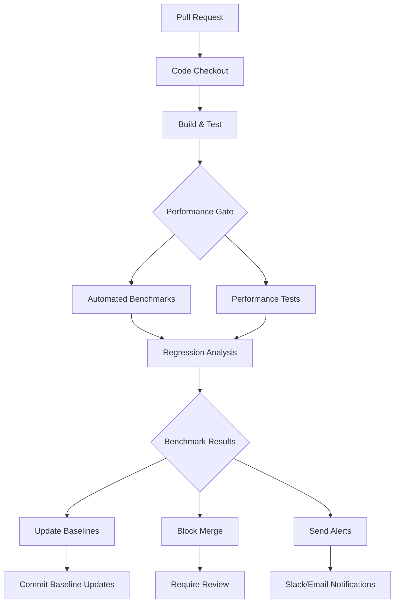

# Automated Benchmarking in CI/CD

## Overview

This document specifies the automated benchmarking framework integrated into the CI/CD pipeline for continuous performance validation and regression detection in RUST_AI_IDE. The system provides real-time performance monitoring, automated alerting, and baseline management.

## CI/CD Benchmarking Architecture

### Workflow Integration



### Benchmark Execution Pipeline

#### Pre-commit Benchmarks (Fast Feedback)
- **Trigger**: On every push to feature branches
- **Duration**: < 5 minutes
- **Scope**: Core critical path operations
- **Failure**: Blocks pull request merge

```yaml
# .github/workflows/fast-feedback-benchmarks.yml
name: Fast Feedback Benchmarks
on:
  pull_request:
    branches: [main, develop]

jobs:
  benchmark:
    runs-on: performance-benchmarking
    steps:
      - uses: actions/checkout@v3
      - name: Setup Rust toolchain
        uses: dtolnay/rust-toolchain@stable
      - name: Run critical path benchmarks
        run: cargo bench critical_path -- --output-format=json
      - name: Check performance regression
        run: ./scripts/check-regression.sh --threshold=3%
```

#### Daily Benchmarks (Comprehensive Analysis)
- **Trigger**: Scheduled daily at 02:00 UTC
- **Duration**: 30-45 minutes
- **Scope**: Full benchmark suite
- **Failure**: Alerts but doesn't block development

```yaml
# .github/workflows/daily-performance.yml
name: Daily Performance Benchmarks
on:
  schedule:
    - cron: '0 2 * * *'  # Daily at 2 AM UTC
  workflow_dispatch:    # Manual trigger support

jobs:
  benchmark:
    runs-on: performance-lab
    environment: benchmarking
    steps:
      - uses: actions/checkout@v3
      - name: Run full benchmark suite
        run: cargo xtask benchmark --suite=full
      - name: Generate performance report
        run: cargo xtask benchmark report
      - name: Archive benchmark results
        uses: actions/upload-artifact@v3
        with:
          name: benchmark-results
          path: target/benchmark-results/
```

#### Release Benchmarks (Quality Assurance)
- **Trigger**: On release creation or deployment
- **Duration**: 1-2 hours
- **Scope**: Extended stress testing and comparison
- **Failure**: Requires explicit approval to proceed

## Benchmark Categories and Scheduling

### Benchmark Tiers

#### Tier 1: Critical Path (Always Run)
```json
{
  "benchmarks": [
    "lsp_completion_latency",
    "lsp_find_definition",
    "lsp_hover_response",
    "code_analysis_speed",
    "memory_usage_baseline"
  ],
  "trigger": "every_commit",
  "max_duration": "3_minutes",
  "regression_threshold": "2%"
}
```

#### Tier 2: Standard Operations (Pull Requests)
```json
{
  "benchmarks": [
    "bulk_analysis_performance",
    "large_file_handling",
    "refactor_operations",
    "search_performance",
    "cache_efficiency"
  ],
  "trigger": "pull_requests",
  "max_duration": "8_minutes",
  "regression_threshold": "5%"
}
```

#### Tier 3: Comprehensive Suite (Daily)
```json
{
  "benchmarks": [
    "stress_test_large_codebase",
    "memory_starvation_test",
    "load_test_concurrent_users",
    "network_degradation_test",
    "cross_platform_performance"
  ],
  "trigger": "daily",
  "max_duration": "45_minutes",
  "regression_threshold": "10%"
}
```

## Regression Detection and Analysis

### Statistical Analysis Framework

#### Performance Trend Analysis
```rust
#[derive(Debug, Clone)]
pub struct RegressionAnalysis {
    pub metric_name: String,
    pub baseline_value: f64,
    pub current_value: f64,
    pub standard_deviation: f64,
    pub confidence_level: f64,
    pub statistical_significance: bool,
    pub improvement_or_regression: ChangeType,
    pub magnitude_percent: f64,
}

#[derive(Debug, Clone)]
pub enum ChangeType {
    Regression,
    Improvement,
    Neutral,
}
```

#### Multi-sample Analysis
- **Minimum Samples**: 5 benchmark runs minimum
- **Statistical Test**: Student's t-test for significance
- **Confidence Level**: 95% confidence interval
- **Trend Analysis**: Linear regression over 7-day window

### Baseline Management

#### Automatic Baseline Updates
```rust
#[derive(Debug, Clone)]
pub struct BaselineUpdate {
    pub metric_name: String,
    pub old_baseline: f64,
    pub new_baseline: f64,
    pub update_reason: BaselineUpdateReason,
    pub confidence_level: f64,
    pub supporting_data: Vec<BenchmarkResult>,
    pub requires_approval: bool,
}

#[derive(Debug, Clone)]
pub enum BaselineUpdateReason {
    SustainedImprovement,
    EnvironmentalChange,
    TestProceduresUpdated,
    ManualOverride,
}
```

#### Baseline Stability Criteria
- **Stability Window**: 7 consecutive successful runs
- **Minimum Improvement**: 3% performance improvement threshold
- **Confidence Level**: 99% statistical confidence
- **Review Window**: 24 hours for human review

## Benchmark Infrastructure

### Dedicated Benchmarking Environment

#### Hardware Specifications
```json
{
  "compute_instances": {
    "cpu": "Intel Xeon E5-2680 v4 or equivalent",
    "cores": 32,
    "ram": "128GB",
    "storage": "2TB NVMe SSD",
    "network": "10Gbps"
  },
  "isolation_requirements": {
    "dedicated_instances": true,
    "network_isolation": true,
    "resource_guarantees": true,
    "consistent_performance": true
  }
}
```

#### Software Environment
```json
{
  "operating_system": "Ubuntu 22.04 LTS",
  "rust_toolchain": "latest stable",
  "benchmark_tools": [
    "Criterion.rs",
    "custom_performance_harness",
    "system_monitoring_tools"
  ],
  "dependency_versions": "pinned_sha256"
}
```

### Benchmark Reproducibility

#### Environment Consistency
- **Kernel Version**: Fixed for benchmarking period
- **System Libraries**: Consistent across runs
- **Background Processes**: Minimal set only
- **Dynamic Frequency Scaling**: Disabled
- **Memory Defragmentation**: Controlled

#### Test Data Standardization
- **Seed Values**: Deterministic test data generation
- **Codebases**: Standard benchmark projects with known metrics
- **File Sizes**: Pre-calculated for consistency
- **Operation Sequences**: Scripted test scenarios

## Result Processing and Reporting

### Automated Reporting Engine

#### Benchmark Result Format
```json
{
  "benchmark_run": {
    "id": "build-1234-benchmark-2024-01-15",
    "timestamp": "2024-01-15T02:30:00Z",
    "duration": 1800000,
    "status": "PASSED"
  },
  "metrics": [
    {
      "name": "lsp_completion_p95",
      "value": 150.5,
      "unit": "milliseconds",
      "baseline": 145.2,
      "change": "+3.7%",
      "status": "REGRESSION"
    }
  ],
  "system_info": {
    "hostname": "perf-runner-01",
    "cpu_model": "Intel Xeon E5-2680 v4",
    "ram_gb": 128,
    "rust_version": "1.75.0"
  }
}
```

#### Performance Report Generation
```rust
#[derive(Debug, Clone)]
pub struct PerformanceReport {
    pub summary: ReportSummary,
    pub detailed_metrics: Vec<MetricResult>,
    pub regressions: Vec<Regression>,
    pub recommendations: Vec<String>,
    pub charts: Vec<ChartData>,
    pub benchmark_metadata: BenchmarkMetadata,
}

#[derive(Debug, Clone)]
pub struct ReportSummary {
    pub overall_status: BenchmarkStatus,
    pub benchmark_coverage: f64,
    pub avg_regression_magnitude: f64,
    pub worst_performing_metric: String,
    pub test_duration: Duration,
}
```

### Visualization and Dashboards

#### Benchmark Trends Dashboard
```
PERFORMANCE BENCHMARKS TREND ANALYSIS
═══════════════════════════════════════════════════

┌─ LSP Operation Response Times ─────────────────┐
│ Completion: ████████▎ +2.3% (142ms -> 145ms)     │
│ Definition: ████████▌ +4.1% (125ms -> 130ms)     │
│ References: ████████▋ +6.2% (198ms -> 210ms)     │
│                                                │
│ ██████████▉▉▉███████████████ 14 days trend     │
│ ▁█▁▁▁█▁▁▁█▁██▁██▁▁███▁████                │
│ ▔─ ▼ 2024-01-14                                │
└────────────────────────────────────────────────┘

┌─ Memory Usage Trends ──────────────────────────┐
│ Base: ████████▍ -1.8% (245MB -> 240MB)          │
│ Peak: ████████▉ +5.2% (890MB -> 936MB)          │
│                                               │
│ ████████████▉███████████████ 14 days trend    │
│ ▂▆▂▁▂▂▅▂▂▁▂▂▃▃▂▃▃▂▂▂▂▁▂▃▂▁▂             │
│ ▔─ ▔ 2024-01-14                               │
└────────────────────────────────────────────────┘
```

#### Regression Alert System

##### Automated Alert Generation
```yaml
# Alert conditions
alert_rules:
  critical_regression:
    condition: "change_percent > 10 AND p_value < 0.05"
    severity: critical
    channels: ["slack_performance", "email_stakeholders"]
    message_template: |
      🚨 Critical Performance Regression Detected

      Metric: {metric_name}
      Regression: {change_percent}%
      Confidence: {confidence_level}

      Previous: {baseline_value}
      Current: {current_value}

      Commit: {commit_hash}
      Branch: {branch_name}

  warning_regression:
    condition: "change_percent > 5 AND p_value < 0.05 AND change_percent <= 10"
    severity: warning
    channels: ["slack_performance"]
    message_template: |
      ⚠️ Performance Regression Warning

      {metric_name}: {change_percent}% change detected

  performance_improvement:
    condition: "change_percent < -3 AND p_value < 0.05"
    severity: info
    channels: ["slack_performance", "github_comment"]
    message_template: |
      ✅ Performance Improvement Detected

      {metric_name}: {change_percent}% improvement!
```

### Integration with Development Workflow

#### Pull Request Comments
```rust
pub async fn post_performance_comment(
    pull_request: &PullRequest,
    benchmark_results: &BenchmarkResults,
) -> Result<(), Box<dyn std::error::Error>> {
    let comment = generate_performance_comment(benchmark_results);

    // Post to GitHub/GitLab/etc
    octocrab::instance()
        .issues(pull_request.repo_owner, pull_request.repo_name)
        .create_comment(pull_request.number, comment)
        .await?;

    Ok(())
}
```

#### Commit Status Integration
```yaml
# Set commit status
- name: Update benchmark status
  uses: EndBug/add-commit-status@v1
  with:
    status: ${{ env.BENCHMARK_STATUS }}
    description: |
      Performance Benchmarks: ${{ env.BENCHMARK_STATUS }}
      Regressions: ${{ env.REGRESSION_COUNT }}
      Duration: ${{ env.BENCHMARK_DURATION }}
    state: ${{ env.COMMIT_STATUS_STATE }}
    target_url: ${{ github.server_url }}/${{ github.repository }}/actions/runs/${{ github.run_id }}
```

## Quality Assurance and Validation

### Benchmark Validation Checks
- **Reproducibility**: Same benchmark run multiple times should be consistent
- **Environment Consistency**: Results should be consistent across different machines
- **Statistical Significance**: Changes must pass statistical tests
- **Time Consistency**: Benchmarks should complete within expected time windows

### Continuous Improvement
- **Benchmark Evolution**: Regularly update benchmark scenarios based on user behavior
- **Tool Updates**: Keep benchmarking tools current with performance analysis libraries
- **Coverage Analysis**: Ensure benchmark coverage reflects actual usage patterns
- **False Positive Reduction**: Minimize spurious alerts while catching real regressions

## Implementation Phases

### Phase 1: CI/CD Integration (4 weeks)
- [ ] Implement basic benchmark execution in CI
- [ ] Set up artifact collection and reporting
- [ ] Configure performance threshold alerts
- [ ] Create documentation and usage guides

### Phase 2: Advanced Analysis (6 weeks)
- [ ] Add regression detection algorithms
- [ ] Implement statistical analysis framework
- [ ] Create automated baseline management
- [ ] Build comprehensive reporting system

### Phase 3: Optimization and Scale (8 weeks)
- [ ] Optimize benchmark execution time
- [ ] Add parallel benchmark execution
- [ ] Implement incremental testing
- [ ] Create performance budget enforcement

### Phase 4: Enterprise Features (Ongoing)
- [ ] Multi-environment benchmarking
- [ ] Performance budget management
- [ ] Comparative competitor analysis
- [ ] Advanced predictive analytics