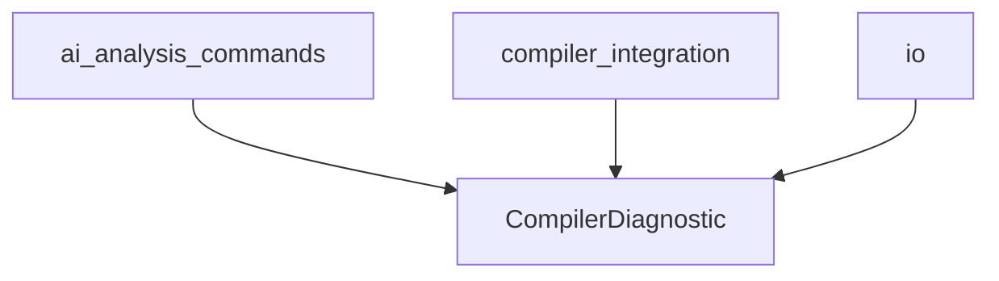

# Code Deduplication Strategy for Rust AI IDE

## Overview
This document outlines strategies for identifying and deduplicating code patterns in the Rust AI IDE codebase, focusing on both the Tauri Rust backend and React frontend components.

## Current Duplication Issues Found

### Backend (Rust/Tauri) Duplications

#### 1. Diagnostic Structures
**Affected Files:**
- `src-tauri/src/commands/ai_analysis_commands.rs`
- `src-tauri/src/commands/compiler_integration.rs`
- `src-tauri/src/commands/io.rs`

**Duplicated Structures:**
```rust
pub struct CompilerDiagnostic {
    pub level: String,
    pub message: String,
    pub spans: Vec<CompilerSpan>,
    pub children: Vec<CompilerDiagnostic>,
    pub rendered: Option<String>,
}

pub struct CompilerDiagnosticsResult {
    pub diagnostics: Vec<CompilerDiagnostic>,
    pub explanations: HashMap<String, ErrorCodeExplanation>,
}
```

**Duplicated Functions:**
- `parse_compiler_diagnostic()`
- `parse_compiler_span()`
- `generate_suggested_fixes()`

#### 2. Caching Infrastructure
**Affected Files:**
- Multiple command modules
- Lifecycle modules

**Duplicated Patterns:**
- `DiagnosticCache` struct (identical implementations)
- `ExplanationCache` struct (identical implementations)
- TTL-based cache entry management

#### 3. Async Command Patterns
**Affected Files:**
- All command modules
- Handler modules

**Duplications:**
- `get_compiler_diagnostics()` (appears in multiple files with minor variations)
- Path validation logic
- State management patterns

#### 4. Dependency Structures
**Affected Files:**
- `src-tauri/src/commands/dependency_commands.rs`
- `src-tauri/src/commands/project.rs`
- `src-tauri/src/dependency/` module files

**Duplicated:**
- `DependencyInfo` struct
- Dependency checking functions
- Graph data structures

### Frontend (React) Duplications

#### 1. Component Structure Patterns
**Affected Files:**
- Multiple components in `web/src/components/`
- Similar layout patterns in panels and editors

**Duplicated Patterns:**
- Panel layouts with headers and content areas
- File handling logic
- Editor integration patterns

## Proposed Deduplication Strategies

### Strategy 1: Create Shared Backend Modules

#### A. Unified Diagnostics Module
```
src-tauri/src/diagnostics/
├── mod.rs
├── types.rs (CompilerDiagnostic, CompilerSpan, etc.)
├── parser.rs (parsing functions)
└── cache.rs (unified caching)
```

**Benefits:**
- Single source of truth for diagnostic structures
- Consistent parsing and caching across modules
- Easier maintenance and updates

#### B. Generic Caching Infrastructure
```rust
src-tauri/src/cache/
├── mod.rs
├── generic.rs (generic cache implementation)
└── diagnostics.rs (specific diagnostic cache wrapper)
```

#### C. Command Traits and Helpers
```rust
src-tauri/src/commands/
├── mod.rs
├── traits.rs (common command traits)
└── helpers.rs (shared async utilities)
```

### Strategy 2: Frontend Component Composition

#### A. Shared Component Library
```javascript
web/src/components/shared/
├── Panel.tsx (reusable panel layout)
├── Modal.tsx
├── Form.tsx
└── hooks/
    ├── useAsyncOperation.ts
    └── useFileHandling.ts
```

#### B. Higher-Order Components
```javascript
web/src/components/hocs/
├── withErrorHandling.tsx
├── withLoading.tsx
└── withCaching.tsx
```

#### C. Utility Libraries
```javascript
web/src/utils/
├── asyncHelpers.ts
├── validation.ts
└── formatting.ts
```

## Implementation Plan

### Phase 1: Backend Deduplication (High Priority)

1. **Extract Shared Structures**
   - Move `CompilerDiagnostic` and related types to `diagnostics::types`
   - Update all imports across modules
   - Test compilation after extraction

2. **Create Unified Caching**
   - Implement generic cache in `cache::generic`
   - Replace specific cache implementations
   - Update state management

3. **Standardize Async Patterns**
   - Create common async helper traits
   - Apply to all command modules
   - Maintain backward compatibility

### Phase 2: Frontend Deduplication (Medium Priority)

1. **Component Library**
   - Identify most-used layout patterns
   - Create composable components
   - Replace instances gradually

2. **Hook Consolidation**
   - Audit existing hooks for duplicates
   - Create shared hooks library
   - Update component usage

### Phase 3: Architecture Improvements

1. **Dependency Graph Consolidation**
   - Unify dependency analysis structures
   - Remove redundant implementations
   - Create centralized dependency service

2. **Error Handling Standardization**
   - Establish consistent error types
   - Create error handling utilities
   - Apply across all modules

## Success Metrics

- Reduce codebase size by 15-20%
- Eliminate structural duplication completely
- Reduce dependency cycles
- Improve maintainability score

## Architectural Improvements

### Event-Driven Design
Replace direct module dependencies with event system:
```rust
// Before: Direct dependency
module_a.call_module_b()

// After: Event-driven
event_system.emit(Event::ModuleARequest, data)
```

### Service-Oriented Architecture
```rust
// Dedicated services
pub trait DiagnosticService {
    async fn get_diagnostics(&self, request: DiagnosticRequest) -> Result<(), Error>;
}
```

## Migration Strategy

1. **Preserve Functionality**
   - All existing APIs remain functional
   - Gradual replacement process
   - Extensive testing at each step

2. **Incremental Changes**
   - Module-by-module migration
   - Feature flags for new implementations
   - Rollback capabilities

3. **Documentation Updates**
   - Update API documentation
   - Create migration guides
   - Update architectural diagrams

## Next Steps

1. Create shared modules structure
2. Begin with high-impact duplications (diagnostics)
3. Establish automated testing for deduplication
4. Monitor for regressions

## Mermaid Diagrams

### Current Architecture (Duplicated)


### Target Architecture (Deduplicated)
```mermaid
graph TD
    A[ai_analysis_commands] --> E[diagnostics::types]
    B[compiler_integration] --> E[diagnostics::types]
    D[io] --> E[diagnostics::types]
    E --> F[Shared Diagnostics Module]