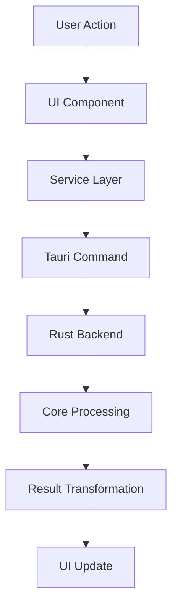
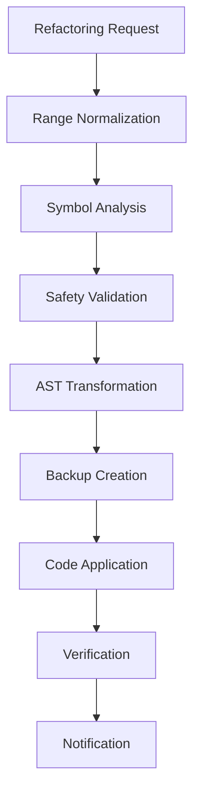

# System Architecture Overview - v2.4.0

## Overview

The Rust AI IDE implements a sophisticated, modular architecture designed for enterprise-grade AI-powered development. Released in v2.4.0, the system introduces advanced refactoring capabilities, intelligent code transformation, and comprehensive safety mechanisms.

## Core Architectural Principles

### 1. **Modular Design**

- **Separation of Concerns**: Each module responsible for specific functionality
- **Layered Architecture**: Clear boundaries between UI, business logic, and data
- **Extensibility**: Plugin system for third-party integrations

### 2. **Safety-First Approach**

- **AST-Safe Operations**: Guaranteed syntax preservation
- **UTF-8 Safe String Handling**: Multi-language text manipulation
- **Range Normalization**: Consistent indexing between frontend/backend
- **Comprehensive Backup System**: Enterprise-grade data protection

### 3. **Performance Optimization**

- **Lazy Loading**: Models and resources loaded on-demand
- **Memory Management**: LRU caching and automatic cleanup
- **Async Processing**: Non-blocking operations for responsiveness
- **Resource Monitoring**: Real-time performance tracking

## System Components

### Frontend Layer (Web Technologies)

#### 🖥️ User Interface (`web/`)

```typescript
// Core UI Architecture
interface UIArchitecture {
  components: ComponentSystem[]
  stateManagement: StateManagement
  theming: ThemeSystem
  extensions: ExtensionAPI
}
```

- **React/TypeScript Framework**: Modern component architecture with type safety
- **Monaco Editor Integration**: Advanced code editing with language support
- **RTK Query Integration**: Efficient server state management
- **Theme System**: Dark/light mode with customization support

#### 🔧 Services Layer

- **Refactoring Service**: Frontend orchestration for code transformations
- **Cargo Integration Service**: Build system interaction
- **AI Service**: Intelligent code assistance and analysis
- **File Management Service**: Project file operations

### Backend Layer (Rust)

#### 🚀 Core Crates

##### `rust-ai-ide-core`

- Fundamental types, traits, and utilities
- Common data structures for all modules
- Error handling and logging infrastructure
- Configuration management system

##### `rust-ai-ide-refactoring` (⭐ v2.4.0 Key Component)

```rust
// Advanced Refactoring Architecture
struct RefactoringEngine {
    symbol_analyzer: SymbolAnalyzer,
    pattern_matcher: PatternMatcher,
    range_normalizer: RangeNormalizer,
    backup_manager: BackupManager,
    safety_validator: SafetyValidator,
}
```

**Core Components:**

- **Range Normalizer**: Frontend 1-based ↔ Backend 0-based conversion
- **Backup Manager**: SHA256 hashing, metadata, change manifests
- **Safety Validator**: AST-safe operations, conflict detection
- **Pattern Matcher**: Language-aware code transformation

**Multi-Language Support:**

- Rust, TypeScript, JavaScript, Python, Java, C++
- Language-specific parsing and transformation rules
- Framework detection and template generation

##### `rust-ai-ide-ai`

```rust
// AI Services Architecture
struct AIServices {
    model_registry: ModelRegistry,
    specification_parser: SpecificationParser,
    code_analyzer: CodeAnalyzer,
    architectural_advisor: ArchitecturalAdvisor,
}
```

- **Model Management**: LRU unloading, resource monitoring
- **Specification Parsing**: Natural language insights
- **Code Analysis**: Multi-language support with quality metrics
- **Architectural Advisor**: Real-time design recommendations

**Key Features:**

- Real-time model loading with memory management
- Automatic resource cleanup with configurable policies
- Multi-model support with fallback mechanisms
- Performance monitoring and optimization

##### `rust-ai-ide-cargo`

- Cargo command execution and monitoring
- Build system integration and analysis
- Dependency resolution and conflict management
- Test execution and coverage reporting

##### `rust-ai-ide-lsp`

- Language Server Protocol implementation
- rust-analyzer integration and enhancement
- Cross-language symbol navigation
- Advanced code intelligence features

##### `rust-ai-ide-debugger`

- Native debugging interface with GDB/LLDB
- MI protocol integration for advanced debugging
- Thread and async debugging capabilities
- Performance profiling and memory analysis

## Data Flow Architecture

### 1. **User Interaction Flow**



### 2. **Refactoring Data Flow**



## Security Architecture

### 1. **Input Validation**

- UTF-8 boundary validation for all text operations
- AST-safe transformations with syntax verification
- Range bounds checking with automatic clamping
- Language-specific validation rules

### 2. **Resource Protection**

- Memory usage monitoring and limits
- Automatic cleanup of orphaned processes
- Safe file operations with permissions checking
- Credential and API key protection

### 3. **Data Integrity**

- SHA256 content hashing for all operations
- Backup verification with manifest-based recovery
- Change tracking with rollback capabilities
- Integrity checks for all code transformations

## Performance Characteristics

### Memory Management

- **LRU Model Unloading**: 4 configurable policies
- **Lazy Loading**: Resources loaded on-demand
- **Automatic Cleanup**: Configurable aging policies
- **Resource Monitoring**: Real-time usage tracking

### Async Processing

- **Non-blocking Operations**: All I/O operations async
- **Background Tasks**: Model loading and cleanup
- **Thread Safety**: Atomic operations and mutexes
- **Channel-based Communication**: Rust tokio channels

### Optimization Techniques

- **Caching**: Result caching with TTL
- **Dedouplication**: Request deduplication
- **Batch Processing**: Multiple operations in single request
- **Incremental Analysis**: Partial re-analysis instead of full rebuild

## Extensibility Points

### 1. **Plugin System**

- **Extension Points**: Defined interfaces for modules
- **API Surface**: Well-documented plugin APIs
- **Hook System**: Before/after operation hooks
- **Configuration**: Plugin-specific settings

### 2. **Language Support**

- **Parser Interfaces**: Language-agnostic parsing API
- **Template System**: Language-specific templates
- **Framework Detection**: Language-aware analysis
- **Rule Engine**: Customizable analysis rules

### 3. **Integration APIs**

- **HTTP APIs**: RESTful APIs for external tools
- **WebSocket Integration**: Real-time synchronization
- **Protocol Extensions**: LSP and DAP extensions
- **SDK Generation**: Auto-generated client libraries

## Deployment Architecture

### Native Applications

- **Tauri Build System**: Cross-platform desktop apps
- **System Dependencies**: Platform-specific binary dependencies
- **Auto-updater**: Integrated update mechanisms
- **Offline Support**: Full offline functionality

### Cloud Integration

- **Hybrid Architecture**: Local processing with cloud capabilities
- **Data Synchronization**: Encrypted cloud sync
- **Collaborative Features**: Real-time multi-user editing
- **Backup Services**: Cloud-based backup and recovery

## Monitoring and Observability

### 1. **Logging**

- **Structured Logging**: JSON-formatted log entries
- **Log Levels**: Configurable verbosity levels
- **Performance Tracing**: Operation timing and metrics
- **Error Tracking**: Comprehensive error capture

### 2. **Metrics**

- **Performance Metrics**: Response times, throughput
- **Resource Usage**: Memory, CPU, disk usage
- **Model Statistics**: Loading times, inference metrics
- **User Analytics**: Feature usage and patterns

### 3. **Health Checks**

- **System Health**: Component status monitoring
- **Dependencies**: External service availability
- **Resources**: Disk space, memory usage alerts
- **Performance**: Threshold-based alerting

## Future Extensions

### Phase 3 (Q4 2025)

- **Collaborative Features**: Real-time multi-user editing
- **Advanced Debugging**: AI-powered root cause analysis
- **Plugin Marketplace**: Third-party extension ecosystem

### Phase 4 (2026)

- **Cloud Native**: Container orchestration support
- **Advanced AI**: Multi-modal analysis and generation
- **Enterprise Integration**: Enterprise toolchain integration

---

**Version**: v2.4.0
**Last Updated**: September 2, 2025
**License**: MIT
